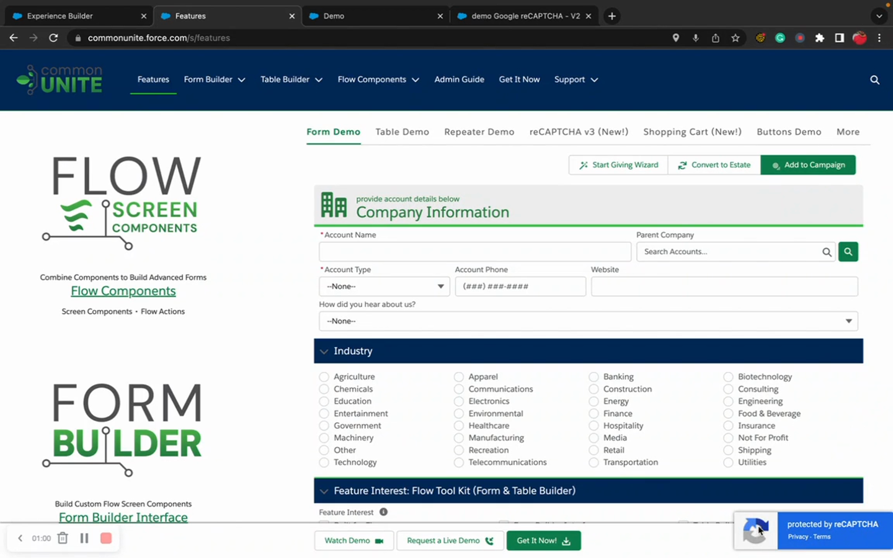

# Google reCAPTCHA Setup

> Complete setup guide for integrating Google reCAPTCHA with Flow Tool Kit forms.


For a quick how-to, see [Add reCAPTCHA](../how-to-guides/add-recaptcha.md). This page covers the full technical setup in detail.


## Video Walkthrough



## Overview

reCAPTCHA protects your public-facing forms from automated bot submissions. Flow Tool Kit supports both reCAPTCHA v2 (checkbox) and v3 (invisible scoring).

## Step 1: Register with Google

1. Go to [Google reCAPTCHA Admin Console](https://www.google.com/recaptcha/admin).
2. Click **+** to add a new site.
3. Configure:

| Setting | Value |
|---------|-------|
| **Label** | Your site name (e.g., "Salesforce Forms") |
| **reCAPTCHA Type** | v2 ("I'm not a robot") or v3 (score-based) |
| **Domains** | Your Experience Cloud domain (e.g., `yourorg.my.site.com`) |

4. Accept the terms and click **Submit**.
5. Copy the **Site Key** (public) and **Secret Key** (private).


**Add all domains.** If your site is accessible from multiple domains (e.g., a custom domain and the default `.my.site.com` domain), add them all.


## Step 2: Salesforce Configuration

### CSP Trusted Sites

Add these trusted sites in **Setup → CSP Trusted Sites**:

| Trusted Site URL | Context | Permissions |
|-----------------|---------|-------------|
| `https://www.google.com` | All | Connect, Script |
| `https://www.gstatic.com` | All | Connect, Script, Style |

### Named Credential (for server-side validation)

For reCAPTCHA v3 (and recommended for v2):

1. Go to **Setup → Named Credentials**.
2. Create a new Named Credential:

| Setting | Value |
|---------|-------|
| **Label** | Google reCAPTCHA |
| **URL** | `https://www.google.com/recaptcha/api` |
| **Identity Type** | Anonymous |
| **Authentication Protocol** | No Authentication |

### Store Keys in Flow Tool Kit Settings

1. Navigate to the reCAPTCHA configuration in Flow Tool Kit.
2. Enter:
   - **Site Key** — the public key from Google
   - **Secret Key** — the private key from Google
   - **Version** — v2 or v3
   - **Score Threshold** (v3 only) — minimum score to accept (0.0-1.0, recommended: 0.5)

## Step 3: Enable on Forms

1. In Form Builder or template configuration, enable reCAPTCHA.
2. Select the reCAPTCHA configuration.
3. Save.

## How Validation Works

### reCAPTCHA v2 (Checkbox)
1. User sees "I'm not a robot" checkbox on the form.
2. User clicks the checkbox (may get an image challenge).
3. Google returns a token.
4. Flow Tool Kit sends the token to Google's verification endpoint.
5. Google confirms the token is valid.
6. Form submission proceeds.

### reCAPTCHA v3 (Invisible)
1. reCAPTCHA v3 runs silently in the background — no user interaction.
2. Google assigns a score from 0.0 (likely bot) to 1.0 (likely human).
3. Flow Tool Kit checks the score against your threshold.
4. If the score is above the threshold, submission proceeds.
5. If below, the submission is blocked.

## Troubleshooting

| Issue | Cause | Fix |
|-------|-------|-----|
| Widget doesn't load | CSP blocking Google scripts | Add `www.google.com` and `www.gstatic.com` to CSP Trusted Sites |
| "Invalid site key" | Domain mismatch | Add your exact domain to the Google reCAPTCHA site registration |
| All submissions blocked (v3) | Score threshold too high | Lower the threshold (try 0.3-0.5) |
| Works in sandbox, not production | Different domains | Register the production domain with Google |
| "Timeout or duplicate" error | Token expired | Tokens are valid for 2 minutes — check for slow form submissions |

## Related Pages

- [Add reCAPTCHA (How-To)](../how-to-guides/add-recaptcha.md) — quick setup guide
- [reCAPTCHA & Security Reference](../form-configuration/recaptcha-security.md) — configuration reference
- [Deploy to Experience Cloud](../how-to-guides/deploy-to-experience-cloud.md) — EC deployment guide
