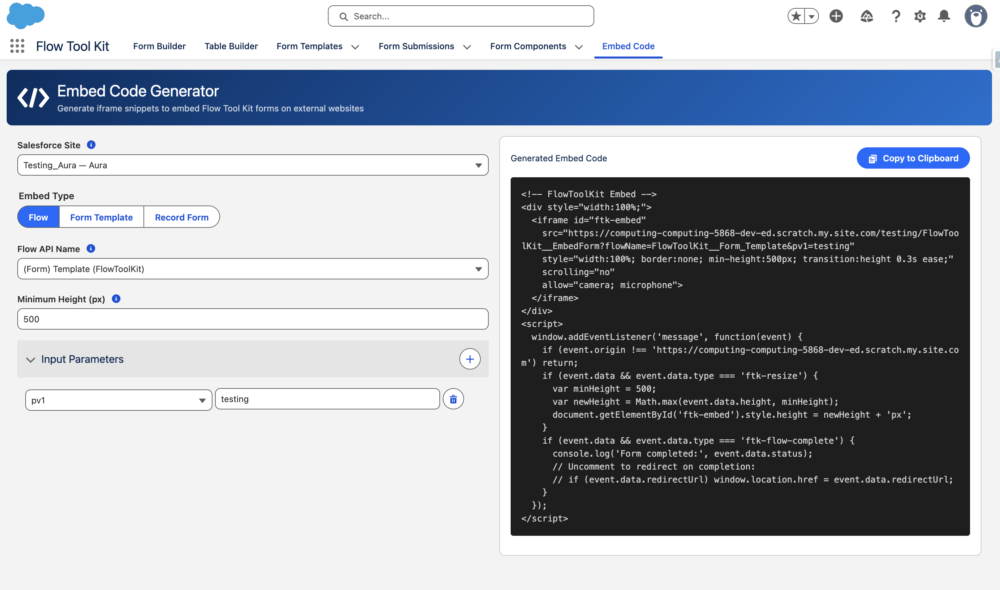

# Iframe Embed

> Embed Flow Tool Kit forms on external websites without requiring users to log in.

## Overview

Iframe Embed lets you place Flow Tool Kit forms on any website: your organization's website, a landing page, or a third-party platform. Unlike [Lightning Out](lightning-out.md) (which requires authentication), Iframe Embed uses a guest-accessible Visualforce page on a Force.com Site, so visitors can fill out forms without a Salesforce account.

## What You Can Embed

| Embed Type        | Description                           | Use Case                                                |
| ----------------- | ------------------------------------- | ------------------------------------------------------- |
| **Flow**          | A Salesforce screen flow              | Multi-step workflows, surveys, intake processes         |
| **Form Template** | A Flow Tool Kit Form Template         | Pre-configured multi-page forms with confirmation pages |
| **Record Form**   | A Flow Tool Kit Record Form component | Simple single-object record creation forms              |

## How It Works

1. You create a **Force.com Site** in your Salesforce org (a few clicks in Setup).
2. You open the **Embed Code Generator** tab in the Flow Tool Kit app.
3. You select your site, choose what to embed, and configure options.
4. The generator produces an iframe snippet; paste it into your website's HTML.
5. Visitors see the form on your website and submit directly to Salesforce.

## Prerequisites

* **Flow Tool Kit** installed in your org
* **Digital Experiences** enabled (Setup > Digital Experiences > Settings > Enable Digital Experiences)
* A **Force.com Site** (Classic or Aura Experience Cloud; setup instructions below)

## Site Setup

You need a Salesforce Site to host the embedded form page. You can use either a **Classic (Visualforce) Site** or an **Aura Experience Cloud Site**. Both work; choose whichever fits your org.


**LWR Experience Cloud sites are not supported** for iframe embedding. If you use an LWR site, it will not appear in the Embed Code Generator's site selector.


### Option A: Classic (Visualforce) Site

This is the simplest option: no Experience Cloud setup required.

1. Go to **Setup > Sites** (search "Sites" in Quick Find).
2. Choose a **Site Domain Name** if prompted (this is a one-time setup for your org).
3. Click **New** to create a new site.
4. Fill in:
   * **Site Label**: `Embed` (or any name you prefer)
   * **Site Name**: auto-populates from the label
   * **Active Site Home Page**: select any Visualforce page (e.g., `UnderConstruction`)
   * **Active**: checked
5. Click **Save**.
6. On the Site detail page, click **Edit**.
7. Set **Clickjack Protection Level** to **"Allow framing by any page (No protection)"**.
8. Click **Save**.

#### Assign the Permission Set to the Guest User

1. From the Site detail page, click **Public Access Settings**.
2. This opens the guest user's profile. Click **Assigned Users** to find the guest user.
3. Click on the guest user's name, then go to **Permission Set Assignments**.
4. Click **Edit Assignments** and add **Form Flow User**.
5. Click **Save**.

### Option B: Aura Experience Cloud Site

Use this if you already have an Aura Experience Cloud site, or if you prefer the Experience Cloud setup.

1. Go to **Setup > Digital Experiences > All Sites**.
2. Click **New** and select the **Build Your Own (Aura)** template.
3. Give it a name (e.g., `Embed`) and a URL path.
4. Click **Create**, then **Publish** the site (it doesn't need any pages; we only use the underlying site for hosting).
5. Go to **Setup > Sites** (not Digital Experiences).
6. Find the site entry created by your Experience Cloud site (it will have a different Site Type than your Classic sites).
7. Click **Edit** on that site record.
8. Set **Clickjack Protection Level** to **"Allow framing by any page (No protection)"**.
9. Click **Save**.


The clickjack setting is on the **Site detail page** in Setup > Sites, **not** in Experience Builder. Experience Builder has its own clickjack setting, but that only controls the `/s/` pages, not Visualforce pages served through the site.


#### Assign the Permission Set to the Guest User

1. Go to **Setup > Digital Experiences > All Sites**.
2. Click the **Workspaces** link next to your site.
3. Go to **Administration > Pages > Go to Force.com** (or navigate via Setup > Sites to the underlying site record).
4. Click **Public Access Settings**.
5. Find the guest user and go to **Permission Set Assignments**.
6. Add **Form Flow User** and click **Save**.

## Using the Embed Code Generator

1. Open the **Flow Tool Kit** app in Salesforce.
2. Click the **Embed Code** tab.
3. **Select a Salesforce Site** from the dropdown.
4. **Choose an Embed Type**:
   * **Flow**: Select a screen flow from the dropdown. Optionally add input parameters (pv1–pv9, recordId, submissionId) to pass values into the flow.
   * **Form Template**: Select a Form Template record.
   * **Record Form**: Select the object and optionally a specific form component.
5. **Set Minimum Height** (default: 500px). This prevents the iframe from collapsing during page transitions.
6. Click **Copy to Clipboard** and paste the snippet into your website's HTML.

## Clickjack Protection: Why "No Protection" Is Safe

Setting clickjack protection to "No protection" sounds alarming, but it's safe for this use case:

* **No authenticated session**: the site only serves anonymous guest forms. There is no logged-in user session for an attacker to exploit.
* **Site-scoped**: this setting only applies to your Embed site, not your org's internal Lightning UI, admin console, or other Experience Cloud sites.
* **Write-only forms**: the embedded page only accepts form submissions. Even in a theoretical clickjack scenario, the worst case is a form submission, which is the intended behavior.

**What is clickjacking?** It's when a malicious site loads your page in a hidden iframe and tricks users into clicking buttons they can't see. This is a real risk for admin pages with destructive actions (delete, approve). It does not apply to public guest forms.

## Troubleshooting

| Problem                                            | Cause                                                                                                              | Fix                                                                                                     |
| -------------------------------------------------- | ------------------------------------------------------------------------------------------------------------------ | ------------------------------------------------------------------------------------------------------- |
| **CSP `frame-ancestors` error in browser console** | Clickjack protection is not set to "No protection"                                                                 | Edit the Site record in Setup > Sites and set Clickjack Protection Level to "Allow framing by any page" |
| **"Page not found" in iframe**                     | Guest user doesn't have the permission set                                                                         | Assign **Form Flow User** to the site's guest user                                                      |
| **Lightning Out fails to load**                    | Digital Experiences not enabled                                                                                    | Go to Setup > Digital Experiences > Settings > Enable Digital Experiences                               |
| **Form loads but confirmation page doesn't show**  | This is a known issue when `@salesforce/user/isGuest` returns false in Lightning Out (fixed in the latest version) | Update to the latest version of Flow Tool Kit                                                           |
| **Iframe doesn't resize with form content**        | The generated snippet includes auto-resize JavaScript                                                              | Make sure the full snippet (including the `<script>` tag) is pasted into your page                      |

## Security Considerations

* The Embed site's guest user has **Form Flow User** permissions; this grants read/create access to form-related objects only.
* Form submissions go directly to Salesforce via secure API calls.
* The iframe communicates with the parent page only via `postMessage` for resize events and completion notifications.
* The generated snippet validates the message origin to prevent cross-origin attacks.

## Related

* [Lightning Out](lightning-out.md): authenticated embedding (requires login)
* [Deploy to Experience Cloud](../how-to-guides/deploy-to-experience-cloud.md): Salesforce-hosted forms
* [Google reCAPTCHA Setup](google-recaptcha-setup.md): bot protection for public forms
