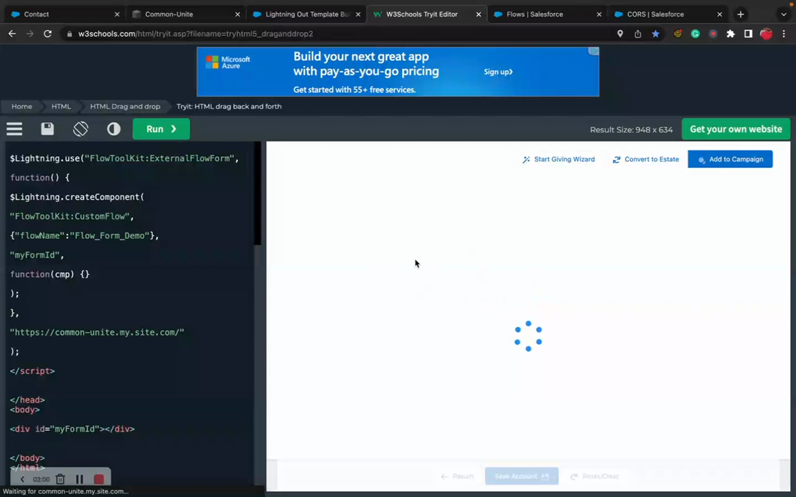

# Lightning Out

> Embed Flow Tool Kit forms on external websites using Salesforce Lightning Out.

## Overview

Lightning Out lets you embed Lightning Web Components (including Flow Tool Kit forms) on websites outside of Salesforce — your corporate website, a custom portal, or any web application. Users interact with the form without ever seeing the Salesforce UI.

## Video Walkthrough



## How It Works

1. Your external website loads the Lightning Out JavaScript library from Salesforce.
2. Lightning Out creates a secure connection to your Salesforce org.
3. Your Flow Tool Kit form component renders inside a container on the external page.
4. Form submissions go directly to Salesforce via the established connection.

## Prerequisites

- A Salesforce **Connected App** configured for Lightning Out
- A **Visualforce page** that serves as the Lightning Out container
- Your external website can load JavaScript from your Salesforce org
- Users must be authenticated (Lightning Out doesn't support guest access natively)

## Step 1: Create a Connected App

1. Go to **Setup → App Manager → New Connected App**.
2. Configure OAuth settings:
   - **Callback URL**: Your external site URL
   - **Selected OAuth Scopes**: Access your basic information, Perform requests on your behalf
3. Save and note the **Consumer Key**.

## Step 2: Create a Lightning Out App

Create an Aura application that references your Flow Tool Kit component:

1. Create a Lightning Application with `extends="ltng:outApp"`.
2. Add a dependency on the Flow Tool Kit component you want to embed.

## Step 3: Create the Container VF Page

Create a Visualforce page that loads Lightning Out and renders your component.

## Step 4: Embed on External Site

Add the Lightning Out JavaScript to your external website:

1. Load the Lightning Out library from your Salesforce org.
2. Initialize the app with your authentication token.
3. Create the component inside a DOM container.

## Security Considerations


**Authentication is required.** Lightning Out requires an authenticated Salesforce session. Users must log in before the form renders. For public-facing forms without authentication, use [Experience Cloud](../how-to-guides/deploy-to-experience-cloud.md) instead.


- **CORS**: Add your external site's domain to **Setup → CORS → Allowed Origins**.
- **CSP**: Configure Content Security Policy trusted sites for both directions.
- **Connected App policies**: Set appropriate session duration and refresh token policies.
- **IP restrictions**: Consider restricting the Connected App to known IP ranges.

## Lightning Out vs Experience Cloud

| | Lightning Out | Experience Cloud |
|---|---|---|
| **Authentication** | Required | Optional (supports guest users) |
| **Hosting** | Your external website | Salesforce-hosted site |
| **Customization** | Full control over surrounding page | Experience Builder templates |
| **Setup Complexity** | Higher (Connected App, CORS, embedding) | Lower (point-and-click) |
| **Best For** | Existing websites needing Salesforce forms | Standalone portals and public forms |

## Related Pages

- [Deploy to Experience Cloud](../how-to-guides/deploy-to-experience-cloud.md) — alternative for public forms
- [Experience Cloud Components](../experience-cloud/experience-cloud-components.md) — EC component reference
- [Google reCAPTCHA Setup](google-recaptcha-setup.md) — bot protection for external forms
