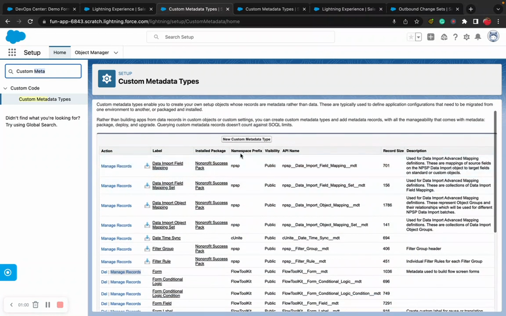

# Deploying Form Metadata

> How to move form configurations between Salesforce environments using change sets, SFDX, or third-party tools.


**Prerequisites**: Flow Tool Kit must be installed in the target org. See [Installation](../getting-started/installation.md).


## Video Walkthrough



## Method 1: Change Sets

The simplest method for sandbox → production deployments.



### Step 1: Create an Outbound Change Set

1. In the source org, go to **Setup → Outbound Change Sets**.
2. Click **New** and give it a name (e.g., "Form Config — Contact Intake").
3. Click **Add** to add components.

### Step 2: Add CMDT Records

Add the Custom Metadata Type records for your forms:

1. Select component type: **Custom Metadata Type Records**.
2. Add all records for your forms:
   - `Form__mdt` records (the form definitions)
   - `Form_Section__mdt` records (sections)
   - `Form_Field__mdt` records (fields)
   - `Form_Conditional_Logic__mdt` records (if conditional logic is used)
   - `Form_Conditional_Logic_Condition__mdt` records (conditions)
   - `Form_Style_Sheet__mdt` records (if themes are customized)
   - `Form_Labels__mdt` records (if labels/translations are used)


**Include all dependencies.** If you deploy a Section without its parent Form, or a Field without its parent Section, the deployment may fail or the references will be broken.


### Step 3: Upload and Deploy

1. Click **Upload** to send the change set to the target org.
2. In the target org, go to **Setup → Inbound Change Sets**.
3. Find your change set and click **Deploy**.

## Method 2: Salesforce CLI (SFDX)

For scripted, repeatable deployments.

### Retrieve from Source Org

```bash
sf project retrieve start \
  --metadata CustomMetadata:FlowToolKit__Form__mdt.Contact_Intake \
  --metadata CustomMetadata:FlowToolKit__Form_Section__mdt.Contact_Intake_Section_1 \
  --target-org source-org-alias
```

### Deploy to Target Org

```bash
sf project deploy start \
  --source-dir force-app/main/default/customMetadata \
  --target-org target-org-alias
```


**Tip**: Use `--dry-run` first to validate without deploying: `sf project deploy start --source-dir ... --target-org ... --dry-run`


### Bulk Retrieve All Form Metadata

To retrieve all Flow Tool Kit CMDT records at once:

```bash
sf project retrieve start \
  --metadata "CustomMetadata:FlowToolKit__Form__mdt.*" \
  --metadata "CustomMetadata:FlowToolKit__Form_Section__mdt.*" \
  --metadata "CustomMetadata:FlowToolKit__Form_Field__mdt.*" \
  --target-org source-org-alias
```

## Method 3: Third-Party Tools

Tools like **Copado**, **Gearset**, **Flosum**, and **AutoRABIT** support Custom Metadata Type deployment:

1. Connect both source and target orgs.
2. Run a comparison to find CMDT differences.
3. Select the Flow Tool Kit CMDT records to deploy.
4. Deploy with the tool's standard workflow.

These tools typically handle dependency ordering automatically.

## Method 4: JSON Export/Import

For quick, manual transfers:

1. In the source org, open **Form Builder**.
2. Select a form and click **Export JSON**.
3. Save the JSON file.
4. In the target org, open **Form Builder**.
5. Click **Import JSON** and upload the file.


JSON export/import handles a single form at a time. For bulk deployments, use SFDX or a third-party tool.


## Post-Deployment Verification

After deploying, verify in the target org:

1. Open **Form Builder** — your deployed forms should appear.
2. Open each form — verify sections, fields, and conditional logic are correct.
3. Test a Flow using the deployed form — verify runtime rendering.
4. If using themes, verify the styling appears correctly.
5. Clear the form cache if changes aren't visible: navigate to `your-org/apex/FlowToolKit__CacheFlow`.

## Related Pages

- [Deployment Overview](deployment-overview.md) — what needs to be deployed and why
- [Deploying to Production](deploying-to-production.md) — production-specific checklist
- [Deploying to Experience Cloud](deploying-to-experience-cloud.md) — EC-specific considerations
