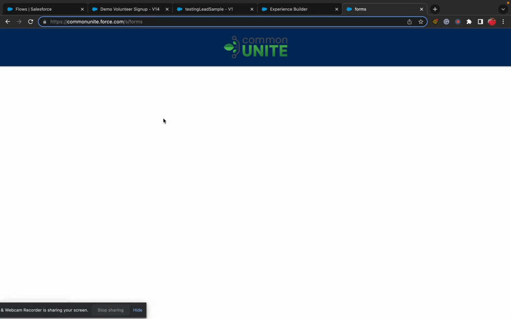

# Deploying to Experience Cloud

> Experience Cloud-specific deployment — site pages, component placement, CSP, and guest user profile.


**Prerequisites**: Experience Cloud site created and Flow Tool Kit installed. See [Deploy to Experience Cloud](../how-to-guides/deploy-to-experience-cloud.md) for the how-to guide.


## Video Walkthrough



## What's Different About EC Deployment

Experience Cloud deployments include everything in a standard deployment ([Deploying Metadata](deploying-metadata.md)) plus:

1. **Site page configuration** — which pages have Flow Tool Kit components
2. **Component property settings** — the JSON configuration for each component instance
3. **CSP Trusted Sites** — external domains the site needs access to
4. **Guest user profile** — object, field, and class access for unauthenticated users

## Additional Metadata to Deploy

| Metadata Type | What to Include |
|--------------|----------------|
| **Experience Cloud pages** | Page layouts with Flow Tool Kit components placed |
| **CSP Trusted Sites** | `https://www.google.com` (for reCAPTCHA), any other external domains |
| **Guest user profile changes** | Object access, field-level security, Apex class access |
| **Sharing rules** | Rules that grant guest users access to records |
| **Network/site settings** | Public access, login, and self-registration settings |

## Guest User Permissions Checklist

For public-facing forms, the guest user profile must have:

- [ ] **Read access** to the form's target object (e.g., Contact, Case)
- [ ] **Read/Edit access** to required fields on the target object
- [ ] **Apex class access** to Flow Tool Kit runtime classes (included in Form Flow User PS as a reference — apply equivalent to the guest profile)
- [ ] **Read access** to `Form_Submission__c` (if using templates/submissions)
- [ ] **Create access** to `ContentDocument` / `ContentVersion` (if file uploads are used)


**Principle of least privilege.** Only grant the minimum access the guest user needs. Never grant Delete or Modify All access to guest users.


## CSP Trusted Sites

Common entries needed for Experience Cloud sites using Flow Tool Kit:

| Domain | Required For |
|--------|-------------|
| `https://www.google.com` | reCAPTCHA |
| `https://www.gstatic.com` | reCAPTCHA assets |

## Post-Deployment Steps

1. **Publish the Experience Cloud site** — changes to site pages require publishing.
2. **Test as guest user** — open an incognito browser and visit the site.
3. **Test as authenticated user** — log in and verify forms work.
4. **Check browser console** — look for CSP errors or permission issues.
5. **Clear form cache** if forms don't load correctly.

## Related Pages

- [Deploy to Experience Cloud (How-To)](../how-to-guides/deploy-to-experience-cloud.md) — full how-to guide
- [Experience Cloud Components](../experience-cloud/experience-cloud-components.md) — component reference
- [Deployment Overview](deployment-overview.md) — general deployment guide
