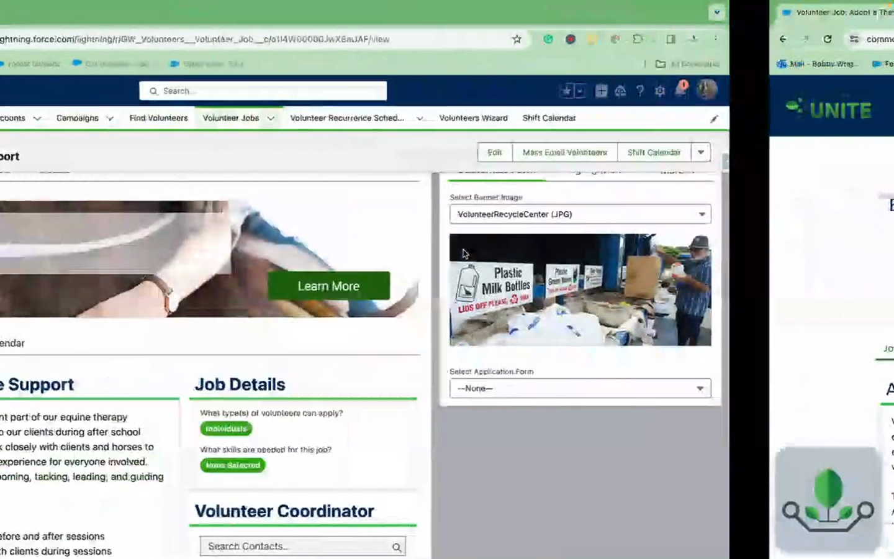
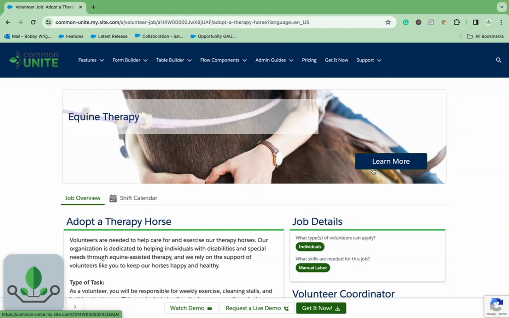

# Experience Cloud Components
> Lightning Data Service-powered components for displaying and editing records on Experience Cloud pages — using Flow Tool Kit forms without requiring a Flow.

## Overview

Form (Dynamic Component) brings Flow Tool Kit's form rendering to Experience Cloud pages without requiring a Screen Flow. It uses Lightning Data Service (LDS) to read and write record data directly, and displays forms using the same Form metadata you build in Form Builder.

This component is designed specifically for Experience Cloud sites where you need record display or editing capabilities on community pages. Unlike the Dynamic Flow Display (which embeds a full Flow), Dynamic Component renders a form directly on the page with LDS handling all data operations — making it lighter, faster, and more tightly integrated with the page context.

## Where to Use It

- **Experience Cloud** (Community Page and Default) — this is an Experience Cloud-only component

## Video Walkthroughs





## Quick Start

1. **Build a Form** — In Form Builder, create a Form for the object you want to display/edit.
2. **Add to Experience Cloud Page** — In Experience Builder, drag "Form (Dynamic Component)" onto your page.
3. **Configure via Property Editor** — The custom property editor opens automatically. Select your object, form, and display options.
4. **Set Record Context** — The component automatically binds to `{!recordId}` and `{!objectApiName}` from the page context.
5. **Publish** — Publish your Experience Cloud site.

## Properties

### Inputs

| Property | Type | Description |
|---|---|---|
| `properties` | String | JSON configuration string managed by the property editor |
| `recordId` | String | Record Id from the page context (default: `{!recordId}`) |
| `objectApiName` | String | Object API Name from the page context (default: `{!objectApiName}`) |

### Property Editor Configuration

The property editor provides a visual interface for configuring:

| Setting | Description |
|---|---|
| **Object** | The SObject API name for the form |
| **Form Selection** | Choose a Form Component or custom JSON form definition |
| **Display Type** | How to render: `component` (inline), `modal` (dialog), or `button` (click to launch) |
| **Button Label** | Label text when display type is `button` |
| **Modal Size** | Dialog width when using modal display: small, medium, large, full |
| **Read Only** | Display the form in read-only mode |
| **Theme** | Form Theme for styling |

### Outputs

This component has no Flow outputs (it operates via LDS, not Flow).

## How It Works

**Lightning Data Service**: Unlike Flow Form (which operates within Flow context), Dynamic Component uses LDS wire adapters (`getRecord`, `getObjectInfo`) to read record data and `updateRecord`/`createRecord` for writes. This means:
- No Apex is needed for record CRUD
- Data is cached and shared across components on the page
- Changes are automatically reflected in other LDS-aware components

**Property Editor Pattern**: The component uses the Experience Cloud custom property editor pattern:
1. A wrapper component exposes a single `properties` String property with an `editor` attribute pointing to the property editor LWC
2. The property editor provides a rich admin UI for configuration
3. All settings are serialized as JSON and stored in the `properties` string
4. At runtime, the wrapper parses the JSON and passes individual properties to the core rendering component

**Display Types**: Like Dynamic Flow, the component supports three display modes:
- **Component** — Inline form on the page
- **Modal** — Form in a dialog
- **Button** — Button that opens the form in a modal when clicked

## Works With

| Component | Integration |
|---|---|
| **Form Builder** | Uses Form metadata for field/section definitions |
| **Themes** | Styled by Form Theme metadata |
| **Form Components** | Can reference reusable Form Component configurations |
| **Lightning Data Service** | All record operations via LDS (no Apex, no Flow) |

## Common Patterns

### 1. Record Detail Page Enhancement
Replace the standard record detail component on an Experience Cloud record page with Dynamic Component using a custom form. This gives you full control over which fields appear, their layout, and styling.

### 2. Quick Edit Button
Set `displayType=button` with a label like "Edit Details". Users click to open a styled form in a modal, make changes, and save — all via LDS without a page reload.

### 3. Read-Only Summary
Enable read-only mode to display a formatted, themed summary of record data. Useful for public-facing profile pages or read-only detail views.

## Tips & Considerations

- **Experience Cloud Only**: This component targets Experience Cloud pages exclusively. For Lightning App/Record/Home pages, use Flow Form in a Flow or Dynamic Flow Display.
- **LDS vs Flow**: Because Dynamic Component uses LDS instead of Flow, you don't get Flow logic (decisions, loops, assignments). If you need Flow capabilities, use Dynamic Flow Display instead.
- **Automatic Context**: `recordId` and `objectApiName` are automatically bound from the page context. You typically don't need to set these manually.
- **No Apex Needed**: LDS handles all data operations. This is simpler to set up but means you can't run custom Apex logic during save. For complex save operations, use a Flow-based approach instead.
- **RelaxedCSP**: The component declares `lightningCommunity__RelaxedCSP` capability for proper styling and functionality in Experience Cloud.
- **Form Configuration Modes**: The property editor supports both Form Component selection (metadata reference) and custom JSON form definitions — the same modes available in Form Builder.
