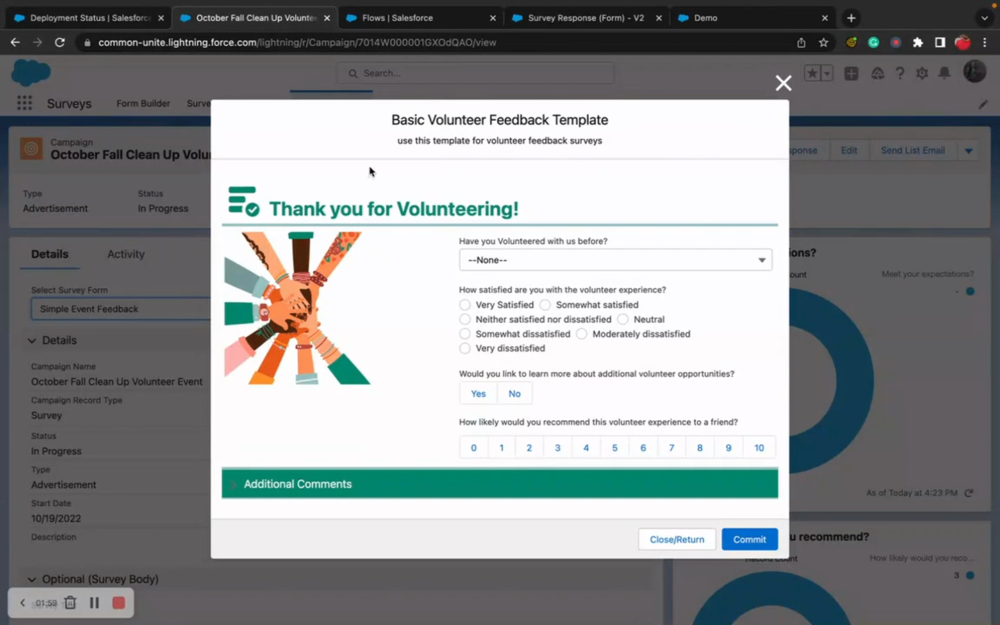

# Conditional Logic
> Show or hide form sections and fields dynamically based on field values, user properties, device size, and custom permissions.

## Overview

Conditional Logic lets you control when sections and fields are visible on your forms. Define rules like "show the Spouse section when Marital Status equals Married" or "hide the Admin Notes field for guest users" — all configured in Form Builder, no code required.

Rules are stored as Custom Metadata Types (Form_Conditional_Logic__mdt and Form_Conditional_Logic_Condition__mdt) and evaluated in real-time as users fill out the form. When a condition is met, the target section or field appears; when it's not met, the target hides.

## Where to Configure

- **Form Builder** — the primary place to create and manage conditional logic rules
- **Custom Metadata Types** — advanced users can create records directly, but Form Builder is recommended

## Quick Start

1. **Open Form Builder** — Navigate to your form in the Form Builder tab.
2. **Select a Section or Field** — Click the section or field you want to conditionally show/hide.
3. **Add Conditional Logic** — In the properties panel, add a conditional logic rule.
4. **Define Conditions** — Specify the field to watch, the operator (equals, not equals, contains, etc.), and the value to match.
5. **Save** — Save the form. The condition is now active at runtime.

## How Conditions Work

### Condition Structure

Each conditional logic rule (`Form_Conditional_Logic__mdt`) contains one or more conditions (`Form_Conditional_Logic_Condition__mdt`). Conditions are evaluated based on the rule's logic type (AND/OR).

### Condition Properties

| Field | Type | Required | Description |
|---|---|---|---|
| `fieldName__c` | EntityParticle | Yes | The field whose value to evaluate |
| `Object__c` | EntityDefinition | Yes | The object the field belongs to |
| `value__c` | Text (255) | No | The value to compare against |
| `position__c` | Number | Yes | Evaluation order (default: 1) |
| `UserValidation__c` | Picklist | No | User-based condition type (see below) |
| `config__c` | LongTextArea | No | JSON with operator and advanced settings |

### Field-Based Conditions

The most common type. Evaluate a field's value on the current record:

- **Equals**: Show section when `Industry` equals `Technology`
- **Not Equals**: Show field when `Status__c` is not `Closed`
- **Contains**: Show section when `Description` contains `urgent`
- **Is Blank / Is Not Blank**: Show fields when a value is present or absent
- **Greater Than / Less Than**: Show section when `Amount` is greater than 10000

### User-Based Conditions

Evaluate properties of the current user instead of field values:

| UserValidation__c Value | What It Checks |
|---|---|
| `DeviceSize` | User's device size (phone, tablet, desktop) |
| `LanguageLocaleKey` | User's language locale |
| `IsGuest` | Whether the user is a guest/unauthenticated user |
| `Profile` | User's Profile name |
| `Role` | User's Role name |
| `IsNew` | Whether the record is new (no Id) |
| `CustomPermission` | Whether the user has a specific custom permission |

### Logic Combinations

- **AND**: ALL conditions must be true for the section/field to show
- **OR**: ANY condition being true causes the section/field to show

## Applying Conditional Logic

### To a Section
Assign a `Form_Conditional_Logic__mdt` record to the section's `conditionalLogic__c` field. The entire section (including all its fields) shows/hides based on the rule.

### To a Field
Assign a `Form_Conditional_Logic__mdt` record to the field's `conditionalLogic__c` field. Only that specific field shows/hides.

### Cascading Effects
When a section is hidden, all fields within it are also hidden — regardless of individual field conditions. Field-level conditions only apply when the parent section is visible.

## Works With

| Component | Integration |
|---|---|
| **Flow Form** | Evaluates conditions in real-time as users interact with the form |
| **Data Table** | Conditional logic applies to table form modals (edit/new) |
| **Form Builder** | Create and manage all conditional logic rules |
| **Form Templates** | Conditions work within template pages and sections |

## Common Patterns

### 1. Dependent Fields
Show "Spouse Name" and "Spouse Email" fields when "Marital Status" picklist equals "Married" or "Domestic Partnership".

### 2. Role-Based Sections
Show an "Internal Notes" section only when the user's Role contains "Manager". Guest users and standard users never see it.

### 3. Progressive Disclosure
Show additional detail fields only after the user fills in key fields. For example, show "Shipping Address" section only when "Ship to Different Address" checkbox is checked.

### 4. Device-Responsive Forms
Hide complex sections on phone-sized screens using the `DeviceSize` user validation. Show a simplified mobile section instead.

### 5. New vs Edit Forms
Use `IsNew` to show a "Welcome" section only for new record creation, and an "Edit History" section only for existing records.

## Tips & Considerations

- **Real-Time Evaluation**: Conditions evaluate as the user types/selects values. There's no delay — visibility changes are instant.
- **Hidden Field Values**: When a field is hidden by conditional logic, its value is NOT cleared by default. If you need to clear hidden field values, use the `returnVisibleFieldsOnly` or `recordVisibleFields` outputs on Flow Form.
- **Multiple Conditions**: You can combine field-based and user-based conditions in the same rule. All must pass for AND logic; any must pass for OR logic.
- **Performance**: Conditional logic evaluation is client-side and fast. Even forms with many rules evaluate instantly.
- **Testing**: Use Form Builder's preview to test conditional logic before deploying to your Flow. Change field values to verify sections/fields show and hide as expected.
- **Operators in Config**: Operators (equals, not equals, contains, etc.) are stored in the `config__c` JSON field. Form Builder manages this automatically.
