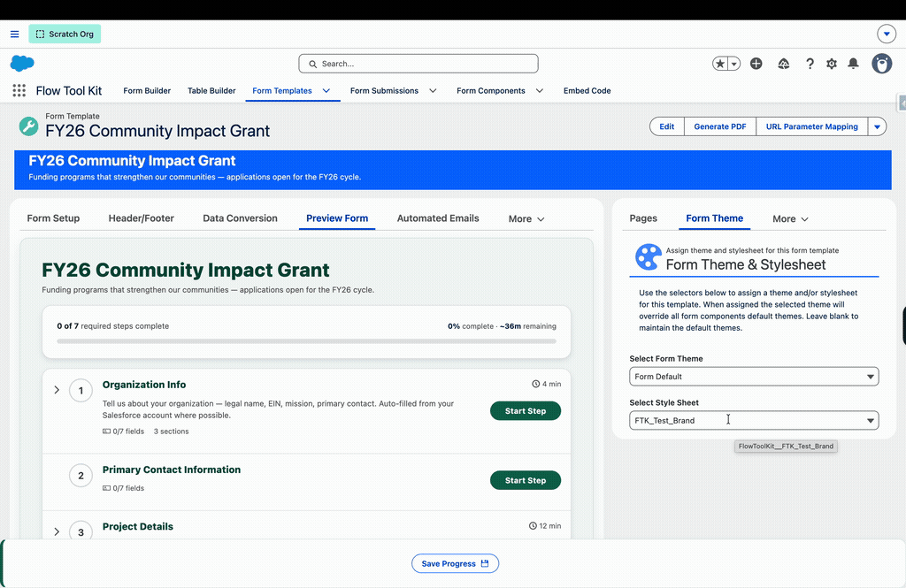

# Custom Styling Overview

> Choose between the style editor, Classic Themes and your own CSS, and see how they combine. This page is written for developers and for administrators who work with one.

## Choose the right tool

| Tool | Use it for | Needs CSS | Where to set it up |
| --- | --- | --- | --- |
| **Org defaults** (style editor) | The shared starting look for every form | No | Form Builder → **Global Styles** tab |
| **Template overrides** (style editor) | One Form Template that should look different | No | Form Template → **Style Editor** tab |
| **Classic Themes** | Themes you already use on a form or section | No | Theme selection in Form Builder or on the template |
| **Form Template stylesheet** | CSS for one template | Yes | Form Template → **Form Theme** tab → Style Sheet Selector |
| **Custom-metadata stylesheet** | CSS for every page that renders a form | Yes | Setup → Custom Metadata Types → Form Style Sheet → Manage Records |

Start with the style editor: [Form Styles](form-styles.md) explains it step by step. Reach for CSS only when a design needs something the editor has no control for.

The two no-code rows and the two stylesheet rows are separate mechanisms. The style editor never reads your CSS, and a stylesheet is never turned into org defaults or shown as values in the editor.

## How saved styles reach a form

Every control in the style editor sets a CSS custom property whose name starts with `--ftk-`. These are the **tokens**.

1. The editor saves a flat map of token names to values. There are two such maps, called **layers** on this page: the org defaults and one template's overrides.
2. When a form renders, the two layers are merged, template over org, and written as inline custom properties on the form's outer element. That element carries the class `form-template-container`.
3. Each component reads a token with a fallback, so a token nobody set changes nothing.

| Layer | Where it is stored | How to move it between orgs |
| --- | --- | --- |
| Org defaults | A protected setting inside the package. Your code and data tools cannot read or write it | **Export** and **Import** in Global Styles, by hand. There is no API or command-line path |
| Template overrides | The **Style Overrides** field on the Form Template record, `FlowToolKit__Style_Overrides__c`, as JSON | **Export** and **Import** in the template's Style Editor, or a data tool that loads Form Template records |

```json
{
  "--ftk-color-primary": "#0b5cab",
  "--ftk-control-scale": "1.15",
  "--ftk-input-radius": "0.5rem"
}
```

This JSON is also what **Export** copies and **Import** accepts in both editors. Neither layer travels in a change set or a package deployment.

What a layer accepts:

- Keys must be token names from the [reference](style-token-reference.md). An unknown key is rejected.
- Every value is a text string, even a number: `"1.15"`, not `1.15`.
- A solid color is saved as a hex code such as `#0b5cab`. A color with opacity is saved as `rgba(11, 92, 171, 0.5)`.
- A value is at most 500 characters on a template and 255 characters in the org defaults. A template's JSON is at most 32,768 characters in total.
- A value cannot contain `;`, braces, angle brackets, a backslash, a comment, `url(`, `expression(` or `!important`.
- A border width cannot be a percentage.

The editor and Import check each value and tell you what is wrong. A form does not: if a layer holds one invalid entry when the form renders, the whole layer is skipped and nothing is logged. So prefer Import to writing the Style Overrides field yourself, and if a template suddenly ignores all of its overrides, look for a hand-edited value.

## CSS tokens for developers

The [CSS Style Token Reference](style-token-reference.md) lists every supported `--ftk-*` property with its editor name, purpose, value type and fallback, plus CSV and JSON downloads. Token names have no Salesforce namespace prefix.

How the names are built:

- **Shared tokens** set one thing for many components, such as `--ftk-color-primary`, `--ftk-radius-medium` and `--ftk-color-border`.
- **Specific tokens** name one component and one property, such as `--ftk-input-radius` or `--ftk-button-font-size`. A specific token falls back to its shared token, so set the shared one first and add a specific one only for the exception.
- **Scale tokens** end in `-scale` and are plain multipliers. Write `1.25`, not `125%`.
- Names starting `--_ftk-` are private and can change in any release. Do not read or set them.

Prefer tokens over selectors that depend on generated LWC markup. Use rem for most dimensions. For example:

```css
/* In a Form Template stylesheet, :root means this template's container. */
:root {
    --ftk-input-surface: #f5f8fc;
    --ftk-input-radius: 0.5rem;
    --ftk-input-padding-inline: 0.875rem;
    --ftk-font-size-heading: 1.5rem;
    --ftk-section-padding-inline: 1rem;
}
```

These act as defaults: a value saved in the style editor for the same token normally wins. A few tokens reach Salesforce's own controls only when they are saved in the editor. The reference marks them in its **From CSS alone** column, and its [native-control notes](style-token-reference.md#native-controls-and-css-only-tokens) show the extra rule a stylesheet needs.

### Use tokens in your own components

A component of yours rendered inside a form, such as an [LWC section](../advanced-topics/lwc-section-type.md), inherits the tokens, because CSS custom properties pass through shadow DOM. Read them with a fallback:

```css
.my-callout {
    border-color: var(--ftk-color-primary, var(--my-site-brand, #0176d3));
    border-radius: var(--ftk-radius-medium, 0.25rem);
}
```

Always give a fallback, and make it the value your component would use anyway, such as your site's own brand color. A token has no value until someone saves one, so without a saved Brand the fallback is what shows.

Download the starting examples: [Form Template CSS](../resources/form-template-styles.css) and [custom-metadata CSS](../resources/org-form-styles.css). Review and adapt their selectors and values before use.

## Assign a Form Template stylesheet

1. Upload a CSS file as a **Static Resource** with content type `text/css`, or upload a zip containing a `.css` file.
2. Open the **Form Template** record and its **Form Theme** tab.
3. Use the **Style Sheet Selector** to select the resource or zip entry. Options are grouped by namespace/Local and resource.
4. Save the stylesheet selection and reload the rendered template to verify it.

The selection is stored in the template's **Style Sheet** field, `FlowToolKit__Style_Sheet__c`. Supported reference formats are:

| Resource | Example stored reference |
| --- | --- |
| Local CSS file | `ClientFormStyles` |
| Namespaced CSS file | `vendor__ClientFormStyles` |
| CSS inside a local zip | `ClientAssets/styles/forms.css` |
| CSS inside a namespaced zip | `vendor__ClientAssets/styles/forms.css` |

Use the selector to avoid namespace and path mistakes. Paths inside zips are case-sensitive.

### How template scoping works

The template's record Id is a class on its outer `.form-template-container`. The loader prefixes stylesheet selectors with that class. Author the stylesheet without hardcoding the Id:

- `:root` targets the template container itself, including variables used by its fields.
- `.flowForm .slds-input` targets matching controls inside that template.
- `body` does not target the surrounding page; use `:root` for the template's own background.
- Standard grouping rules such as `@media`, `@supports`, `@container` and `@layer` are scoped too, as are supported nested selectors.

Scoping is by **template Id**, not by individual component instance. Two instances of the same template share that selector scope. Animation and font names are not renamed; use distinctive names. Native shadow boundaries can prevent direct selectors from reaching Salesforce internals, so verify the host where the form will run.

`@import` is not supported by this loader; imported styles are not loaded. Put all the CSS you need in the selected file. A blank or invalid resource is skipped. Clearing the stylesheet selection removes its rules when the template reloads, and choosing a different sheet removes the previous one first.



## Load a stylesheet through custom metadata

1. Upload the CSS Static Resource or zip.
2. In **Setup → Custom Metadata Types**, find **Form Style Sheet** and select **Manage Records**.
3. Create a mapping using these values:

| Mapping field | Local CSS file | CSS inside a local zip | Namespaced zip |
| --- | --- | --- | --- |
| **Static Resource Name** | `ClientFormStyles` | `ClientAssets` | `ClientAssets` |
| **Namespace Prefix** | Leave blank | Leave blank | `vendor` |
| **Path** | `ClientFormStyles` | `ClientAssets/styles/forms.css` | `vendor__ClientAssets/styles/forms.css` |

The Path must include the resource's URL name, not just the folder inside the zip. Static Resource Name is the resource's unprefixed API name. Namespace Prefix identifies the package containing it. Both Static Resource Name and Path must be populated.

A form loads every mapped stylesheet into the page it runs in. This is page-level CSS, with **no automatic template scoping**. Scope your selectors so they do not change Form Builder's own controls or the rest of the Salesforce page:

```css
/* Token values for every Flow Tool Kit component on the page. */
:root {
    --ftk-input-surface: #f5f8fc;
    --ftk-input-radius: 0.5rem;
}

/* A direct rule for form content, in a template or on its own. */
.flowForm .flow-form-help-below-label {
    font-style: italic;
}
```

Declare tokens under `:root` in a custom-metadata stylesheet. Only Flow Tool Kit components read `--ftk-*` properties, so this does not restyle the surrounding page, and it reaches every component: templates, builder previews, and a form, table, header, illustration or calendar selector placed directly on a Flow screen.

The class `form-template-container` marks the outer element that saved styles are written on. Templates and the builder preview always carry it. A component placed directly on a Flow screen carries it only once org defaults are saved, so a token declared only under that class can miss such a component. Use the class, or a narrower ancestor selector, for rules that should reach one place only.

**To beat a saved value from this kind of stylesheet,** declare the token on that element, not on `:root`. A saved value is inline on the container, and a value inherited from `:root` never beats one set on the element itself, even with `!important`:

```css
/* Default for every form: a saved value still wins. */
:root { --ftk-input-radius: 0.5rem; }

/* Developer-owned: wins over a saved value. */
.form-template-container { --ftk-input-radius: 0.5rem !important; }
```

Tokens marked **Partly** in the reference need a companion rule to reach Salesforce's own controls. In a page-level stylesheet, start that rule with `.flowForm` so it does not touch other buttons or inputs on the page. See the [native-control notes](style-token-reference.md#native-controls-and-css-only-tokens).

The loader deduplicates resource URLs for the page session. Mapping order is not a styling priority contract; if two sheets style the same property, use intentional CSS specificity/layers or consolidate the rules. Content and mapping paths are cached. After changing a resource or mapping, reload the page and allow for Salesforce caching; a new resource name is useful when verifying a changed file.

## How CSS interacts with editor values and Classic Themes

Without CSS, the order for one property is **component default → org default → template override → a Classic Theme you created or a component setting**, with the last one winning. Inside the editor, a detail set on its **Advanced** tab also wins over the broader control on its **Basics** tab.

Custom CSS participates in the browser cascade rather than becoming an extra fixed step in that list:

| Declaration | Typical result |
| --- | --- |
| Normal token declaration on the same template root | Editor's inline declaration of that token wins |
| Token absent from the inline configuration | Stylesheet token can supply its value |
| Targeted `!important` token on that same root | Overrides a normal inline token declaration |
| A token set on a descendant | Takes effect there where the component consumes it; inherited tokens on ancestors do not prevent local values |
| Direct property rule such as `border-radius` | Competes with component rules according to the CSS cascade; it does not update the token or the editor display |

For example, to make one template's input corners developer-controlled:

```css
:root {
    --ftk-input-radius: 0.875rem !important;
}
```

The editor still saves its own value, but this stylesheet declaration controls the root token while the sheet is assigned. A still-more-specific component property or Classic Theme rule can remain authoritative inside a descendant; `!important` on an ancestor's variable is not a universal override of everything below it.

For maximum predictability, give each property a clear owner: stylesheet or editor. Avoid setting a value through several mechanisms unless that fallback is deliberate.

## Existing CSS and compatibility

Existing Classic Theme assignments, custom-metadata mappings, and Form Template stylesheet selections remain available. The style editor does not rewrite those resources. Existing direct selector rules continue to use normal CSS behavior in hosts where they can reach the intended element.

Common form selectors include `.flowForm`, `.flowForm-field`, `.flow-form-help-below-label`, `.attestation-card`, `.flow-form-docked-buttons` and `.form-template-container`. The exact effect depends on component markup and Salesforce's shadow DOM mode. Prefer public `--ftk-*` tokens and supported Salesforce styling hooks over generated attributes or private `--_ftk-*` variables.

Both stylesheet paths are tested together with saved style editor values, including that one template's sheet does not leak into another and that clearing a sheet restores the layers under it. That cannot cover every stylesheet, Salesforce host or PDF renderer, so test your CSS wherever your forms run.

### Differences between hosts

The same token can meet different Salesforce markup in Lightning Experience, on an Aura site, on an LWR site and on the embed page (a form placed in another website with [Embed Code](../advanced-topics/iframe-embed.md)). The package maps each token to the styling hook that host uses, so most tokens behave the same everywhere. The known exceptions:

| Host | Difference |
| --- | --- |
| LWR site | `--ftk-joined-choice-radius` and `--ftk-richtext-radius` have no effect. The LWR site stylesheet fixes both corner values with no hook |
| LWR site | A site serves the code and stylesheets from its last publish. Republish the site after a package upgrade or a Static Resource change |
| LWR site | A Flow on a site page needs the **FlowToolKit LWR Support** component in the site footer or on that page, or its Calendar, Repeater and Table components do not load. See [LWR Site Component Support](../experience-cloud/lwr-site-component-support.md) |
| Lightning Experience | An illustration title follows `--ftk-font-family`, not `--ftk-font-family-heading` |
| Any site page | A header or illustration placed directly on the page, outside a Flow, does not load the org defaults |

## Related pages

- [Form Styles: Org Defaults and Template Overrides](form-styles.md), the style editor guide
- [CSS token reference](style-token-reference.md)
- [Classic Themes, Labels and Styling](themes-labels-styling.md)
- [Form Builder](../screen-components/form-builder.md)
- [Form Templates](../form-template-framework/form-templates.md)
