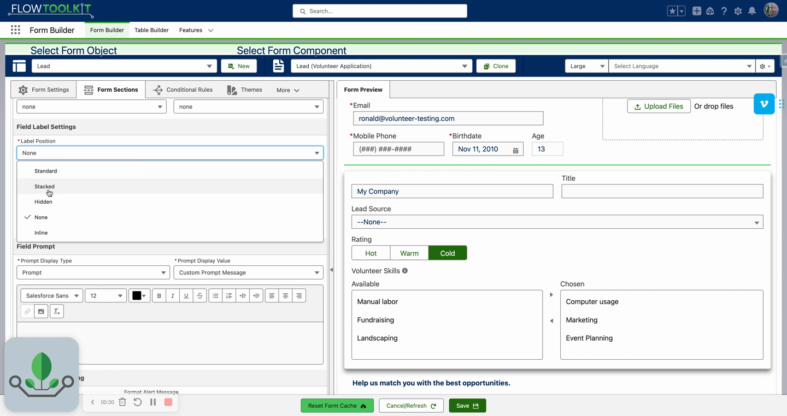
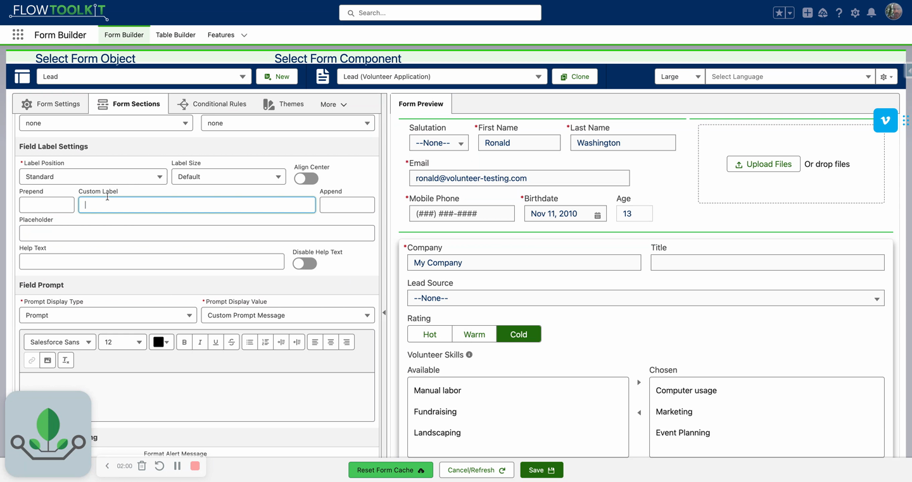
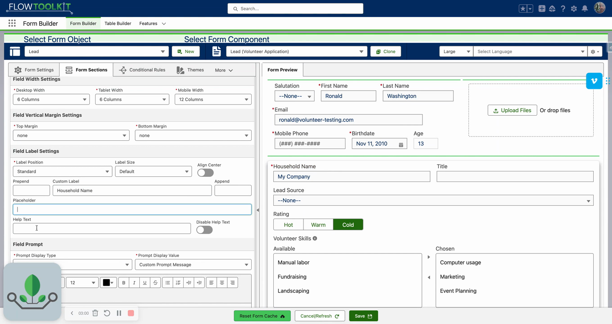

# Field Labels & Help Text
> Customize label position, size, and text — use merge fields for dynamic labels, override help text, and add prepend/append indicators.

## Video Walkthrough



## Overview

Flow Tool Kit gives you full control over field labels and help text. Override the default label from the object schema, change the position, inject dynamic merge fields, add prepend/append text, and customize help text — all from the Form Builder.

## Label Position

| Position | Description |
|---|---|
| **Default / Stacked** | Label above the field (standard) |
| **Inline** | Label to the left of the field |
| **None** | Label hidden entirely |



## Label Size & Alignment

- **Label Size**: Default, Medium, or Large
- **Center Label**: Toggle to center the label text above the field

## Custom Label Override

Type a custom label to replace the one from the object schema. The field still maps to the original object field.


Salesforce limits field labels to 40 characters. The custom label override **removes this limitation** — enter labels of any length.


### HTML in Labels

Custom labels support HTML for styling. For example:
```html
<span style="color:red">Required: Household Name</span>
```

This also works with custom stylesheet injection via static resources for org-wide label styling.

## Merge Fields

Use `{{fieldName}}` syntax in labels, placeholders, and help text to inject live values from other fields on the form.

| Merge Field | What It Injects |
|---|---|
| `{{FirstName}}` | Current value of the FirstName field (updates in real-time as the user types) |
| `{{Label}}` | The field's schema label (from the object definition) |
| `{{HelpText}}` | The field's schema help text |



### Common Merge Field Patterns

**Placeholder-as-Label**: Set label position to **None** and use `{{Label}}` as the placeholder text. The label appears inside the input field and disappears when the user starts typing.

**Help Text as Label**: Use `{{HelpText}}` in the custom label to display the field's help text as the label. This is useful for Translation Workbench users — help text fields support longer descriptions than labels, and translations apply automatically.

## Prepend & Append Text

Add text or symbols before or after the input field:

- **Prepend Text**: Displayed before the input (e.g., `$` for currency fields)
- **Append Text**: Displayed after the input (e.g., `%` or unit abbreviations)



## Help Text

By default, help text comes from the object schema and displays as a tooltip icon.

| Setting | Description |
|---|---|
| **Custom Help Text** | Override the schema help text with custom text |
| **Disable Help Text** | Toggle to hide the help text tooltip entirely |

### Help Text + Merge Fields

Use `{{HelpText}}` in a custom label or prompt message to repurpose the schema help text. Combined with **Disable Help Text**, this moves the help text from a tooltip to the label or prompt — making it always visible.

## Tips & Considerations

- **Merge fields are live** — `{{FirstName}}` updates in real-time as the user types in the FirstName field. This enables personalized labels and prompts.
- **Translation Workbench compatibility** — the `{{HelpText}}` merge field pattern lets you use longer, translatable descriptions from the help text field as labels, with automatic translation support.
- **HTML requires care** — while HTML in labels is powerful, use it sparingly. Broken HTML tags can affect form rendering.
- **Prepend/Append vs. Label** — use prepend/append for short indicators ($, %, units). Use custom labels for longer descriptive text.

## Related Pages

- [Input Field Configuration](input-field-configuration.md) — field configuration overview
- [Prompt Messages](prompt-messages.md) — rich text prompts on field focus
- [Themes, Labels & Styling](themes-labels-styling.md) — theme-level label and translation configuration
- [Field Width & Responsiveness](field-width-responsiveness.md) — label position affects layout at different widths
