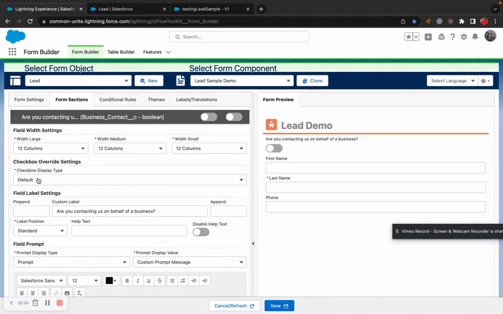
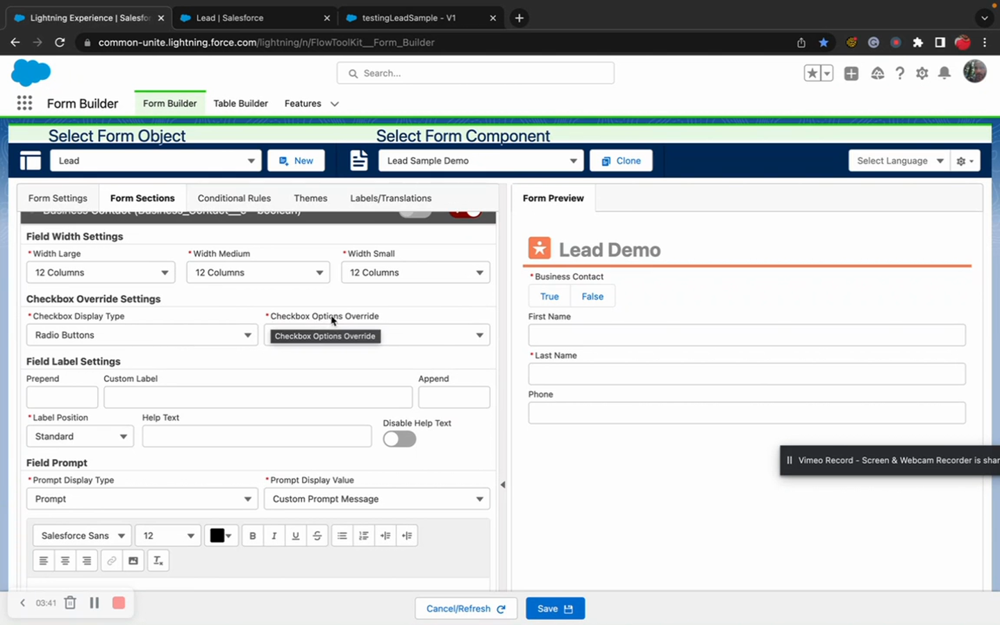
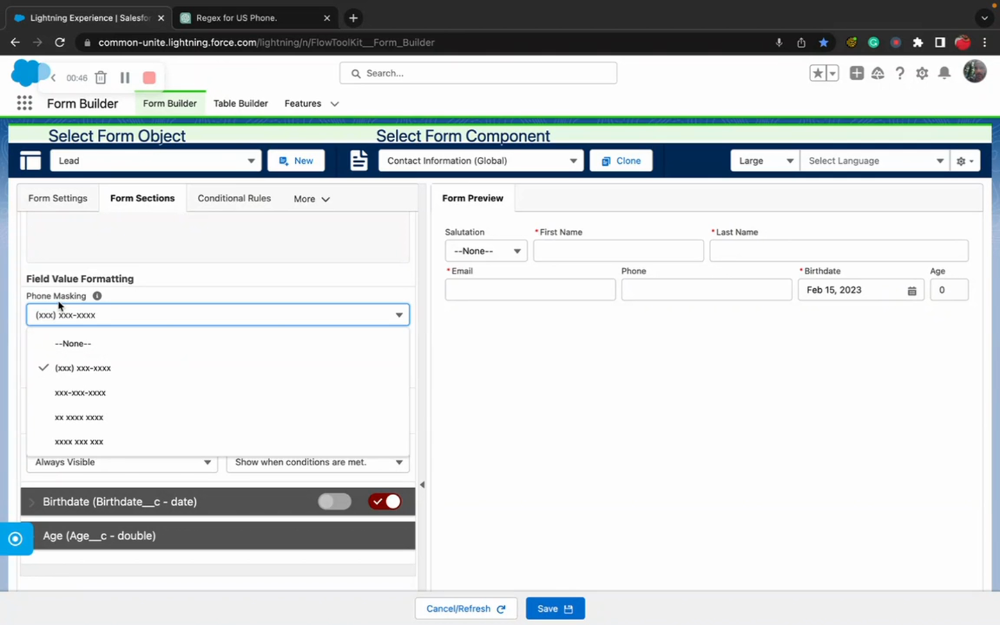
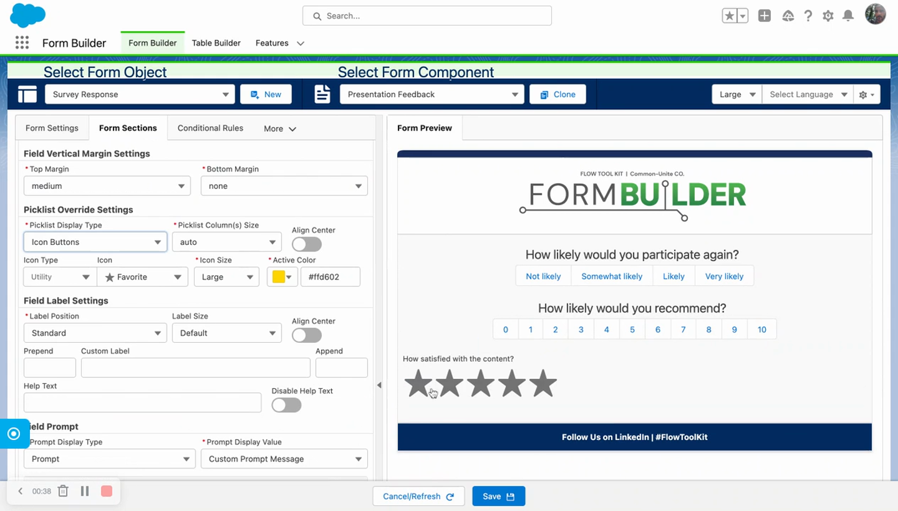
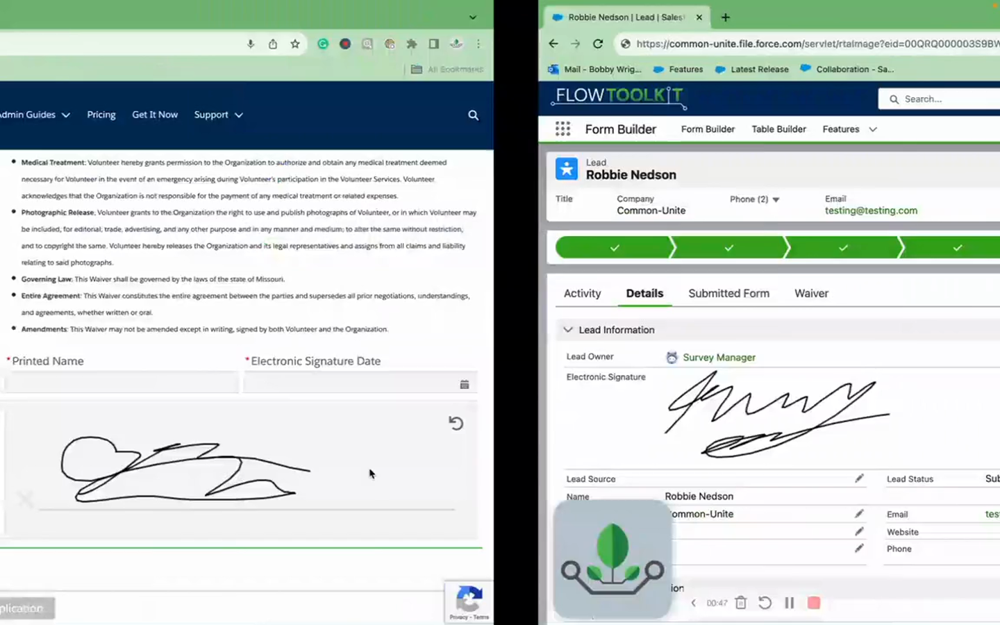
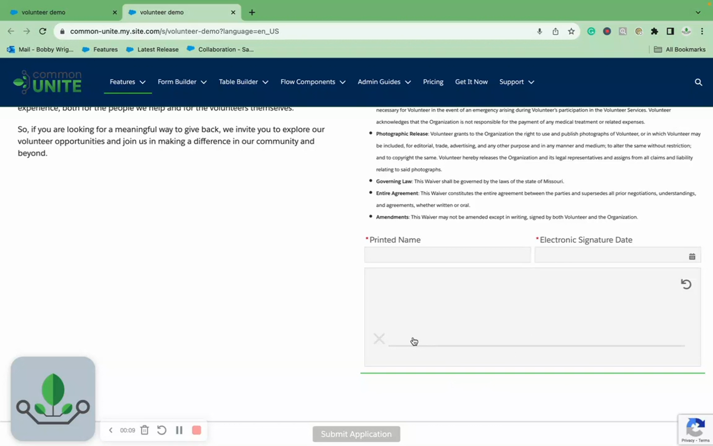

# Field Type Settings
> Configure display overrides and type-specific settings for boolean, phone, string, textarea, checkbox, picklist rating, and signature pad fields.

## Video Walkthroughs





## Overview

Flow Tool Kit lets you override how standard Salesforce field types display on your forms. Convert a boolean toggle into radio buttons, transform a picklist into a star rating, or turn a rich text field into a signature pad — all through the Form Builder without code.

## Boolean / Checkbox Fields

By default, boolean fields display as a modern **toggle switch**. You can override the display type in the field's **Checkbox Override Setting**:

| Display Type | Description |
|---|---|
| **Toggle** (default) | Modern toggle switch component |
| **Checkbox** | Traditional small checkbox |
| **Picklist** | Dropdown with True/False options |
| **Radio** | Radio button group with True/False options |
| **Buttons** | Button group (same as picklist button overrides) |

### Custom True/False Labels

When using Picklist, Radio, or Buttons display types, you can override the option labels:

- **True Label Override** — e.g., "Yes", "Agree", "Accept"
- **False Label Override** — e.g., "No", "Disagree", "Decline"

The underlying value is always boolean `true`/`false` regardless of the display label.

### Making Booleans Required

The toggle and checkbox display types have a UX limitation with required fields — they default to `false`, so "required" effectively means "must be true." Use the **Picklist** or **Radio** display type instead: the field loads with no value selected, so requiring a selection forces an intentional choice between true and false.

## Phone Fields



### Phone Masking

Phone masking is **enabled by default** with US standard format: `(XXX) XXX-XXXX`. Users type digits only — parentheses, spaces, and dashes are inserted automatically.

### Phone Mask Formats

| Format | Example |
|---|---|
| US Standard (default) | `(555) 555-5555` |
| Dashes Only | `555-555-5555` |
| Additional formats | Available in the Phone Masking picklist |
| None | Disables masking — accepts any input |

### Phone Validation

- **With masking enabled**: Min/max length is enforced automatically. Users cannot submit a partial phone number.
- **With masking disabled**: Use the **Field Format (Regular Expression)** field and **Custom Formatting Alert Message** for custom phone validation.
- **Placeholder**: Set a placeholder matching the mask pattern (e.g., `(555) 555-5555`) so users know the expected format.


If you need a phone format not in the list, contact Common Unite to request new masking formats in a future release.


## String & Email Fields



### Length Validation

- **Minimum Length**: Validates on blur — shows "entry is too short" error if below the minimum.
- **Maximum Length**: Defaults from the object schema. Can be overridden to a shorter value. Input stops at the limit — users cannot type beyond it.

### Regex Pattern Validation

Enter a regular expression in **Field Format** and a user-friendly message in **Custom Formatting Alert Message**. The error displays when the value doesn't match the pattern on blur.

**Example**: Email field with regex `.*@salesforce\.com` shows "You must provide a Salesforce email" when a non-Salesforce email is entered.

## Text Area & Long Text Area Fields



- **Character Counter**: Automatically displays as the user types (e.g., "7 of 200"). No configuration needed.
- **Minimum / Maximum Length**: Same as string fields. Override the schema default maximum to a lower value.
- **Custom Height**: Set a CSS height value (e.g., `250px`) in the **Height** field to control the initial textarea size. Users can still manually resize.

## Picklist Rating Selector



Convert any picklist field into an interactive star/icon rating selector by selecting **Icon Buttons** as the display type override.

### Rating Configuration

| Setting | Description |
|---|---|
| **Selected Icon Color** | Color of selected icons (e.g., green, gold) |
| **Icon Size** | Size of the rating icons |
| **Icon Type** | Which icon to use: star/favorite (default), smiley faces, etc. |
| **Label Alignment** | Center, left, or right alignment of the question text |
| **Label Size** | Adjustable label size to emphasize the question |

The number of icons matches the number of picklist values. Hovering over an icon shows the picklist value label. Selecting an icon lights it up along with all icons to its left (standard rating behavior). The underlying data is still a standard picklist value, integrating with Salesforce reporting.

## Signature Pad



Convert a **Rich Text** field into a drawable signature pad for collecting e-signatures.

### Configuration

1. Create a **Rich Text** field on the object (e.g., label it "E-Signature").
2. Add the field to your form in Form Builder.
3. Open the field customization > **Rich Text Override Settings**.
4. Toggle on **Signature Pad**.

### How It Works

- Users draw their signature directly on the pad.
- On save, the signature is stored as an **image file** inside the rich text field.
- The signature is visible on Salesforce record page layouts.
- External document generation tools can access the image from the rich text field.
- You can toggle between Signature Pad and Rich Text display modes without losing data.

## Tips & Considerations

- **All overrides are purely visual** — the underlying Salesforce field type and data format don't change. A boolean displayed as "Yes/No" radio buttons still stores `true`/`false`.
- **Signature pad requires a Rich Text field** — this is not available on other field types.
- **Phone masking is enabled by default** — turn it off explicitly if you don't want auto-formatting.
- **Rating selectors work with any picklist** — the number of icons matches the number of picklist values automatically.

## Related Pages

- [Input Field Configuration](input-field-configuration.md) — field configuration overview
- [Field Validation](field-validation.md) — min/max, regex, required rules
- [Field Labels & Help Text](field-labels-help-text.md) — label customization
- [Conditional Logic](conditional-logic.md) — show/hide/require/disable rules
