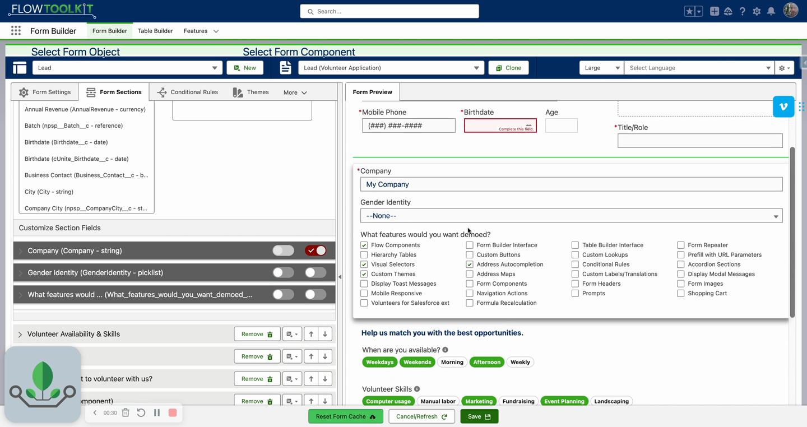
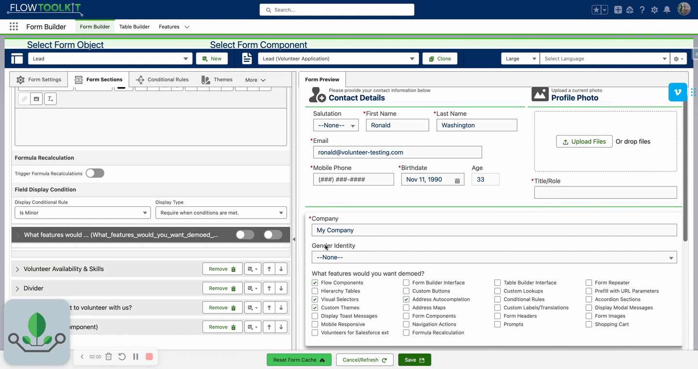
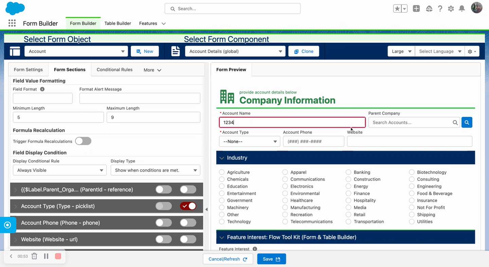
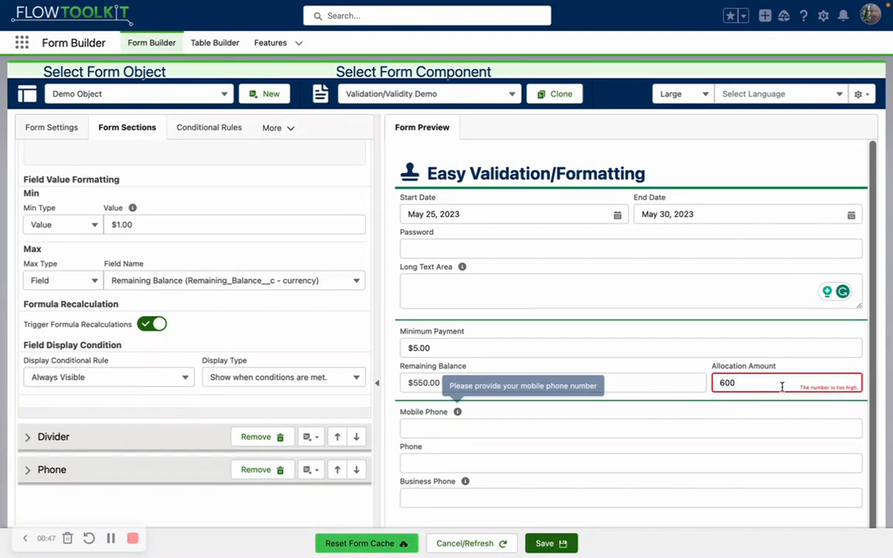
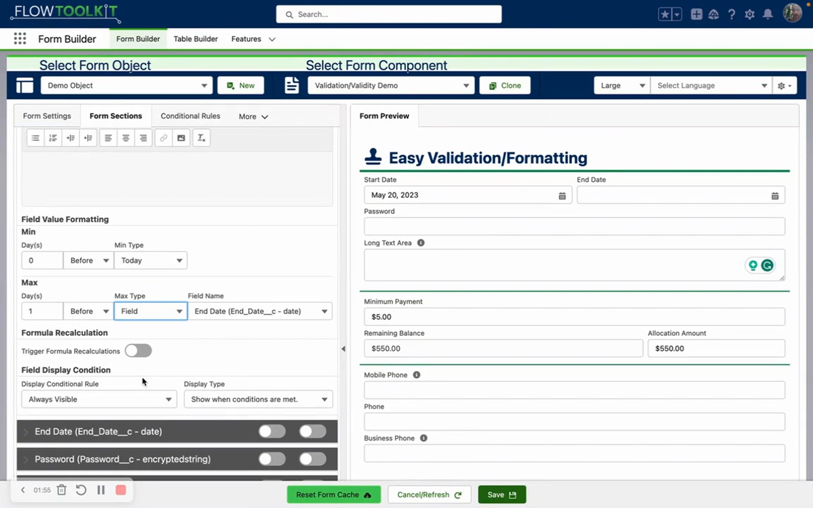
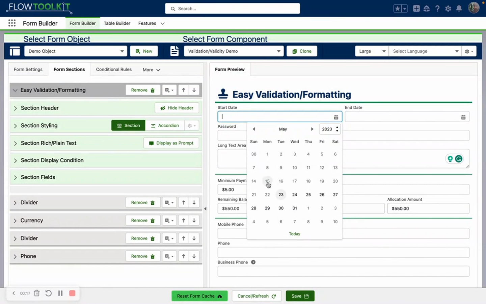

# Field Validation
> Enforce required fields, read-only states, minimum/maximum values, and regex patterns — manually or dynamically through conditional rules.

## Video Walkthroughs





## Overview

Flow Tool Kit provides field-level validation that goes beyond standard Salesforce validation rules. Set fields as required or read-only, define min/max constraints for text length, number values, and date ranges, and apply regex patterns — all configured in Form Builder with real-time client-side enforcement.

## Required & Read-Only Fields

### Manual Toggles

Each field has **Required** and **Read Only** toggles in its customization panel:

- **Required**: Prevents form submission until the field has a value. Shows a validation error if left blank.
- **Read Only**: Displays the field value but prevents editing. Useful for showing calculated or prefilled data.


**System-required fields** (fields marked required at the object schema level, e.g., Company on Lead) **cannot** be made optional. The required toggle is locked.


### Conditional Required / Disabled

Fields can be dynamically required or disabled based on conditional rules:

1. Open a field's customization panel.
2. Navigate to **Display Conditional Rules**.
3. Select a conditional rule (e.g., "Is Minor").
4. Choose the action: **Require** or **Disable** (in addition to the standard Hide/Show).

**Example**: A Date of Birth field triggers an "Is Minor" rule. When the date indicates a minor, the Guardian Name field becomes required automatically.

### Read-Only Behavior

- Multi-select picklist fields displayed as read-only show **only the selected values** (not the full option list) — useful for displaying completed form results.
- Conditional rules can combine with manual settings: a field can be normally optional but become required based on another field's value.

## Text Length Validation (String, Email, TextArea)



### Minimum Length

Set a minimum character count. When the user enters fewer characters and leaves the field, a "too short" validation error displays.

### Maximum Length

By default, the maximum is inherited from the object schema (e.g., 80 characters for Account Name). You can override it to a **shorter** value — the object schema maximum is the hard ceiling and cannot be exceeded.

When the user reaches the maximum, input stops — they cannot type beyond the limit.

### TextArea Character Counter

Text area and long text area fields automatically display a character counter as the user types (e.g., "7 of 200"). No configuration needed — the counter appears automatically.

You can also set a custom **height** (CSS value, e.g., `250px`) to control the initial textarea size. Users can still manually resize.

## Number and Currency Validation



Number and currency fields support min/max validation with two modes:

| Mode | Description |
|---|---|
| **Specific Value** | A hard-coded number (e.g., minimum $1, maximum $500) |
| **Field Reference** | Dynamic limit from another field on the same object (e.g., max = Remaining Balance formula field) |

**Example**: An "Allocation Amount" field with max set to reference a "Remaining Balance" formula field. Entering more than the remaining balance shows "this number is too high."

Field-relative validation is dynamic — as the referenced field's value changes, the validation boundary updates automatically.

## Date Validation



Date fields support min/max validation with two modes:

| Mode | Description |
|---|---|
| **Relative to Today** | Days before or after today (e.g., 0 = today, 3 = 3 days ago) |
| **Field Reference** | Another date/datetime field from the same form component |

The date picker visually **greys out** dates outside the valid range, preventing invalid selection. If a user bypasses the picker and enters an invalid date manually, a validation error displays.

**Example**: A Start Date with min = today and max = the End Date field. An End Date with min = the Start Date field. This creates an enforced date range where the start can never exceed the end.

## Regex Pattern Validation

String and email fields support **regular expression** validation:

1. Enter a regex pattern in the **Field Format (Regular Expression)** field.
2. Enter a **Custom Formatting Alert Message** — the user-friendly error shown when the value doesn't match.

**Example**: An email field with regex `.*@salesforce\.com` and message "You must provide a Salesforce email address."

## Phone Validation

When **phone masking** is enabled (default), min/max length validation is enforced automatically — users cannot submit a partial phone number.

When masking is disabled, use regex validation for custom phone format enforcement. See [Field Type Settings](field-type-settings.md) for phone masking details.

## Tips & Considerations

- **Client-Side Enforcement**: All validation runs in the browser in real-time — no server round-trips for basic checks.
- **Object Schema Safety**: The Form Builder never allows a maximum length to exceed the object schema's limit. If you try, it warns you and caps the value.
- **Conditional + Manual**: Conditional required/disabled rules work alongside manual toggles. A field can be manually optional but conditionally required.
- **Formula Fields as Boundaries**: Formula fields make excellent min/max references for number validation — combine with [formula recalculation](formula-recalculation.md) for real-time feedback.

## Related Pages

- [Input Field Configuration](input-field-configuration.md) — field configuration overview
- [Field Type Settings](field-type-settings.md) — per-type display overrides
- [Formula Recalculation](formula-recalculation.md) — live formula updates
- [Conditional Logic](conditional-logic.md) — show/hide/require/disable rules
