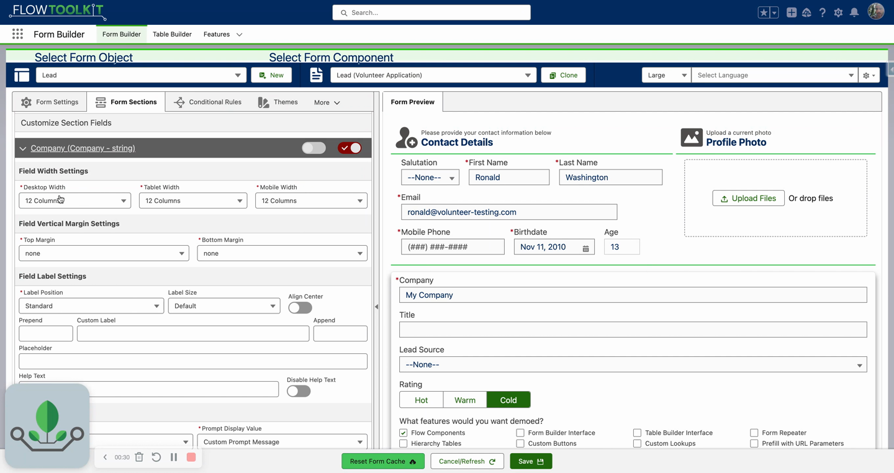
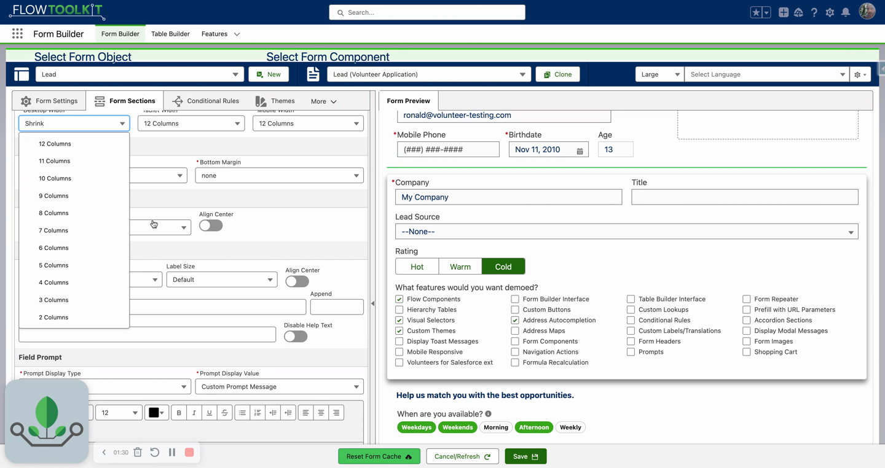

# Field Width & Responsiveness
> Control field widths across desktop, tablet, and mobile using a 12-column grid system with real-time preview.

## Video Walkthrough



## Overview

Flow Tool Kit uses a 12-column grid system to control field widths. Each field can have independent width settings for desktop, tablet, and mobile breakpoints. Fields automatically stack and reflow based on the available width, and you can preview all breakpoints directly in Form Builder.

## Width Settings

Each field has three width properties:

| Setting | Description | Default |
|---|---|---|
| **Desktop Width** | Column count for large screens (1-12) | 12 (full width) |
| **Tablet Width** | Column count for medium screens (1-12) | 12 (full width) |
| **Mobile Width** | Column count for small screens (1-12) | 12 (full width) |

**Column values**: 12 = full width, 6 = half width, 4 = one-third, 3 = one-quarter.

### Side-by-Side Fields

Set two fields to 6 columns each to align them side by side on desktop. For example, First Name (6) and Last Name (6) appear on the same row.

### Mobile Stacking

Mobile width typically stays at 12 (full width) so fields stack vertically on small screens. This is the default and recommended behavior for mobile.

## The Shrink Option

The **Shrink** width option auto-collapses a field to its minimum content width rather than stretching to fill the column.

- Works well with **picklist button** display types — buttons shrink to fit their labels
- Does **not** work well with multi-select checkboxes — use a specific column count instead (e.g., 8)

## Previewing Responsiveness

Use the **preview size toggle** at the top of the Form Builder to switch between:

- **Large** — desktop view
- **Medium** — tablet view
- **Small** — mobile view

Test all three breakpoints directly in the builder without needing a real device.

## Tips & Considerations

- **12 columns = full width** of the form component, not the page. If the form component itself is in a narrow container, 12 columns fills that container.
- **Fields wrap automatically** — if two fields at 6 columns don't fit on one row (e.g., on mobile), they stack vertically.
- **Consistent widths** — set all fields in a row to the same tablet and mobile width for consistent stacking behavior.
- **Shrink for buttons** — the Shrink option is ideal for picklist button display types where you want compact buttons rather than full-width ones.

## Related Pages

- [Input Field Configuration](input-field-configuration.md) — field configuration overview
- [Field Type Settings](field-type-settings.md) — display overrides for specific field types
- [Field Labels & Help Text](field-labels-help-text.md) — label positioning affects layout
