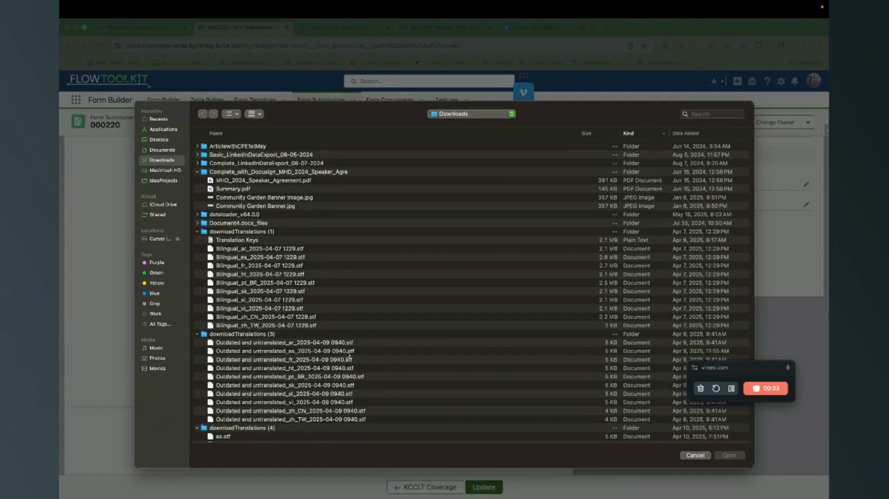
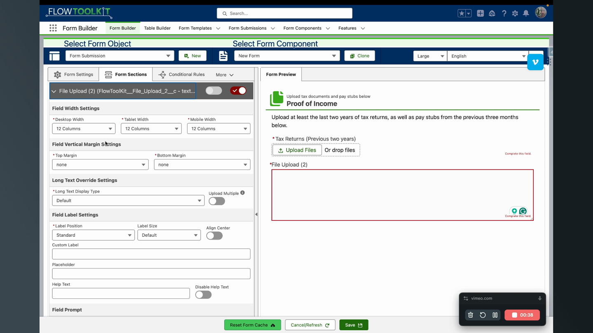
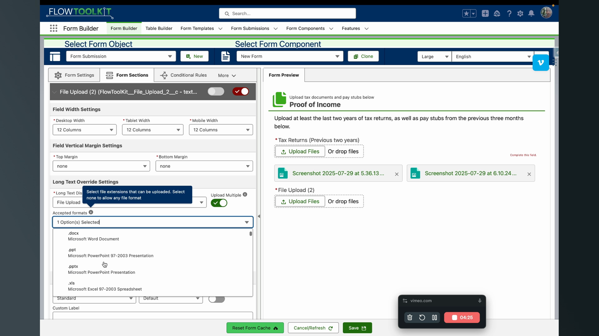
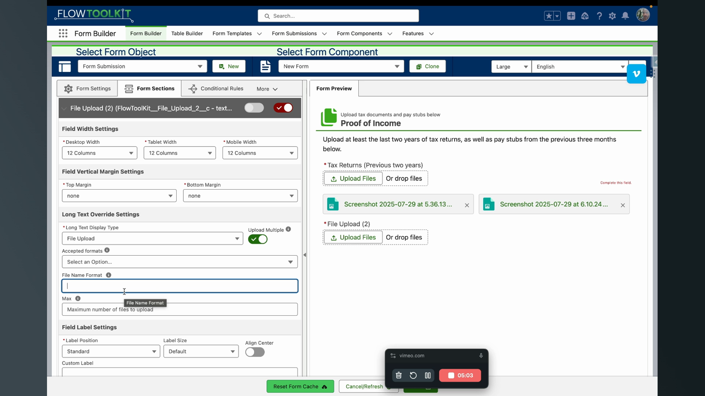
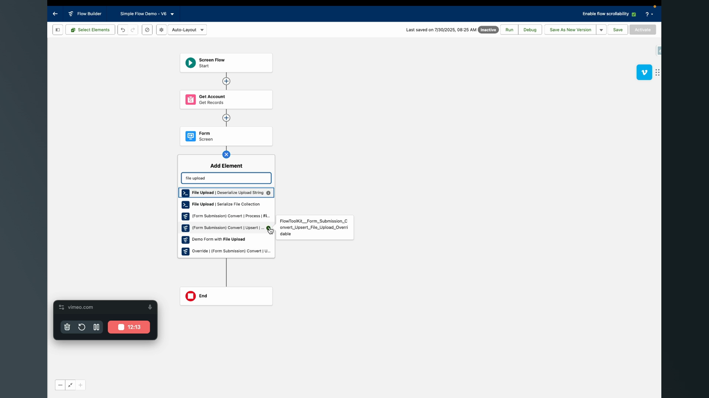

# File Uploads
> Collect file uploads on forms using long text area fields — with multi-file support, type restrictions, custom naming, and automated file linking.

## Video Walkthroughs





## Overview

Flow Tool Kit enables file uploads on any form by converting a Long Text Area field into a file upload control. Uploaded files are stored as Salesforce ContentDocuments, and the file metadata (document ID, content version ID, file name, type) is stored as JSON in the long text area field. A reusable subflow ships with Flow Tool Kit to handle post-submission file linking.




## Configuration

### Basic Setup

1. Create a **Long Text Area** field on your object (e.g., "File 1", "File 2" on the Form Submission object).
2. Add the field to your form in Form Builder.
3. Open the field's properties and find **Long Text Area Display Type**.
4. Select **File Upload**.
5. Optionally set a custom label and toggle **Required**.




### Advanced Options

| Setting | Description |
|---|---|
| **Upload Multiple** | Toggle to allow multiple files per field |
| **Maximum Number of Files** | Cap how many files when multiple is enabled (upload button disappears at limit) |
| **Accepted File Types** | Multi-select to restrict uploadable types (e.g., PDF, JPEG only — other types greyed out in picker) |
| **Default Document Title** | Custom naming with merge field support (e.g., `Pay Stub ({{fileName}})`) |
| **Required** | Enforce file upload before form submission |





## How It Works

### Upload Process

1. User clicks the upload button.
2. File is **instantly created** as a Salesforce ContentDocument and ContentVersion.
3. A file card displays with the file name and a clickable link.
4. User can remove and replace the file.
5. JSON metadata is stored in the Long Text Area field:

```json
{
  "documentId": "069...",
  "contentVersionId": "068...",
  "name": "application.pdf",
  "type": "pdf",
  "isDeleted": false,
  "isProcessed": false
}
```

### File Removal (Soft Delete)

When a user removes a file in the form UI, the ContentDocument is **not** deleted from Salesforce. Instead, `isDeleted: true` is set in the JSON. Your flow logic decides whether to actually delete the file or just unlink it.

## Post-Submission Processing

Use the **Upsert File Upload Override** subflow (ships with Flow Tool Kit) to process uploaded files after form submission:



### Subflow Inputs

| Input | Description |
|---|---|
| **Field Name** | The field API name (for debugging) |
| **JSON String** | The JSON metadata from the file upload field |
| **Linked Record ID** | Record to link the file to (single ID or collection) |

### What the Subflow Does

1. Deserializes the JSON metadata
2. Creates ContentDocumentLinks to the specified record(s)
3. Deletes files marked with `isDeleted: true`
4. Returns a "processed" tag to stamp back into the long text field

## Guest User Considerations

File uploads work in guest user context:
- Files upload successfully and metadata is stored
- However, the clickable file link **does not work** for guest users because they cannot access ContentDocument records
- Files can be processed internally/asynchronously after submission

## Tips & Considerations

- **One Long Text Area per file field** — each file upload needs its own Long Text Area field on the object. You can have as many as needed.
- **Save progress support** — previously uploaded files are retained when a form with save progress reloads.
- **PDF generation** — uploaded files appear as clickable links in generated PDFs.
- **Inspect JSON during development** — toggle the field between "File Upload" and "Default" long text area view to see the raw JSON.
- **Multiple record linking** — pass a collection of record IDs to the subflow to link files to multiple records at once.

## Related Pages

- [How To: Set Up File Uploads](../how-to-guides/set-up-file-uploads.md) — step-by-step how-to guide
- [Input Field Configuration](input-field-configuration.md) — field configuration overview
- [Form Submissions](../form-template-framework/form-submissions.md) — submission processing
