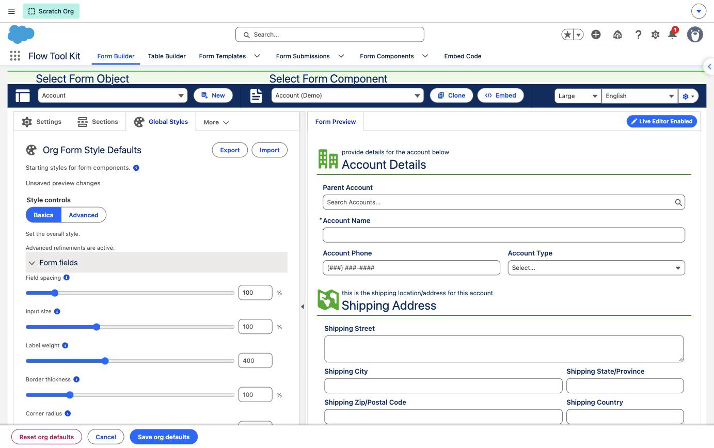
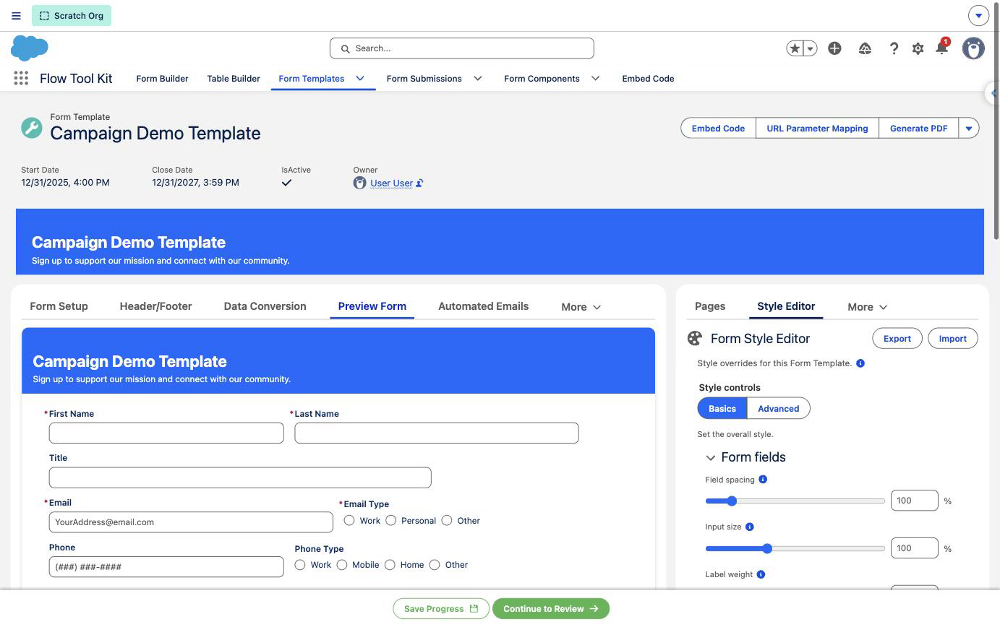
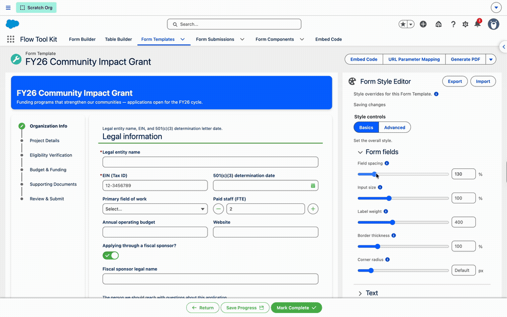
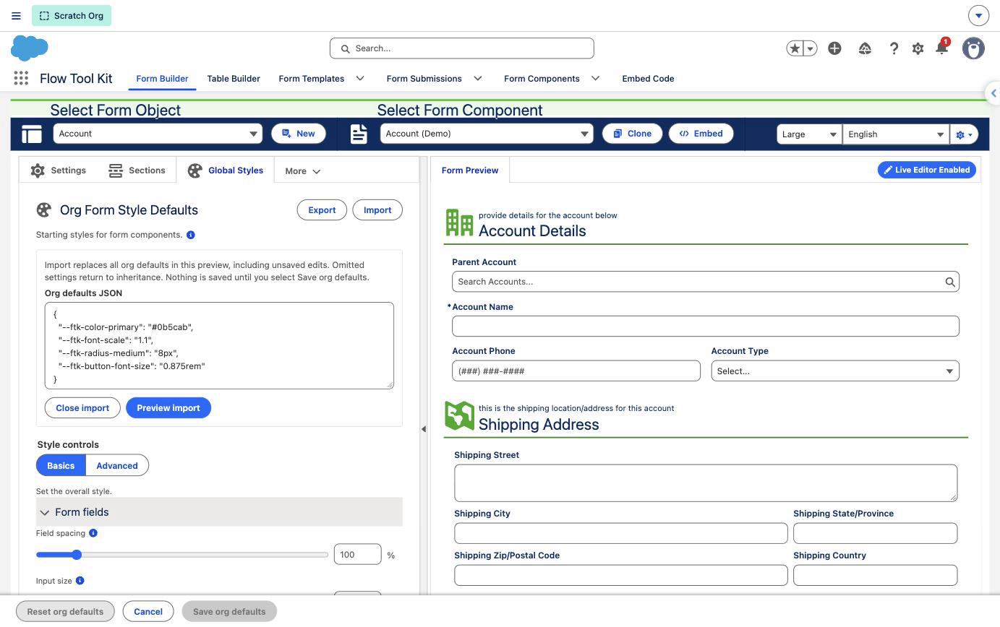
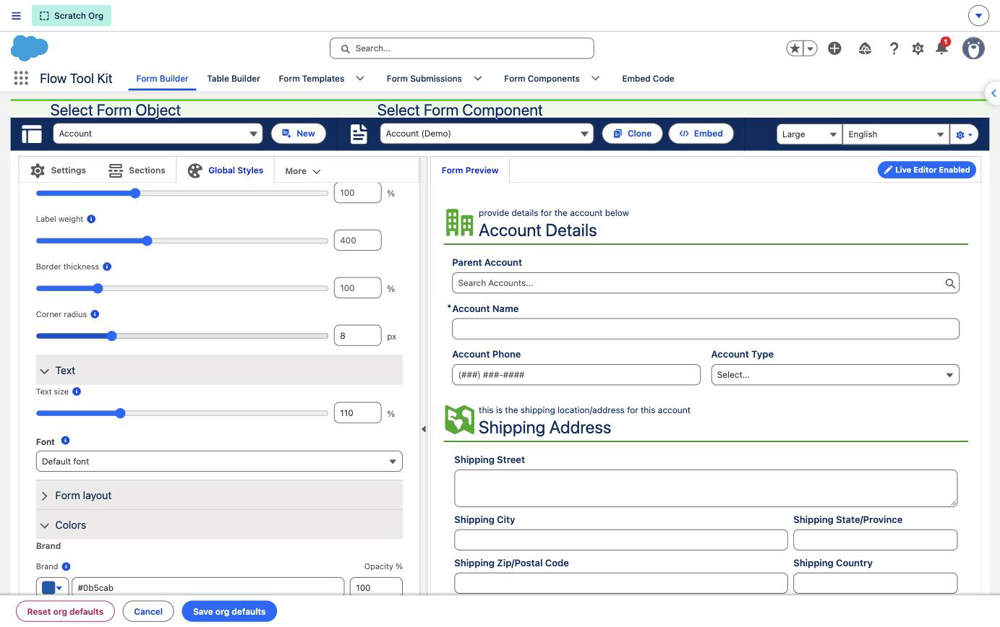
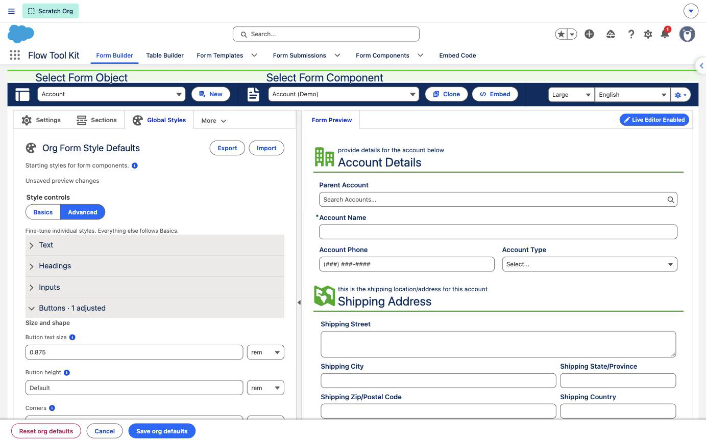

# Form Styles: Org Defaults and Template Overrides

> Set one look for every form in your org, make a single Form Template different, and fine-tune the details, all without writing code.

Form Styles is a visual editor. You move a slider or pick a color, the preview changes, and the saved result applies to your forms. It appears in two places:

- **Global Styles**, a tab in Form Builder, sets the **org defaults**: the look every form starts from.
- **Style Editor**, a tab on a Form Template record, changes that one template only.

Themes and stylesheets you already use keep working alongside it.

| If you want to | Read |
| --- | --- |
| Change how forms look without code | This page. The quick start below takes five steps |
| Write a stylesheet, or look up the code name of a setting | [CSS Style Token Reference](style-token-reference.md) and [Custom Styling Overview](custom-styling-overview.md) |
| Understand a theme you already use | [Themes, Labels & Styling](themes-labels-styling.md) |

## Quick start

**Before you start:** you need the **Form Style Defaults Manager** permission set and the **Customize Application** permission. Without the permission set, the Global Styles tab does not appear.

1. In the **Flow Tool Kit** app, open **Form Builder** and select any form component. It is only there to give you a preview.
2. Open the **Global Styles** tab. It is the last tab and may sit under **More**.
3. Under **Colors**, choose a **Brand** color. The preview updates.
4. Select **Save org defaults** in the bar at the bottom of the page.
5. To make one template different, open the **Form Template** record, open the **Style Editor** tab in the right sidebar and change a setting. It saves by itself.

Opening the editor changes nothing. Your forms change only when something is saved.

A saved style reaches every form that has no theme of its own, and every form on the theme that comes with the package, **Form Default**. A form on a theme you created keeps the colors that theme sets. See [How the layers combine](#how-the-layers-combine).

## Words used on this page

| Word | Meaning |
| --- | --- |
| **Global Styles** | The Form Builder tab where you edit the org defaults |
| **Org defaults** | The styles saved in Global Styles. Every form starts from them |
| **Template overrides** | Styles saved on one Form Template. They replace the matching org defaults for that template only |
| **Basics** and **Advanced** | The two tabs inside the editor. Basics has the broad controls. Advanced has one control for each detail, and a detail set there wins over Basics |
| **Inherit** | A setting left blank uses the value from the level below it. A template inherits from the org defaults. The org defaults inherit from Salesforce or your site |
| **Classic Theme** | The theme records you select in Form Builder or on a template |
| **Token** | The code name of a setting, used by developers in stylesheets. You do not need tokens to use the editor |

## Choose where to edit

| | Global Styles | Style Editor |
| --- | --- | --- |
| **Where** | Form Builder → **Global Styles** tab | Form Template record → **Style Editor** tab in the right sidebar |
| **What it changes** | The org defaults, for every form | That template only |
| **How it saves** | **Save org defaults**, in the bar at the bottom of the page | By itself, about two seconds after your last change |
| **Undo an edit** | **Cancel**, before you save | Change the setting back, or clear it |
| **Start over** | **Reset org defaults** | **Reset to org defaults** |
| **Who can use it** | The **Form Style Defaults Manager** permission set, plus **Customize Application** to save | Anyone who can edit the template. The **Form Builder (Administrator)** and **Form Builder (Manager)** permission sets include the field it saves to, **Style Overrides** |

In Form Builder, selecting a different form component changes the preview, not what you are editing. Saving in Global Styles always saves the org defaults.

## Where saved styles show up

| Where the form runs | Org defaults | Template overrides |
| --- | --- | --- |
| **Form (Template)**, and every component inside it | Yes | Yes |
| **Form (Component)** on a Flow screen, a Lightning page or an Experience Cloud page | Yes | Does not apply |
| **Form (Repeater)**, **Form (Table)** and **Form (Calendar/Scheduler)** on a Flow screen | Yes | Does not apply |
| **Form (Header)** and **Form (Illustration)** on a Flow screen | Yes. An illustration follows the fonts only | Does not apply |
| **Form (Header)** or **Form (Illustration)** placed directly on an Experience Cloud page, outside a Flow | No | Does not apply |
| The form preview in Form Builder | Yes, including edits you have not saved yet | Does not apply |
| Form Builder's own toolbars and editors, the setup forms on the Form Template pages, and the Salesforce page around a form | No | No |

Saved styles work in Lightning Experience, on Experience Cloud sites and on the embed page. A few settings behave differently on LWR sites; see [Limits](#limits).

A form already open in another browser tab keeps its old look until you reload it.

## Set the org defaults

1. Open **Form Builder** and select a form component that is typical of your forms.
2. Open **Global Styles**.
3. Adjust **Basics** first. A slider updates the preview as you drag it. A typed value updates it when you press Tab or Enter.
4. Open **Advanced** when one detail needs its own value, such as button text size.
5. Select **Save org defaults** in the bar at the bottom of the page. A confirmation message appears.

While Global Styles is open, the bottom bar shows **Reset org defaults**, **Cancel** and **Save org defaults** in place of the form's own buttons. **Cancel** puts back the saved values.

Saving the org defaults does not save the form component. Use the form's own Save for layout or field changes.

## Style one Form Template

Your record page may be laid out differently, so the tab names below can differ in your org.

1. Open the **Form Template** record.
2. Open the **Style Editor** tab in the right sidebar.
3. Open the **Preview Form** tab to watch the result.
4. Change only the settings that should differ from the org defaults. For larger text on this template, for example, raise **Text size** under **Text**.

There is no Save button. The editor saves about two seconds after your last change. The line under the editor's title reads **Saving changes**, then **Style overrides saved**. Other templates keep their own settings.

A setting you leave alone keeps inheriting. Opening the editor does not copy the org defaults into the template, so a later change to the org defaults still reaches every setting this template has not changed.

### Add the editor to a custom record page

In Lightning App Builder, add **Form Style Editor** to the sidebar or to a tab of the Form Template record page. Add **Form Style Preview** to the wider main region. Both follow the record you are viewing, so the editor updates the preview on the same page.

The editor's **Top Margin**, **Bottom Margin** and **Horizontal Margin** properties add space around it.

## Clear a setting

Clearing a setting makes it inherit again. How you clear it depends on the control:

| Control | How to clear it |
| --- | --- |
| A slider | Delete the number in the box beside the slider, then press Tab |
| A size or number box | Delete the number, then press Tab |
| A color | Delete the color code in the box beside the swatch, then press Tab |
| A dropdown | Choose the first option: **Default**, **Default font**, **Use org style** or **Use Basics / defaults** |

A blank box is not the same as zero. Blank means "inherit". Zero is a value: a corner radius of 0 gives square corners.

## Start over with Reset

| Button | What it clears | What the forms fall back to |
| --- | --- | --- |
| **Reset org defaults** in Global Styles | Every saved org default | How they look with nothing saved, unless a template has its own styles |
| **Reset to org defaults** in a template's Style Editor | Every style saved on that template | The org defaults |

Both ask you to confirm, take effect at once, and cannot be undone. Each template is reset on its own record; there is no reset for all templates at once.

To keep a copy you can restore later, select **Export** first. See the next section.

## Move styles between orgs

Saved styles are stored as data in each org. A change set or a package deployment does not carry them. Copy them with **Export** and **Import**, the two buttons at the top of both editors.

1. In the source org, save your styles, then select **Export**. The saved settings are copied to your clipboard as a block of text. Edits you have not saved are left out.
2. In the destination org, open the same editor, select **Import** and paste the text.
3. In Global Styles, select **Preview import**, check the form preview, then select **Save org defaults** or **Cancel**. In a template's Style Editor, select **Import styles**; the result saves by itself.

Things to know:

- **An import replaces everything in that editor.** A setting missing from the pasted text goes back to inheriting. Export the destination's own styles first if you want a backup.
- **Templates move one at a time.** Export from one template and import into the matching template in the other org. The same text can also be pasted into a different template to copy its look.
- **Nothing breaks on bad input.** Text that is not a valid export, or that holds a setting or value the editor does not accept, is rejected and nothing changes.
- **The destination needs the same package version or a newer one.** An older version rejects settings it does not have.
- **If the browser blocks the clipboard,** Export shows the text for you to select and copy.
- **Themes and stylesheets are separate.** Classic Themes, stylesheet files and stylesheet mappings are deployed the way you deploy other metadata.

## Basics: the overall look

| Section | Control | What it changes | Range |
| --- | --- | --- | --- |
| **Form fields** | **Field spacing** | The vertical gaps between field rows | 0% to 800% |
| | **Input size** | Inputs, the text typed into them, their inner spacing and icons, plus choice controls and buttons | 50% to 200% |
| | **Label weight** | How bold field labels are. 400 is normal, 700 is bold | 100 to 900 |
| | **Border thickness** | Input, choice, button and section borders | 0% to 500% |
| | **Corner radius** | How rounded the corners of inputs, buttons, choices and containers are | 0 to 32px |
| **Text** | **Text size** | Labels, help text, headings, Stages page text and plain rich text. Text typed into an input follows **Input size** instead | 75% to 200% |
| | **Font** | The font for the whole form. **Sans serif**, **Serif** and **Monospace** work on every device. **Custom font** lets you type the name of a font your site already uses. **Default font** uses the site or Salesforce font | |
| **Form layout** | **Horizontal padding** and **Vertical padding** | The space inside form sections and their headers. A Form Template's own top header keeps its padding | 0 to 128px |
| **Colors** | **Brand** and **Brand text** | Buttons and selected choices, and the text on them | |
| | **Field labels**, **Input text**, **Choice text** | The three kinds of text in a field | |
| | **Form background**, **Card background**, **Input background** | The area behind the form, the cards on it and the inside of inputs | |
| | **Borders** | Field and container borders | |

**What the percentages mean.** 100% is the size a control has with nothing saved. 150% is half as large again. In Global Styles, saving a slider at 100% changes nothing. On a template, 100% sets that template back to the normal size even when the org default is larger; leave the box blank to follow the org default instead.

**Opacity.** Each color has an **Opacity %** box from 0 (see-through) to 100 (solid). Clearing the opacity returns it to 100.

## Advanced: one detail at a time

Advanced adds to Basics. Open only the category you need:

| Category | Examples |
| --- | --- |
| **Text** | Body and input text size, line spacing, label and help text size, help text color |
| **Headings** | Heading font, size and weight, header background, rule color and thickness, shadow, padding, and the Stacked header details |
| **Inputs** | Input height, corners, padding, background, border, input text and placeholder colors, text areas, read-only and rich text fields |
| **Buttons** | Button text size, height, corners and icon button size |
| **Choices** | Answer buttons, visual cards, checkboxes and attestations |
| **Sections** | Frame background, border, corners, shadow, the gap under the header and each padding side |
| **Form card** | Card background, border, corners and shadow |
| **Other components** | Error color, footer, tables, matrix questions, dialogs, dividers and the calendar |

Each category title counts what is set, for example **Buttons · 1 adjusted**. On a template, a second count such as **2 inherited** shows values coming from the org defaults.

Less common settings sit in sections you expand, such as **Text area details**. **Other saved overrides**, at the bottom, lists older or specialized settings that are still saved and still apply.

Examples:

- **Smaller button labels.** Raise **Input size** in Basics, then set **Buttons → Button text size**. Everything else keeps following Basics.
- **Header colors.** Set **Headings → Background** and **Headings → Rule color**. The rule is the line under a header.
- **Text areas.** Set the input background, corners or padding once. Text areas follow until you give them their own value under **Text area details**.
- **Line spacing.** **Text → Line spacing** changes body text, rich text and multi-line inputs. Heading spacing stays as it is.
- **Placeholder text.** Set **Inputs → Placeholder text**, or leave it blank to follow the input text color.

Two words you may see in a box:

- **Mixed** means the control stands for several settings that hold different values. Typing a value sets them all. Leaving it alone keeps the differences.
- **Default** means there is no single number to show, because the value comes from Salesforce or your site.

### Stacked headers and section frames

Under **Headings → Stacked header**, set the title, eyebrow, pretitle, body, tag and footer text sizes, the gaps between lines and the maximum text width. These apply to the Stacked header style only. Clearing a size returns it to the shared heading size.

The **Sections** controls also apply to the Box, Shadow, Card and Title on border frames, and **Frame background** sets the color inside them. Choosing a frame or a header style is still a setting on the form component; the style editor refines how it looks.

Record Picker lookups follow the input settings. They have no category of their own.

### Units

Advanced sizes use **rem**. One rem is the page's normal text size, usually 16px, so a size in rem grows and shrinks with the text size your site or your users choose. You can switch a box to px for a fixed size. Switching between px and rem converts the number for you.

## How the layers combine

When the same setting is given in more than one place, the highest one in this table wins:

| Priority | Source | Meaning |
| --- | --- | --- |
| Highest | A Classic Theme you created, or a setting on the form component | Styling someone chose on purpose for that form or section |
| Next | Template override | Replaces the matching org default for this template |
| Next | Org default | The shared starting value |
| Lowest | Salesforce or site default | Used when nothing above is set |

This works **one setting at a time**. A Classic Theme does not switch the style editor off. Only what that theme actually sets takes priority; everything else still follows the editor. In the same way, a detail set in Advanced wins over the Basics control it would otherwise follow.

**Example.** A Classic Theme sets the header rule to green. A blue rule color in the org defaults and an orange one on the template change nothing on that header. Clear the rule color in the theme and the template's orange shows. Clear the template's and the org's blue shows.

**The Form Default theme is the exception.** It comes with the package and is the starting look of every form nobody themed, so saved styles win over it. Brand, Field labels, the header rule color, header corners, the subtitle color, divider colors and the section frame's border, corners and background all follow the style editor. With nothing saved, the theme's own values show as before. A theme you created, or copied from Form Default, keeps its priority.

A stylesheet a developer added sits below the style editor unless it was written to win. See [Custom CSS still works](#custom-css-still-works).

## Custom CSS still works

Developers can keep using stylesheets, in two ways:

- **A stylesheet for one Form Template**, chosen with the **Style Sheet Selector** on the template's **Form Theme** tab.
- **A stylesheet for every page that shows a form**, set up by a developer in Setup.

A value saved in the style editor normally wins over a stylesheet. A developer can write a stylesheet that wins on purpose, and then the matching control in the editor appears to do nothing. The editor cannot show what a stylesheet sets, so agree who owns each setting: the editor for values an administrator should control, a stylesheet for the rest.

Setup, examples and every token are in [Custom Styling Overview](custom-styling-overview.md) and the [CSS Style Token Reference](style-token-reference.md).

## Limits

- **LWR sites keep two corner settings.** On an Experience Cloud site built on Lightning Web Runtime, such as Build Your Own (LWR), joined answer buttons and the rich text editor keep the site's own corners. **Choices → Answer buttons → Corners** still rounds separated answer buttons there, and **Inputs → Rich-text editor corners** has no effect. Both work in Lightning Experience, on Aura sites and on the embed page. Every other setting works on LWR sites.
- **A Flow on an LWR page needs the FlowToolKit LWR Support component** in the site footer, or on the same page. Without it the Calendar, Repeater and Table components do not load. See [LWR Site Component Support](../experience-cloud/lwr-site-component-support.md).
- **A header or illustration placed directly on a site page** does not follow the org defaults. Inside a Flow on the same page, both do.
- **An illustration title in Lightning Experience** follows Font, not Heading font. Heading font reaches it on the embed page and on Aura and LWR sites.
- **PDFs and Salesforce's own dialogs** are not promised to match the browser exactly. Check them separately.

## Troubleshooting

### A change has no visible effect

Work down this list. The first match is usually the cause.

1. **It is not saved.** In Global Styles, select **Save org defaults**. On a template, wait for **Style overrides saved**.
2. **The page was already open.** Reload the page that shows the form.
3. **The form does not use that control.** Button settings change nothing on a form with no buttons of that kind.
4. **A more specific setting wins.** A value in Advanced beats Basics, and a template override beats the org default. Clear the more specific one. Category titles in Advanced show where values are set.
5. **A theme you created sets it.** Clear that property in the theme, or change it there.
6. **The form component sets it.** A color or style chosen on the component itself wins. Change it on the component.
7. **A stylesheet sets it.** Ask the developer who owns the stylesheet.
8. **It is one of the [Limits](#limits).**

### Other symptoms

| Symptom | Check |
| --- | --- |
| The Global Styles tab is missing | You need the **Form Style Defaults Manager** permission set. On a narrow screen, look under **More** |
| Save org defaults reports a missing permission | Saving also needs **Customize Application**, the same permission Form Builder needs to save a form |
| "Org styles changed since you loaded them" | Another administrator saved first. Reload Form Builder, then make your change again |
| A template change did not save | Wait for **Style overrides saved** under the editor title. If it reports an error, the record was changed elsewhere; reload the page |
| The editor will not switch between Basics and Advanced | One value is invalid. Correct the highlighted field; your other edits are kept |
| Basics changes some components but not others | An Advanced value is set for those components, possibly inherited from the org defaults |
| The template preview differs from Form Builder | Form Builder previews the org defaults. A template adds its own overrides, theme and stylesheet |

Test real forms with filled, empty, required, invalid and read-only fields, at the screen sizes your users have, and in the place the form actually runs.

## Related pages

- [Form Builder](../screen-components/form-builder.md)
- [Form Templates](../form-template-framework/form-templates.md)
- [CSS Style Token Reference and downloads](style-token-reference.md)
- [Custom Styling Overview](custom-styling-overview.md)
- [Themes, Labels & Styling](themes-labels-styling.md)
