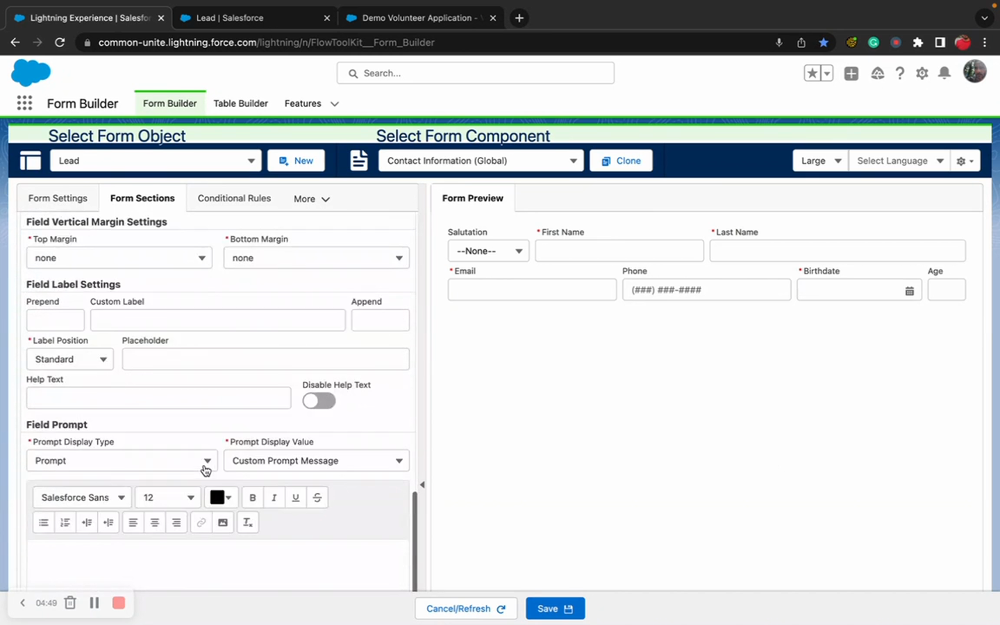
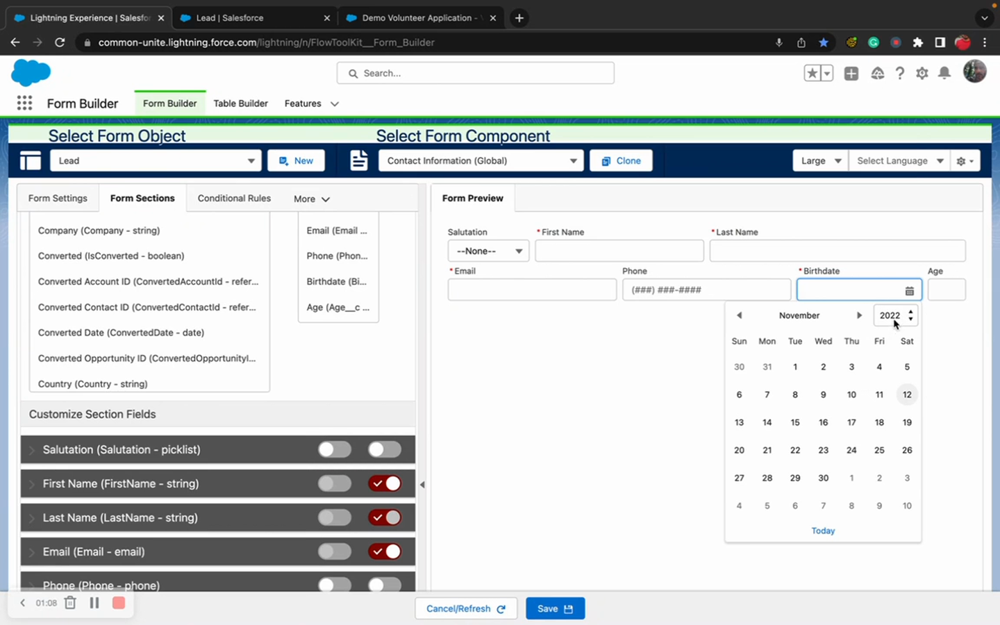
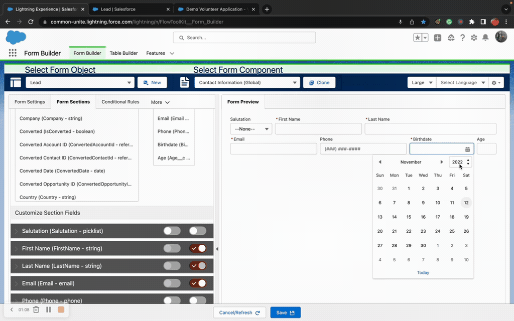

# Formula Recalculation
> Trigger live formula field recalculation on forms as users enter data — enabling real-time calculations, qualification checks, and conditional logic based on computed values.

## Video Walkthroughs







## Overview

Salesforce formula fields normally only recalculate when a record is saved. Flow Tool Kit's formula recalculation feature lets formula fields update **live on the form** as users type — without saving the record first. This enables real-time calculations (income totals, age from birthdate, tax amounts) and conditional logic based on computed values.

## How It Works

1. Formula fields on the form display as **read-only** (they are calculated values).
2. When a user changes a field that has the **Trigger Formula Recalculations** toggle enabled, an Apex callout fires.
3. **All formula fields** on the form recalculate based on the current values.
4. The updated formula values can drive conditional logic, showing or hiding other form components in real-time.

## Configuration

1. Create a **formula field** on the object (e.g., Age calculated from Birthdate, Total Income from multiple currency fields).
2. Add the formula field and its **input fields** to the form in Form Builder.
3. Open each **input field** that participates in the formula (not the formula field itself).
4. Find the **Formula Recalculation** section in the field's properties.
5. Enable the **Trigger Formula Recalculations** toggle.


Enable the toggle on the **input fields** that feed into the formula — NOT on the formula field itself.


## Common Patterns

### 1. Age Calculation
A Birthdate field triggers recalculation of an Age formula field. Combined with a conditional rule ("Is Minor" = Age < 18), this dynamically shows a Parent/Guardian Waiver section for minors and a standard Waiver section for adults.

### 2. Income Qualification
Multiple income fields (disability, retirement, wages) trigger recalculation of a Total Monthly Income formula. A conditional message shows whether the applicant qualifies for a program based on household size and income thresholds.

### 3. Reusable Calculator Component
Build a calculator form component (e.g., Monthly Household Income) and reference it from multiple program application forms using a Form Component Section. Update the formula in one place and all forms using it are instantly updated.

### 4. Running Totals
Currency fields in an allocation form trigger recalculation of a remaining balance formula. Combined with [number field validation](field-validation.md), prevent users from allocating more than is available.

## Tips & Considerations

- **Be selective**: Only enable the toggle on fields that actually feed into formulas. Each recalculation triggers an Apex callout — don't enable it on every field.
- **Formula fields are read-only**: They display their calculated value on the form but cannot be edited by the user.
- **Cross-component reactivity**: Formula changes in one form component can trigger conditional logic in other flow components on the same screen.
- **Works everywhere**: Formula recalculation works in both internal Flow screens and Experience Cloud sites.
- **Conditional rules**: Recalculated formula values can be used as conditions for conditional logic rules — show/hide sections based on computed values.

## Related Pages

- [Input Field Configuration](input-field-configuration.md) — field configuration overview
- [Field Validation](field-validation.md) — min/max validation using formula fields as boundaries
- [Conditional Logic](conditional-logic.md) — rules that can reference formula field values
- [Form Components System](form-components-system.md) — reusable components for calculator patterns
