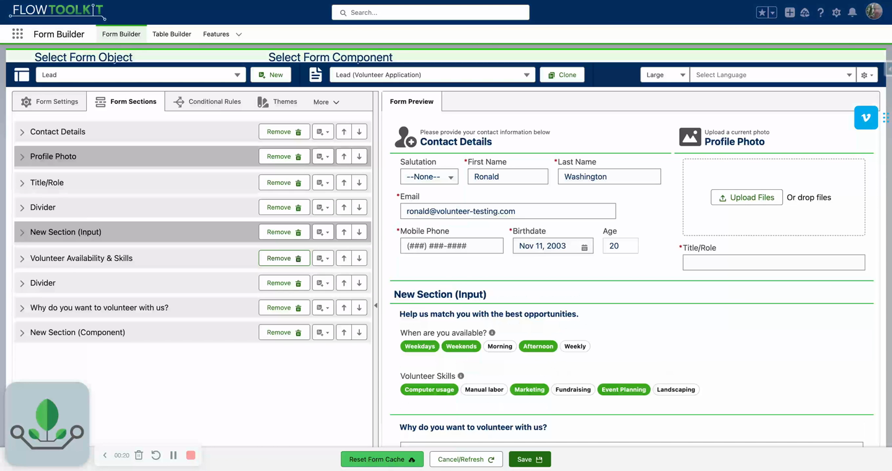

# Input Field Configuration
> Add, arrange, and customize individual fields on your form components — controlling display, validation, labels, and more.

## Video Walkthrough



## Overview

Every field on a Flow Tool Kit form starts from the object schema — labels, help text, and required status are inherited automatically. From there, you can customize each field's display, validation, labels, width, prompts, and behavior through the Form Builder without writing code.

This page introduces the input field configuration system. Detailed configuration for specific features is covered in dedicated pages linked below.

## Adding Fields to a Form

1. Open Form Builder and navigate to a section in your form component.
2. Hover over a section button and click to add an **Input Fields** section type.
3. Open the **Section Fields** accordion.
4. The **Available** column lists all fields from the selected object (custom and standard).
5. Search by **field name**, **label**, or **type** (e.g., type "picklist" to find all picklist fields).
6. Select one or more fields and move them to the **Assigned** column.
7. Drag fields within the Assigned column to control display order.

## Customizing a Field

There are two ways to access field customization:

### Method 1: Accordion
Open the section > **Section Fields** accordion > scroll to **Customized Section Fields**. Each assigned field has its own expandable accordion with all configurable properties.

### Method 2: Shift+Double-Click (Quick Edit)
In the form preview, hold **Shift** and **double-click** on any field. The field's edit modal opens inline — make changes and click **Return** to apply.



## Configuration Areas

Each field's customization panel contains these configuration areas:

| Area | What You Configure | Learn More |
|---|---|---|
| **Required / Read Only** | Make fields required or disabled, conditionally or manually | [Field Validation](field-validation.md) |
| **Field Width** | Desktop, tablet, and mobile column sizes (12-column grid) | [Field Width & Responsiveness](field-width-responsiveness.md) |
| **Labels & Help Text** | Label position, size, overrides, merge fields, prepend/append text | [Field Labels & Help Text](field-labels-help-text.md) |
| **Prompt Messages** | Rich text prompts displayed on field focus | [Prompt Messages](prompt-messages.md) |
| **Display Conditional Rules** | Show, hide, require, or disable fields based on conditions | [Conditional Logic](conditional-logic.md) |
| **Field Value Formatting** | Min/max lengths, regex validation, phone masking, textarea height | [Field Validation](field-validation.md) |
| **Override Settings** | Display type overrides (checkbox → buttons, rich text → signature pad, etc.) | [Field Type Settings](field-type-settings.md) |
| **Formula Recalculation** | Trigger live formula recalculation when the field changes | [Formula Recalculation](formula-recalculation.md) |

## Tips & Considerations

- **Schema Inheritance**: When fields are added, all defaults (label, help text, required) come from the object schema. Customize only what you need to change.
- **Search by Type**: Use the field search to filter by type (e.g., "picklist", "phone", "date") — useful for finding all fields of a specific type.
- **Multi-Select**: Hold Shift or Ctrl to select and move multiple fields at once.
- **Shift+Double-Click**: The fastest way to make quick field edits without scrolling through the accordion.

## Related Pages

- [Field Validation](field-validation.md) — required/disabled states, min/max, regex
- [Field Type Settings](field-type-settings.md) — per-type display overrides
- [Field Width & Responsiveness](field-width-responsiveness.md) — responsive column sizes
- [Field Labels & Help Text](field-labels-help-text.md) — label customization and merge fields
- [Prompt Messages](prompt-messages.md) — field-level help prompts
- [Formula Recalculation](formula-recalculation.md) — live formula updates
- [Conditional Logic](conditional-logic.md) — show/hide/require/disable rules
