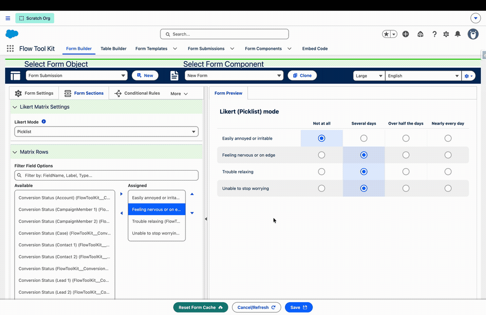
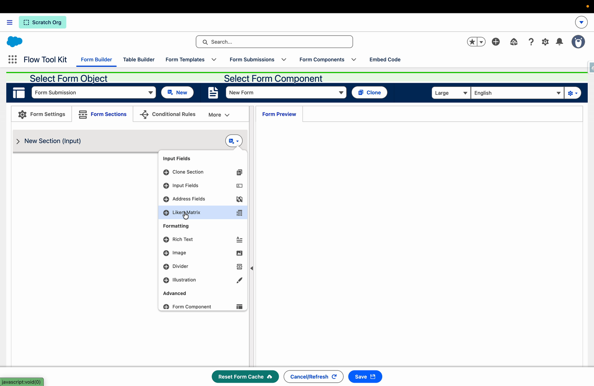
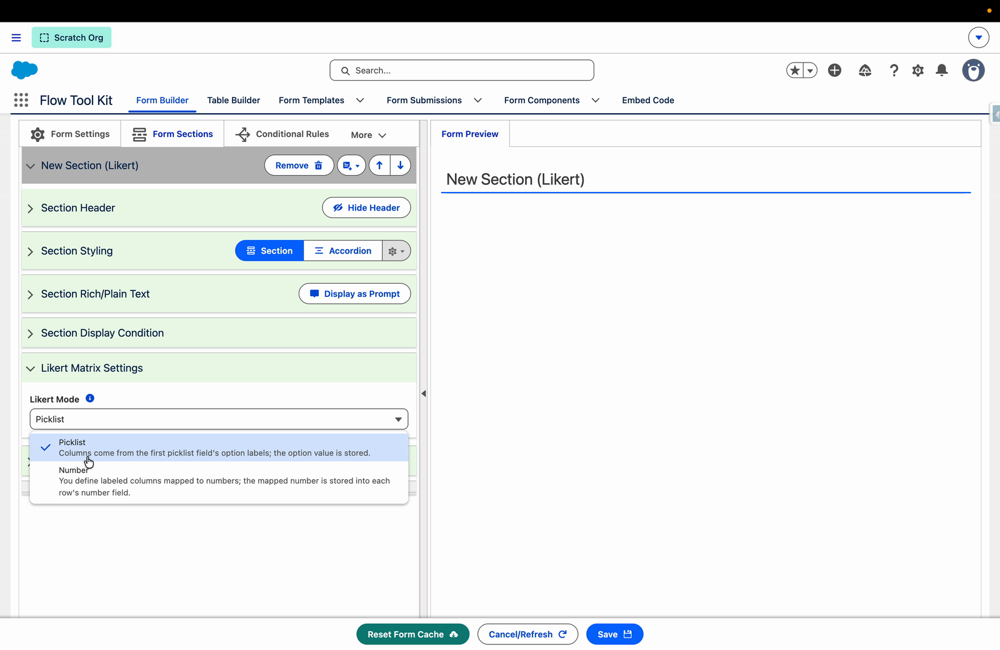
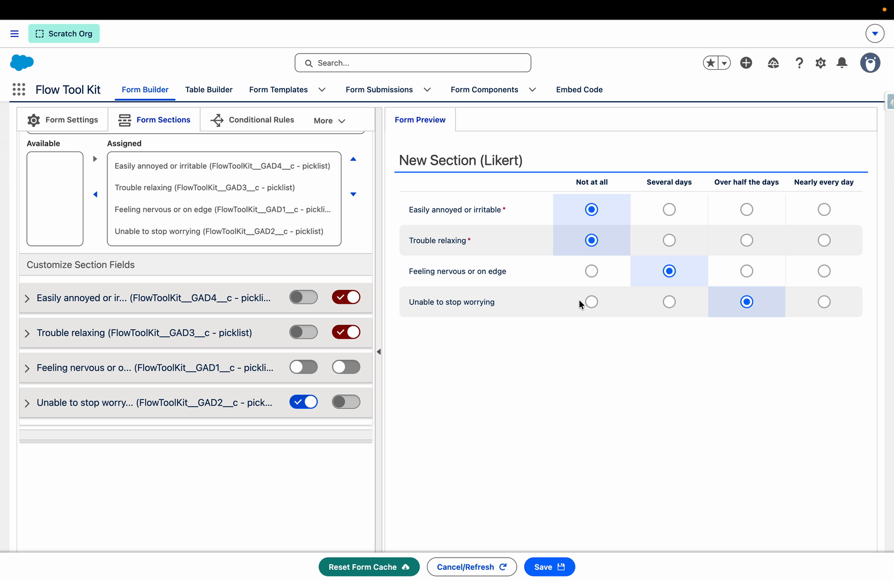
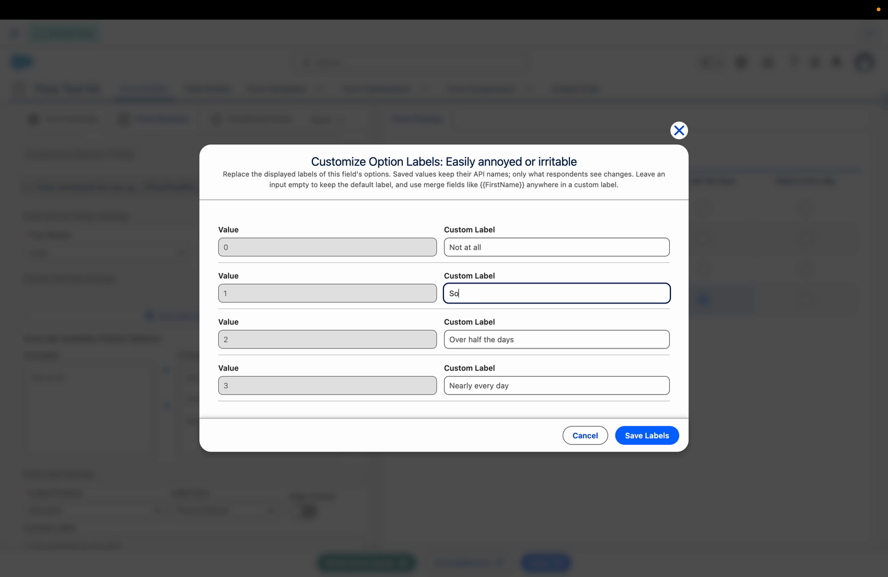
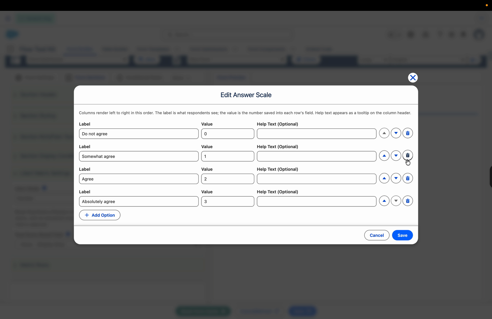
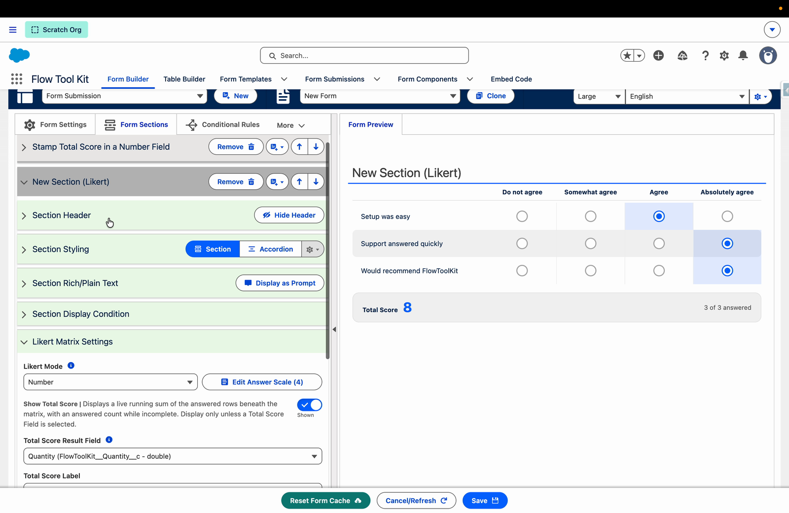
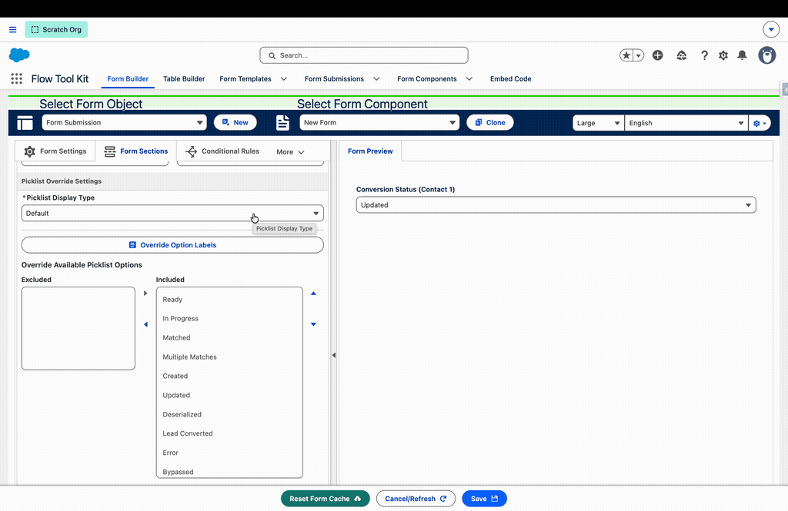

# Likert Matrix Sections

> Ask a set of related questions that share one answer scale, in a single compact grid. Rows are your fields, columns are the scale, and every click stores a real field value on the submission. Number mode adds a live total score that can stamp itself into a field on the record, no custom logic required.

## Overview

A Likert Matrix section renders a group of fields as a survey-style grid: one row per field, one column per answer, with a radio selection at each intersection. It is the natural fit for screeners, assessments, satisfaction surveys, and any "rate each of the following" question set.

* **Rows are ordinary fields.** Every answer is stored straight into the row's field on the submission, so reports, conversion mappings, and record-triggered automation see normal field values.
* **Everything else about the section works like a regular input section.** Headers, accordion styling, rich text, prompts, display conditions, and per-field settings all behave exactly as they do elsewhere in Form Builder.
* **Two modes.** Picklist mode builds the answer columns from a picklist field's options; Number mode lets you define labeled answers that store numbers, with an optional live total.
* **On phones and narrow columns** the grid collapses to stacked survey-button cards per question, using the same brand-aware styling as the [Survey Buttons display type](field-type-settings.md#survey-buttons).

You will find **Likert Matrix** in the new-section menu under Input Fields:

Open **Likert Matrix Settings** inside the section to pick the mode:

## Picklist mode

In Picklist mode, the answer columns come from the **first assigned field's picklist options**: the option labels become the column headers, and selecting a cell stores that option's API value into the row's field. The **Matrix Rows** picker offers only picklist fields, since every row must be able to store the selected option.

Rows stripe alternately for readability, the selected cell fills with your org's brand color, and required rows show the standard asterisk beside their label:

Both picklist override tools work on the matrix and apply to the whole scale:

* **Override Available Picklist Options** subsets or reorders the columns. Enable three of five options on the first field and the matrix renders three columns.
* **Override Option Labels** relabels columns without touching stored values, with full merge-field support. See [Picklist Option Labels](picklist-option-labels.md).

Edits to either override on any row sync to every row automatically, since the matrix shares one scale.

## Number mode

Number mode is for scored surveys. You define the answer columns yourself, and each answer stores a **number** into the row's field, so the Matrix Rows picker offers number-typed fields (number, currency, percent).

Click **Edit Answer Scale** to define the columns. Each option has a **Label** (what respondents see), a **Value** (the number saved into the row's field), and optional **Help Text** that appears as a tooltip on the column header. Reorder options with the arrows, remove them with delete, and add as many as you need:

Save the scale, assign your number fields as rows, and the matrix is ready:

## Total score

Number mode can display and even store a running score:

* **Show Total Score** adds a total row beneath the matrix that sums the answered rows live, with an answered count (for example "3 of 3 answered") and a Partial flag while the matrix is incomplete.
* **Total Score Label** renames the total row (merge fields supported).
* **Total Score Result Field** is the optional stamp: pick an updateable number field and the matrix writes the running total into it every time an answer changes. Only number fields that are not matrix rows are offered. Leave it at **--None-- (Display Only)** to show the total without saving it.

Stamping the score into a real field means formulas, conditional rules, and record-triggered automation can react to it with no custom scoring logic.

A matrix with no answered rows stamps an empty value rather than 0, so an untouched survey is always distinguishable from a legitimate all-zeros score.

## Per-row field settings

Each row is a full form field, and its editor under Customize Section Fields carries the settings you already know:

* **Required** and **Read Only** per row. Read-only rows show their stored selection but ignore clicks.
* **Custom Label** to override the question text, with merge-field support (row labels are a good home for long question wording that exceeds a field label's 40 characters).
* **Help Text**, shown as a hover bubble on the question or below the row's options in the stacked layout, with the standard Disable Help Text and Help Text Display controls.
* **Trigger Formula Recalculations** re-evaluates the form's formulas when the row's answer changes.
* **Field Display Condition** shows or hides individual rows with conditional rules, and the matrix renumbers its striping seamlessly.

## Validation, review, and mobile

* Required rows validate on page navigation and submit like any other field; unanswered required rows highlight inline with a per-row message.
* The review screen renders each row as a standard field review entry with its stored value.
* On phones, or wherever the matrix has less than 480 pixels of width, the grid collapses to one stacked group per question using the same option cards as the [Survey Buttons display type](field-type-settings.md#survey-buttons), preserving required flags, help text, read-only muting, and keyboard navigation.

## Good to know

* In Picklist mode the **first assigned field defines the scale**. Rows whose own option sets differ still render the first field's columns, so choose fields that share a value set.
* The total row sums whatever is numeric: always in Number mode, and in Picklist mode only when the stored option values happen to be numbers.
* Answers dispatch through the same change pipeline as every other field, so autosave, conditional logic, merge fields, and stage tracking all see them immediately.
* The section stores its configuration on the standard form objects (`Likert_Mode__c`, `Likert_Scale__c`, `Show_Total_Score__c`, `Total_Score_Label__c`, `Alternative_Field__c`), so it travels with the form when cloned, published, or migrated.

## Related Pages

* [Field Type Settings](field-type-settings.md): display type overrides, including Survey Buttons
* [Picklist Option Labels](picklist-option-labels.md): relabel scale columns per form with merge fields
* [Conditional Logic](conditional-logic.md): show or hide individual matrix rows
* [Formula Recalculation](formula-recalculation.md): react to answers and stamped scores
