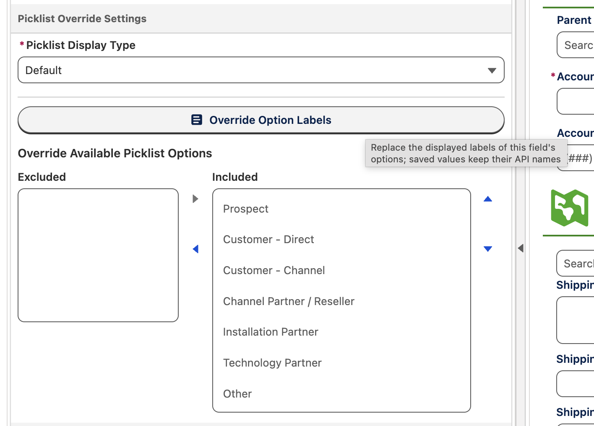
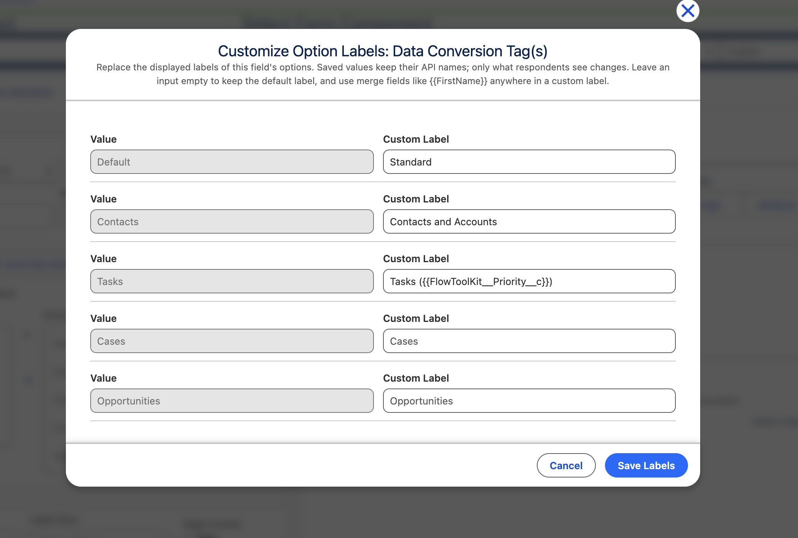

# Picklist Option Labels

> Rename what respondents see in any picklist or multiselect, per form, without touching your org's metadata. Values stay API-safe for your automations and reports; labels become audience-friendly, and with merge fields they can even change live as the respondent fills out the form.

## Overview

Your org's picklist values are named for your database: "Customer - Direct", "Tier 2 Escalation", "FY26-Q3-Renewal". Your respondents should never have to read them. Custom Option Labels let you replace the displayed label of any picklist or multiselect option, per form, straight from Form Builder:

* The **stored value never changes**. Submissions, reports, record-triggered flows, and integrations keep receiving the exact API value they always have. Only what the respondent sees is different.
* Labels are **per form**, not per org. The same Status field can read as formal wording on a client-facing application and as internal shorthand on a staff intake form.
* Labels support **merge fields**, so an option's wording can react to the respondent's other answers in real time.
* No metadata deployments, no value renames, no admin change tickets. A form manager does it all in the builder in seconds.

## Configuring option labels

1. Open your form in **Form Builder** and select a picklist or multiselect field.
2. In **Picklist Override Settings**, click **Override Option Labels**. The button shows a count whenever the field already has custom labels, so you can spot overridden fields at a glance.
3. The editor lists every value with two columns: the read-only **Value** (the API name that gets saved) and a **Custom Label** input whose placeholder shows the current default label.
4. Type a custom label for any subset of values. Leave an input empty to keep the default; a respondent never sees a blank option.
5. Click **Save Labels**, then save the form.

Labels can be up to 255 characters. If a saved override maps a value that is no longer active (or belongs to a different record type), the editor still shows it, flagged as inactive, so you can clear it deliberately; it is never silently dropped.

## Dynamic labels with merge fields

Custom labels run through the same merge pipeline as every other label in Flow Tool Kit, which means an option's wording can reference the respondent's own answers with `{{FieldApiName}}` tokens and re-resolve as those answers change.

In this example, a Data Conversion Tag option is labeled `Tasks ({{FlowToolKit__Priority__c}})`. The moment the respondent switches Priority from Low to Medium, the checkbox re-labels itself to "Tasks (Medium)":

This turns option lists into contextual UI: "Email a copy to \{{Email\_\_c\}}", "Schedule follow-up with \{{Contact\_1\_\_r.FirstName\}}", or any wording that should reflect what the respondent already told you.

## How it works

* **Display-only, everywhere.** The override applies across every picklist display type: the standard dropdown, radio buttons, button groups, icon ratings, path, multiselect checkboxes, and the dual listbox. Both the available and selected sides of multiselects show the custom label.
* **Merge fields honor the custom label too.** When other content on the form renders the field's value through a `{{FieldApiName}}` merge (a confirmation message, a rich text block, a review screen), it displays the custom label, keeping the respondent's experience consistent end to end.
* **The data layer is untouched.** The Form Submission stores the API value. Salesforce reports, list views, and record pages continue to show your org's real (translated) picklist labels.
* **Works alongside the other picklist overrides.** Combine it with Override Available Picklist Options in the same settings block to subset, reorder, and relabel a field's options in one pass.

## Using it effectively

* **Write for the audience, not the database.** Grant portals, client intake, and volunteer signups each deserve their own phrasing of the same field. Configure each form's labels independently.
* **Shorten long value names.** Multi-part values like "Channel Partner / Reseller" can become "Reseller" on a narrow mobile layout without any org-wide rename discussion.
* **Add context with merge fields** where a static label would be ambiguous, especially on multiselects where each option is a decision of its own.
* **Pair with custom labels and translations.** Because overrides resolve through the standard label pipeline, `{{label:...}}` tokens and Form Label translations work inside them, so multilingual forms can localize option labels per language.
* **Leave most options alone.** Only override what needs it; empty inputs always fall back to the default label, so upgrades and new picklist values keep working with zero maintenance.

## Good to know

* If two different forms on the same page override the same field with different labels, each form's option list is always correct; merge-field text on that page resolves to the most recently rendered form's labels.
* A field hidden by conditional logic registers its labels for merge display once it first renders.
* Custom option labels live in the form's configuration (`Form_Component_Field__c.picklistOptionLabels__c`), so they travel with the form when you clone or migrate it.

## Related Pages

* [Field Labels Help Text](field-labels-help-text.md): custom field labels, merge fields, and translations
* [Field Type Settings](field-type-settings.md): display type overrides, including boolean true/false labels
* [Input Field Configuration](input-field-configuration.md): the full field settings reference
