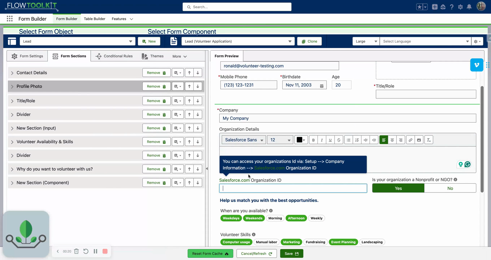
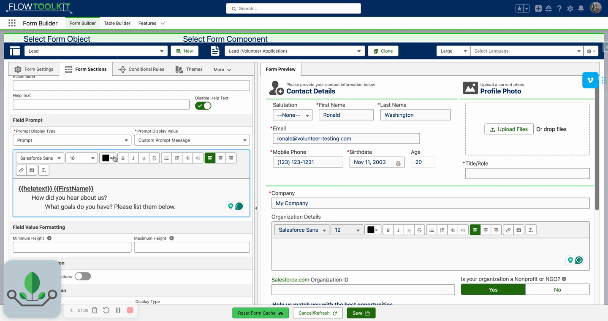

# Prompt Messages
> Display rich text help prompts when users focus on a field — with merge fields, formatting, and an always-visible mode.

## Video Walkthrough



## Overview

Prompt messages are field-level help content that appears when a user clicks on or focuses on a field. Unlike help text tooltips (which require hovering over a small icon), prompts display prominently below the field and support rich text formatting, merge fields, and an always-visible mode.

## Configuration

1. Open a field's customization panel in Form Builder.
2. Scroll to the **Field Prompts** section.
3. Enter a prompt message using the rich text editor.
4. The prompt appears when the user focuses on the field and disappears when they leave.

## Rich Text Formatting

Prompt messages support full rich text formatting:

- **Bold**, *italic*, and other text styles
- Text color and highlighting
- The rich text editor in Form Builder provides a formatting toolbar

## Merge Fields in Prompts

Use `{{fieldName}}` syntax to inject dynamic values:

- `{{HelpText}}` — inject the field's schema help text as the prompt content
- `{{FirstName}}` — personalize prompts with the user's input from other fields
- Any field on the form can be referenced as a merge field

### Help Text as Prompt Pattern

Instead of writing custom prompt text, use `{{HelpText}}` to display the field's schema help text as a prompt. Then disable the help text tooltip to avoid showing the same content twice.

## Always-Visible Mode

By default, prompts only appear when a field has focus. To show all prompts at once:

1. Go to the form-level **Settings**.
2. Enable the **Display Prompts** toggle.
3. All field prompts are now visible simultaneously, regardless of focus.

### Toggle Prompts at Runtime

- Wire a **custom button** to toggle prompt visibility on/off, giving users a "show all hints" experience.
- The always-show setting can also be controlled from within **Flow** at runtime (not just the builder).

## Tips & Considerations

- **Prompts are optional** — leaving the prompt message blank means no prompt appears for that field.
- **Use alongside or instead of help text** — prompts can supplement the tooltip help text or replace it entirely.
- **Rich text keeps attention** — colored or bold text in prompts draws attention to important guidance without cluttering the form.
- **Always-visible for training** — enable "Display Prompts" when training users on a new form, then disable it once they're familiar.

## Related Pages

- [Input Field Configuration](input-field-configuration.md) — field configuration overview
- [Field Labels & Help Text](field-labels-help-text.md) — label and help text customization
- [Custom Buttons](../screen-components/custom-buttons.md) — wiring buttons to toggle prompts
