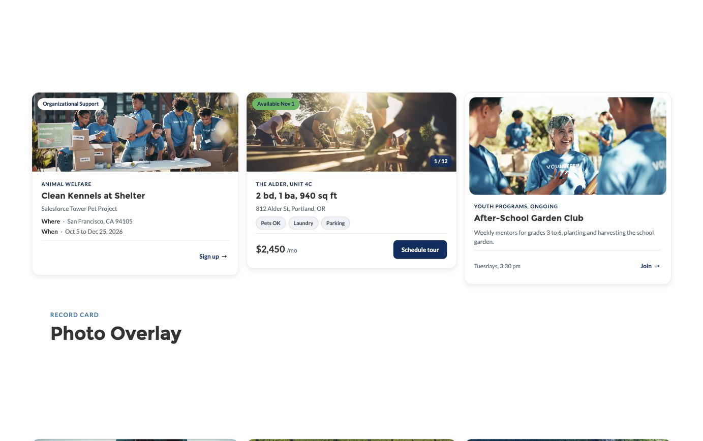
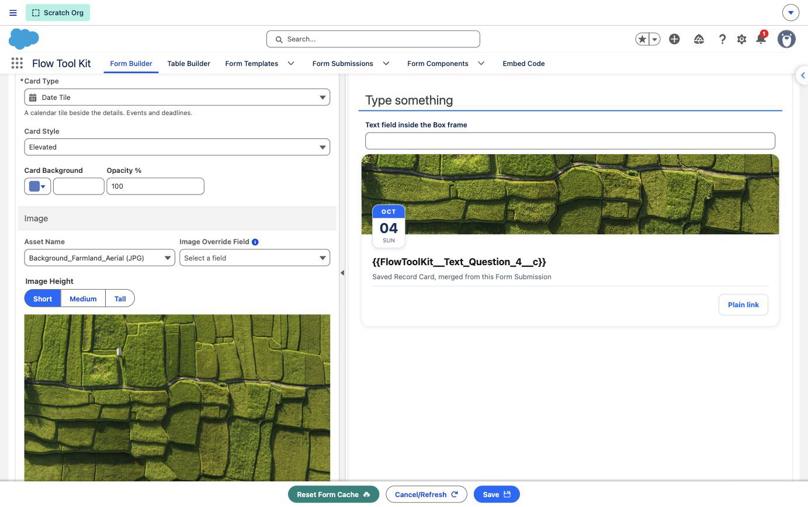

# Record Cards

A Record Card shows one record as a designed card: a photo, a badge, a title, detail rows, tags and buttons. Each line of the card takes typed text, a merge field from the record, or both.

The same card is available in two places, and it looks and behaves the same in both:

- **Experience Cloud:** the **Record Card** type of the Form (Design Block) component.
- **Form Builder:** the **Record Card** section type, for forms, Flow screens, repeaters and Form Templates.

## Card types

Pick the card type first. Each type shows only the settings it draws, and switching type keeps every line the new type also uses.

| Card type | Use it for | What it draws |
|---|---|---|
| Media Top | Listings, jobs, articles, products | Photo above; badge and corner tag on the photo; eyebrow, title, subtitle, description, detail rows, tags; a value or a footer note beside the buttons |
| Photo Overlay | Events, places, properties | Copy set over a full photo, with a badge, a large value and a footer line |
| Date Tile | Events and deadlines | A calendar tile read from one date, an optional photo, eyebrow, title, subtitle, footer note, buttons |
| Countdown | Deadlines, launches, campaigns | Tiles that count to a date and tick: days, hours and minutes, with seconds if you want them, then a message once the date has passed |
| Strip | Notices and next steps | One band: an icon or a thumbnail, a badge, a line of copy and a button, in an Info, Warning, Success or Error tone |
| Progress | Fundraisers, capacity, courses | A current value, its goal and a bar that fills between them, with an optional photo and a corner tag counting the days left |
| Header Band | Workshops, cases, job postings | A brand colored band with a label on each side, then title, description, tags and a footer |
| Icon Lead | Contacts, speakers, locations, files | A photo, an icon or initials beside the title, then description, detail rows, tags and buttons |
| Centered Profile | Staff, members, sponsors | A centered photo, icon or initials, title, subtitle, tags, up to three stats and buttons |
| Field List | Any record at a glance | A title and badge over label and value rows, tags and buttons |
| Value Spotlight | Scholarships, invoices, pricing | One large value with its title, a qualifying line, detail rows and a full-width button |

## Filling a card

Every text line accepts:

- **Typed text**, for a card that reads the same everywhere.
- **A merge field**, written `{{FieldApiName}}`, for a card that follows the record.
- **Both**, for example `{{Seats_Left__c}} seats left`.

A line left empty is left off the card, with no gap. To hide a line, clear it. A detail row is left off when its value is empty, so a label never shows without something beside it.

### Formatting a merged value

A merge field arrives exactly as Salesforce stores it: a date as `2026-10-24`, a currency as a plain number. Add a format prefix to display it properly:

| Write | To show |
|---|---|
| `{{$currency.Amount__c}}` | $38,420.00 |
| `{{$number.Seats__c}}` | 1,250 |
| `{{$date.Close_Date__c}}` | October 24, 2026 |
| `{{$dateShort.Close_Date__c}}` | 10/24/2026 |
| `{{$due.Close_Date__c}}` | Due in 3 days (or Due tomorrow, Due today, Due yesterday, Due 4 days ago) |
| `{{$datetime.Start__c}}` | October 24, 2026 at 10:00 AM |
| `{{$time.Start__c}}` | 10:00 AM |

Some lines calculate from the stored value, so give them the plain merge field with no prefix:

- **Date** on a Date Tile: the month, day and weekday are read from it.
- **Counts Down To** on a Countdown: a date counts to midnight at the start of that day, a date and time to the minute.
- **End Date** on a Progress card: with no Corner Tag typed, the corner tag reads "12 days left", "1 day left", "Ends today" or "Ended".
- **Current** and **Goal** on a Progress card: the bar fills to Current out of Goal. Formatted amounts such as `$38,420` are read correctly too.
- **Image**: a link, a URL field, or a formula or rich text field holding an image. In the Form Builder it is the Image Override Field; on an Experience Cloud site it is the Image URL.

### Tags from a multi-select picklist

A tag whose text is one multi-select picklist field becomes one pill for each selected value. A **Badge** fed by a multi-select picklist does the same.

## Record Card in the Form Builder

1. In the Form Builder, open the **Insert New Section** menu and choose **Record Card** under Formatting.
2. The section opens on a finished example card, with one of the package's background photographs chosen at random. Open it to edit.
3. On the **Content** tab, set the **Section Title**, pick the **Card Type**, then work down the groups: Card, Image, Badge and Corner Tag, Text, Value, Detail Rows, Tags, Footer, Buttons and Card Link. A group appears only when the card type draws it.
4. Use the **Style** tab for the section's width, padding and margin, as on any section.

Merge fields read the form's own record, including what the respondent has typed and not yet saved, so the card updates as the form is filled in.

The **Section Title** names the section in the Form Builder's outline. It is not drawn on the form, because the card carries its own title.

### Choosing a card type

Choosing a card type loads that type's example, so you always start from a finished card. Once you have changed the card's text, tags or buttons, choosing another type keeps your content and only changes the layout.

Media Top and Photo Overlay lead with a photo, so a card with no image of its own is given one of the package's background photographs at random when you choose either type. Swap it under **Asset Name**. An image you have already chosen, or an **Image Override Field** on a card you have edited, is left as it is.

### Image

The image is chosen the way an Image section chooses one.

| Setting | What it does |
|---|---|
| Asset Name | The Asset File the card shows. Required on Media Top and Photo Overlay, where the photo leads the card |
| Image Override Field | Optional. When the record holds an image in this field, it is shown in place of the asset. A link, a formula or a rich text field works |
| Image Height, Framed Image, Photo Overlay | Appear once an image is chosen |

On Icon Lead and Centered Profile the Image group is called Photo, and appears when **Avatar** is set to Image.

### Values that come from a field

An input that can take a field is a single list. Pick a field, or type your own value where the input accepts one.

- The list shows only fields the input can use. **Current** and **Goal** on a Progress card list number, currency and percent fields. **Date** on a Date Tile lists date and date and time fields.
- Fields are grouped by data type, each with its icon. Formula fields have their own group.
- **Date** takes a field only and is required: a typed date would never change with the record. The same goes for **Counts Down To** on a Countdown and **End Date** on a Progress card.
- **Badge** and **Corner Tag** leave out checkbox fields, which would only read true or false.
- **Card Link** and a button's **URL** lead with **This record**, which opens the record the card shows. On a form that has not saved its record yet, that link or button is left off.

**This record** goes to the right place wherever the form is shown:

| Where the form is shown | Where the link goes |
|---|---|
| Lightning Experience | The record's page in Lightning Experience |
| A Flow opened on its own page | The record, through Salesforce's own redirect |
| An Aura site | The site's record page for that record |
| An LWR site | The site's page for that object. If the site has no page for the object, the link or button is left off, because there is nowhere on the site to send the reader |
| An embedded form | The record, opened in a new tab so it does not try to load inside the frame |
- The right format is applied for you. A currency field shows as currency, a date as a date.

### Detail rows

A detail row is a field. In **Add Row**:

| Setting | What it does |
|---|---|
| Field | Required. The field the row shows. It is added to the section as a form field, so the form loads it and Salesforce tracks that the form uses it |
| Label | Optional. Leave it empty and the row shows the field's own label |
| Value | Optional. Leave it empty and the row shows the field's value, formatted for its data type. To style the value or put text round it, write `{{value}}` where the value should sit, for example `{{value}} a year` |

A row whose field is empty is left off the card. Stats on a Centered Profile work the same way.

### Insert Field

Each rich text input carries an **Insert Field** button in its toolbar. It lists every field on the form's object; type to filter by label or API name, then pick one. The merge field lands where the cursor is, with the right format prefix for its data type. The list closes when you click anywhere outside it.

### Colors

Text colors are set in the rich text inputs. The Card group keeps **Card Background**, and the corner tag has its own color; the tag's text turns dark or white to stay readable on it.

## Record Card on an Experience Cloud site

1. Add the **Form (Design Block)** component to a page and choose **Record Card** as its type.
2. Open **Card** to pick the card type, its options, and an optional link that makes the whole card clickable.
3. Open **Card Content** for the image, the badge and corner tag, the text lines, the value, tags and the footer note. The groups are the same ones the Form Builder shows.
4. **Detail Rows** and **Buttons** are their own entries, as on other block types. Buttons support every button type: a link, a Form Template or Form Submission, a Flow, and a Record Form. See [Buttons that open a Flow or a Record Form](#buttons-that-open-a-flow-or-a-record-form).
5. **Card Style**, **Background**, **Border**, **Spacing**, **Motion** and **Visibility** work as they do on every block.

Merge fields read the page's record through the block's **Record Id** property, which Experience Builder fills in on a record page. Related fields work, for example `{{Owner.Name}}`. On a page with no record, Experience Builder shows the merge fields as written so you can see where each one lands; on the live site an unfilled line is left off.

Record Cards work on Aura and LWR sites. A Record Card fills the column it is placed in and adds no padding of its own. Place it in a narrow column for a card, or use Spacing to add room around it.

### Image

The card's photo is chosen the way every image on a Design Block is chosen, under **Source** in Card Content.

| Source | What it uses |
|---|---|
| None | No photo |
| CMS | A published CMS image, picked with the **Overlay Image** picker below the editor |
| URL | A full address, `resource:Name/path.png` for packaged art, or a merge field such as `{{Photo_URL__c}}` holding a link or an image |
| Asset | An Asset File |

**Image Alt Text**, **Image Height**, **Framed Image** and **Photo Overlay** appear once a source is chosen. Media Top and Photo Overlay lead with a photo, so a card with no image is given one of the package's background photographs at random when you choose either type; swap it under Source.

On Icon Lead and Centered Profile the group is called Photo, and appears when **Avatar** is set to Image.

### Colors

The card follows the site theme. Brand Color and Accent Color on the block are used exactly as chosen for the band, the date tile, the progress bar, the avatar and the Brand and Accent buttons; the text over them turns dark or white to stay readable. Text colors are set in the rich text inputs, and the corner tag has its own color beside it in Card Content.

### Countdown

- **Units**: days, hours and minutes; the same with seconds; or days only. The card updates itself every minute, or every second when seconds show.
- **Direction**: count down to the date, or count up from it for a streak or a running campaign.
- **Ended Message**: shown in place of the tiles once the date has passed. Leave it empty and the tiles simply go, with the rest of the card kept.

### Strip

- **Tone** colors the band's edge and its round icon: Info follows your brand color, Warning, Success and Error use the form's or site's status colors.
- **Icon** shows when the strip has no thumbnail. Leave it empty for the tone's own icon.
- To word a deadline, put `{{$due.Close_Date__c}}` in the subtitle: "Due in 3 days".

## Buttons that open a Flow or a Record Form

A button's **Type** decides what it does. Beside a link, a button can open a screen flow, or an existing record in a Form Component, in a window over the page. These two types are offered on a Record Card in a form, on a Record Card block, and on the buttons of every other Form (Design Block) type.

| Type | What opens | Settings |
|---|---|---|
| **Flow** | A screen flow | **Flow**, **Record**, **Modal Size**, **Modal Title** |
| **Record Form** | A record in a Form Component, to edit or to read | **Record**, **Mode** (Edit or Read Only), **Form Component**, **Modal Size**, **Modal Title** |

### Which record the button passes

The button passes one thing: a record Id. **Record** chooses where that Id comes from.

| Record | The Id that is passed |
|---|---|
| **This record** | The record the card or the page shows: the form's record for a card in a form, the block's **Record Id** for a block on a site page |
| **Lookup field** | The record a lookup field on that record points to, for example the Account of a Contact |
| **No record** (Flow only) | None. The flow starts with no record |

- **The choice decides which forms are listed.** In the Form Builder there is no object to pick. **This record** lists the forms for the form's own object, and a lookup field lists the forms for the object that lookup points to. Until a lookup field is chosen, **Form Component** says to choose one.
- **Flow.** A flow that has a text input variable named `recordId` receives the Id.
- **Record Form.** The window shows that record. Its footer stays in view while the form scrolls: **Save Record** and **Cancel** when editing, **Close** when reading. **Save Record** is available once something has been changed. The window closes once the save succeeds, and the saved confirmation shows on the page; a save that fails keeps the window open with its message.
- When a flow finishes on a site page, the block reads the page's record again, so a merged value the flow changed shows the new value at once.

### A button with no record is left off

A button that passes a record is shown only where there is an Id to pass. Without one it is left off the card or block, the same way a **This record** link is.

| What happened | What the reader sees |
|---|---|
| The lookup field is empty on this record | The button is left off |
| The form has not saved its record yet | The button is left off |
| The page has no record | The button is left off |
| **This record**, and the form is for another object than that record's | The button is left off |
| A Flow set to **No record** | The button always shows |

The Record setting says this in the editor, under the choice.

**On a Flow screen** a form can be handed a whole record by the flow instead of a record Id. The button still passes an Id: the Id of that record. A record the flow has built but not saved has no Id yet, so **This record** buttons are left off until it is saved, and a lookup field passes whatever Id the record holds in that field.

A Record Form opens an existing record. It does not start a new one.

### Before you rely on one

- The person clicking needs access to the flow and to the record, as they would to run the flow or open the record themselves.
- On an LWR site the page must carry the **FlowToolKit LWR Support** component, in the site footer or on the page, and the site must be published after it is placed. Without it the button does nothing. See [LWR Sites: Setup and Considerations](../experience-cloud/lwr-site-component-support.md).
- In Experience Builder the editor does not know which object the page is for, so it asks: type the lookup as a merge field, such as `{{AccountId}}`, and choose **Form Object** before the form.
- A site page opened with `?recordId=` in its address hands that record to the record forms placed on the page. A button's window is not one of them: it opens the record the button was set to pass, the page's own or a lookup field's.
- The buttons work in the Form Builder's preview, so you can try one as you build it. The preview has no saved record, so every button shows, a flow receives no record Id, and a Record Form opens empty and read only.

## Limits in this release

- Field lists and Insert Field are available in the Form Builder. In Experience Builder, merge fields are typed, because Experience Builder does not tell the editor which object the page is for.
- In the Form Builder a field list shows the fields a form can use. System date fields such as Created Date are not among them, so a Date Tile needs a date field of your own.
- A Record Card is one record. It is not a list of records.
- In a form, a card button is a link, a Flow or a Record Form. Form Template and Form Submission buttons are available on Experience Cloud sites, where the block resolves the template from the page's record.
- A Record Form button opens an existing record. Starting a new record from a button, and writing it back to a lookup field, is not in this release.
- A Record Card section is not included in the submission PDF.
