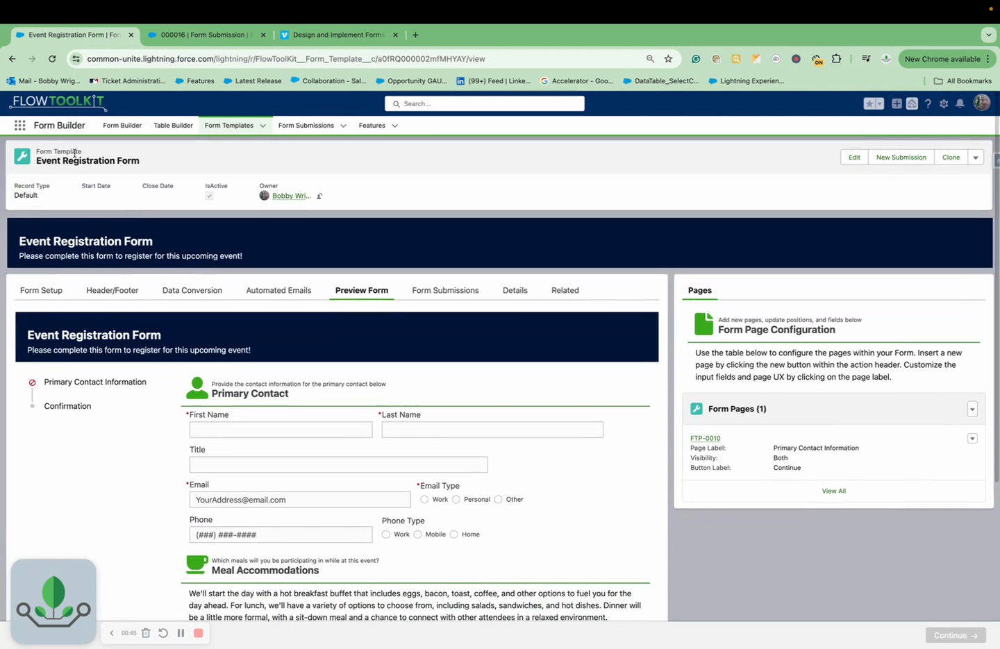
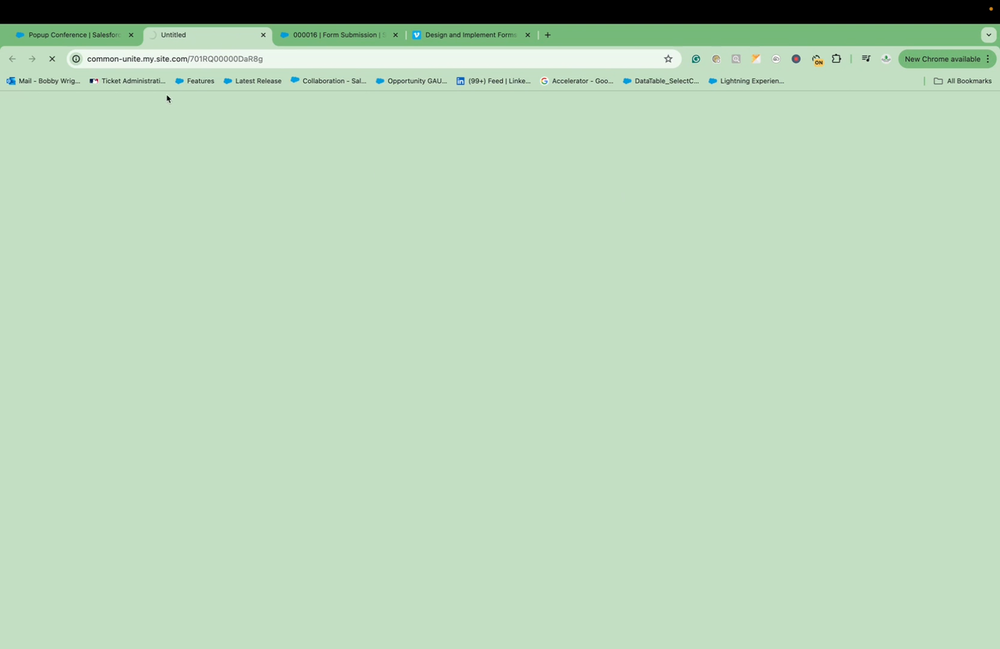

# Campaign Integration
> Link Form Templates to Campaigns via a lookup field — reuse one template across multiple events and swap templates without rebuilding.

## Video Walkthrough



## Overview

Flow Tool Kit ships with a lookup field from the Campaign object to the Form Template object. This lets you assign a reusable form template to any campaign — build one event registration form and use it across dozens of campaigns. When the form loads, the Campaign ID is passed into the Flow, which retrieves and renders the associated template.

## Configuration

### Linking a Template to a Campaign

1. Create a reusable Form Template (e.g., "Event Registration Form" with generic questions like meal preferences, contact info).
2. Open a **Campaign** record.
3. Find the **Form Template** lookup field (ships with Flow Tool Kit).
4. Select the desired Form Template.
5. Save the Campaign.

### Loading the Form

When exposing the form via Experience Cloud or a Flow:

1. Pass the **Campaign ID** into the flow.
2. The flow traverses the Campaign ID to retrieve the linked Form Template.
3. The template's pages, fields, and configuration render automatically.

## Common Patterns

### 1. One Template, Many Campaigns
Build a single "Event Registration" template with standard event questions. Assign it to every event campaign. Update the template once and all campaigns get the update.

### 2. Template Swapping
Change the Form Template lookup on a campaign to a different template. The form immediately changes — new pages, new questions, new configuration. No rebuilding required.

### 3. Combined with Pre-fill Templates
Use [Pre-fill Templates](prefill-templates.md) to inject campaign-specific backend values (Campaign ID, Campaign Member Status) so the same form can create different Campaign Members per campaign.

### 4. Extend to Other Objects
The Campaign-to-Template lookup pattern can be extended to **any Salesforce object**. Create a lookup field from any object to Form Template and pass that record's ID into the flow. The same pattern works for Programs, Accounts, custom objects, etc.

## Tips & Considerations

- **Reusability is the goal** — build fewer, more generic templates and assign them to many campaigns rather than building a unique template per campaign.
- **Instant switching** — changing the template lookup on a campaign takes effect immediately. Users accessing the campaign's form see the new template right away.
- **Campaign ID is the key** — the flow uses the Campaign ID to look up the template. Ensure the Campaign ID is available in your flow context (e.g., from URL parameters in Experience Cloud).
- **Works with data conversion** — the Campaign ID flows through to data conversion rules, enabling automatic Campaign Member creation.

## Related Pages

- [Pre-fill Templates](prefill-templates.md) — default values per template
- [Form Templates](form-templates.md) — form template record configuration
- [Submission Conversion](submission-conversion.md) — data conversion from submissions
- [Overview](overview.md) — Form Template Framework overview
