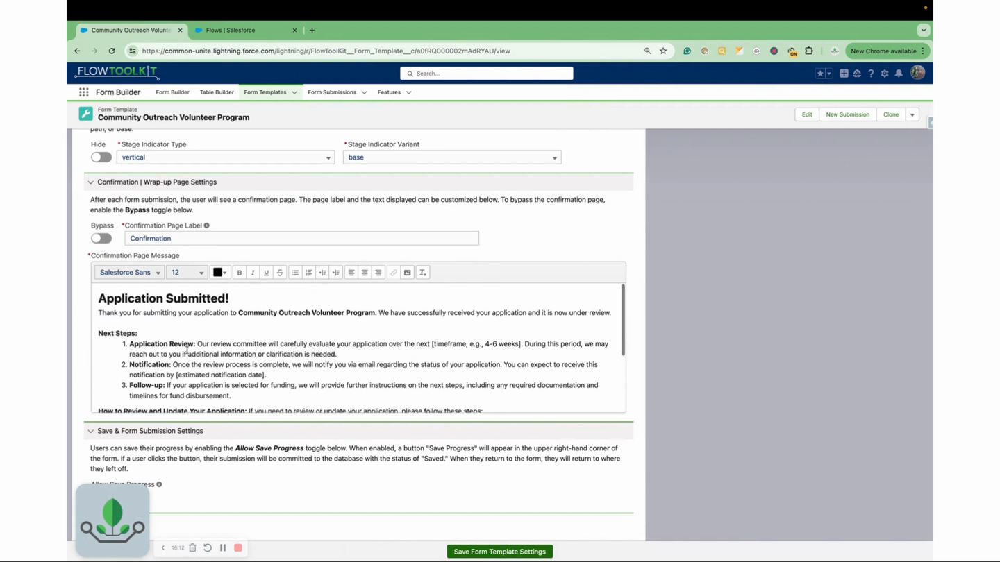
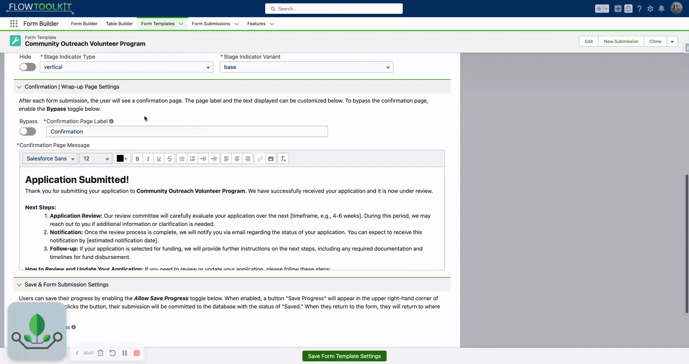

# Confirmation Pages
> Configure a customizable confirmation screen after form submission — or bypass it entirely with a redirect.

## Video Walkthrough



## Overview

When a user submits a form built with the Form Template Framework, they see a confirmation (wrap-up) page. This page can display a custom message, be completely disabled, or redirect users to a different page.





## Configuration

The confirmation page is configured in the **Confirmation / Wrap-Up Page Setting** section on the Form Template record.

### Default Behavior

When you create a new form template, a default confirmation message is automatically loaded. You can customize this message to explain what the user should expect after submission.

### Customizing the Message

1. Navigate to your Form Template record.
2. Scroll to the **Confirmation / Wrap-Up Page Setting** section.
3. Edit the confirmation message text.
4. Include information about next steps, expected timelines, or follow-up actions.

### Disabling the Confirmation Page

To skip the confirmation screen entirely:

1. Toggle the confirmation page setting to **disabled**.
2. Configure a **custom navigation action** inside the Flow to redirect users to a different page (e.g., a landing page, thank you page, or back to the home page).

## Form Flow Example

A typical multi-page form with a confirmation page:

```
Page 1: Application Details
Page 2: Availability
Page 3: Experience
Page 4: Consent & Signature
Page 5: Confirmation (customizable or disabled)
```

## Tips & Considerations

- **Completely optional** — the confirmation page can be disabled if your flow handles post-submission navigation differently.
- **Rich text supported** — the confirmation message supports formatting to create a polished closing experience.
- **Redirect pattern** — when disabled, use a Flow navigation action to send users to a specific URL or page after submission.
- **Electronic signature** — the consent/signature page (if used) appears before the confirmation page, not after it.

## Related Pages

- [Form Templates](form-templates.md) — form template record configuration
- [Pages and Sections](pages-and-sections.md) — configuring form pages
- [Overview](overview.md) — Form Template Framework overview
