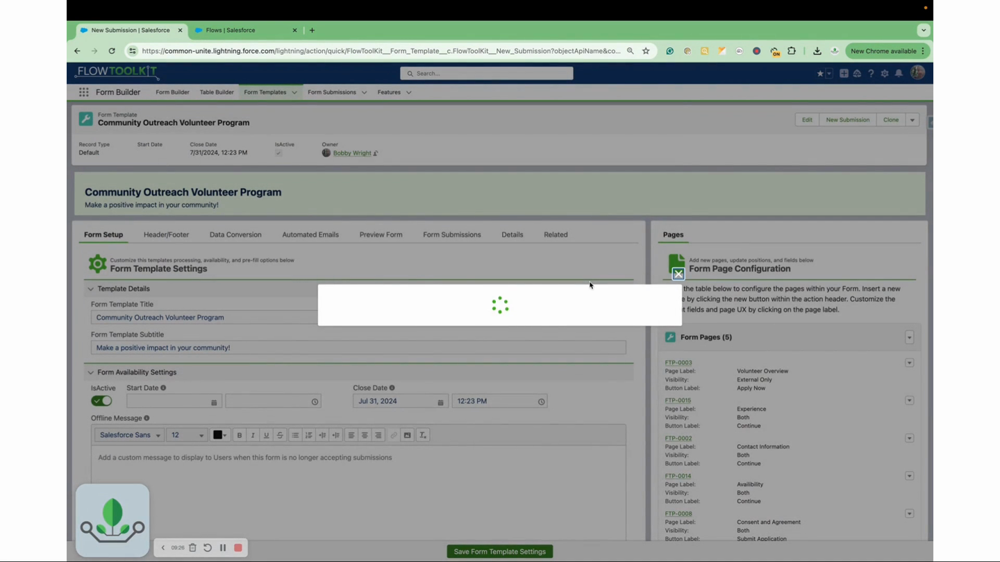

# Form Availability

> Control when and to whom Form Templates are available — date ranges, active toggles, and access conditions.

## Overview

Form Availability settings on `Form_Template__c` records control whether a template is currently active and accessible. This lets you schedule forms for specific periods, deactivate old templates, and manage access without deleting records.

## Video Walkthrough



## Availability Controls

### Active Toggle
The simplest control — set the template's **Active** field to true or false. Inactive templates are not rendered by the Form Template component.

### Date Ranges
Configure start and end dates to make templates available only during specific windows:
- **Available From** — template becomes active on this date
- **Available Until** — template deactivates after this date
- Useful for time-limited applications, seasonal surveys, and event registration forms

### Access Conditions
Additional conditions can restrict template access based on user attributes or record values.

## Common Patterns

### 1. Annual Application Window
Set "Available From" to January 1 and "Available Until" to March 31. The application template is only accessible during Q1. Outside this window, the form is not rendered.

### 2. Phased Rollout
Create multiple templates and stagger their availability dates. As one template expires, the next one activates — useful for phased program enrollment.

### 3. Emergency Deactivation
Toggle **Active** to false to immediately take a template offline. The form stops rendering in all contexts (Flows, pages, Experience Cloud) without deleting the template or its submissions.

## Tips

- **Existing Submissions**: Deactivating a template does not affect existing submission records. Users who already started the form cannot resume it, but their data is preserved.
- **Experience Cloud**: Ensure your site's Flow handles the case where a template is inactive — display a message instead of a blank screen.
- **Testing**: When building new templates, keep them inactive until testing is complete, then activate for production use.

## Related Pages

- [Creating Templates](creating-templates.md) — template setup
- [Form Templates Reference](form-templates.md) — component properties
