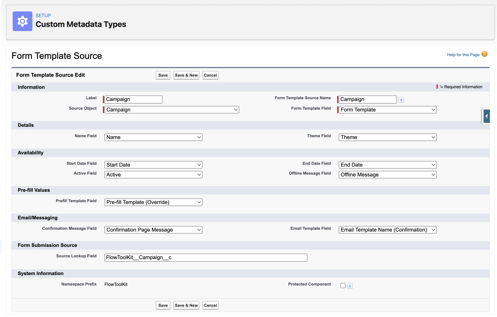

# Form Template Sources

> Build one form. Use it everywhere. Connect a single Form Template to any Salesforce object so each record (a campaign, an event, a program, a cohort) drives its own name, dates, branding, prefill values, and confirmation messaging.

## Overview

A Form Template defines *what the form asks*. A **Form Template Source** defines *the context it runs in*. One "Event Registration" template can serve dozens of campaigns at once: each campaign record supplies its own display name, availability window, theme, prefill template, confirmation message, and confirmation email template. When a respondent submits, the submission is stamped with the source record's Id (`Source_Id__c`), so conversion flows and reports always know exactly which campaign, event, or program the answer belongs to.

## How it works

The framework is metadata-driven. A **Form Template Source** custom metadata record teaches Flow Tool Kit how to read *any* object as a source:

| Setting | What it points at |
|---|---|
| **Source Object** | The object whose records act as sources (e.g., `Campaign`) |
| **Source Lookup Field** | The Form Submission field that stores the source record's Id |
| **Form Template Field** | The source object's lookup to the Form Template |
| **Name Field** | Drives the form's displayed name |
| **Start / End Date Fields** | The availability window; outside it, respondents see the offline message |
| **Active Field** | A checkbox that turns the source on or off regardless of dates |
| **Theme Field** | Per-source theme override |
| **Prefill Template Field** | Per-source prefill template (seed answers per campaign/event) |
| **Confirmation Message Field** | Per-source confirmation page message |
| **Email Template Field** | Per-source confirmation email template |
| **Offline Message Field** | What respondents see when the source is inactive or out of window |

Flow Tool Kit ships a ready-to-use source definition for **Campaign** (see [Campaign Integration](campaign-integration.md)). To source templates from your own object (an Event, Program, or Application Cycle), create the matching fields on that object and add one Form Template Source metadata record pointing at them.

## The Template Source Editor

Add the **Form (Template Source Editor)** component to the source object's record page in Lightning App Builder. It manages everything about a source in one tabbed panel:

* **Details**: name, dates, active flag, theme
* **Availability**: the open/close window and offline message
* **Prefill Values**: a tag-based prefill template picker to seed per-source answers
* **Confirmation Message**: the per-source confirmation page content
* **Email Template**: the per-source confirmation email

The editor auto-saves as you switch tabs, shows a save-state indicator, and includes a **live form preview** modal so you can see exactly what respondents will get for this source.

## Loading a form by source

Pass the source record's Id to the Form (Template) component (via a record page, URL parameter, or Flow input) and the framework resolves: source record → its Form Template → its per-source name, dates, theme, prefill, and messaging. Submissions stamp `Source_Id__c` automatically for downstream [conversion flows](how-to/overridable-conversion-flows.md) and reporting.


Sources pair naturally with the [Prefill Flow](prefill-flow.md): the source drives the *configuration* context while the prefill flow drives *data* context from the running user.


## Related Pages

- [Campaign Integration](campaign-integration.md): the packaged Campaign source, step by step
- [Prefill Templates](prefill-templates.md): the prefill values a source can select
- [Confirmation Pages](confirmation-pages.md): how confirmation messaging renders
- [Form Availability](form-availability.md): availability windows in depth
