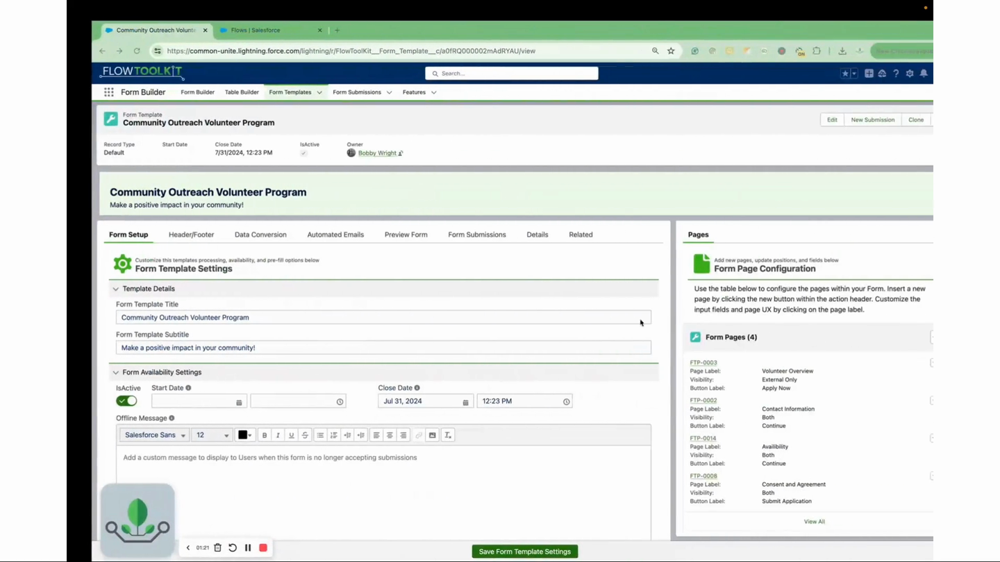

# Form Templates

> Build multi-page, multi-section forms with built-in navigation, progress tracking, and save-and-resume capability, all driven by a template record structure.

## Overview

Form (Template) enables multi-page forms that go beyond what a single Flow Screen can offer. Instead of cramming everything onto one screen or building complex multi-screen flows manually, you define a Form Template record with pages and sections, and the component handles navigation, progress tracking, and form rendering automatically.

Form Templates use a record-based structure: a Form Template contains Pages, and each Page contains Sections. Each section references a Form (built in Form Builder), and the component renders the appropriate form for each section. Users navigate between pages with built-in or custom navigation, and the component tracks their progress.

This is especially useful for long intake forms, applications, surveys, and any scenario where users need to complete information across multiple logical pages, potentially saving progress and returning later.

## Video Walkthrough



## Where to Use It

* **Flow Screen** (with full navigation and submission support)
* **App Page**
* **Record Page**
* **Home Page**
* **Experience Cloud** (Community Page and Default)

## Quick Start

1. **Create a Form Template**: Create a `Form_Template__c` record with a name and description.
2. **Add Pages**: Create `Form_Template_Page__c` records linked to the template, each with a page number and label.
3. **Add Sections**: Create `Form_Template_Page_Section__c` records linked to each page. Each section references a Form (built in Form Builder) via the Form name field.
4. **Add to Screen**: In Flow Builder, drag "Form (Template)" onto a screen and pass the Form Template record Id.
5. **Process Output**: After the screen, use the `currentPage`, `priorPage`, and `formSubmission` outputs to track navigation and save data.

## Properties

### Inputs (Flow Screen)

| Property         | Type                     | Required | Default | Description                                              |
| ---------------- | ------------------------ | -------- | ------- | -------------------------------------------------------- |
| `recordId`       | String                   | Yes      | —       | The Id of the Form Template record (`Form_Template__c`)  |
| `isFlow`         | Boolean                  | Yes      | false   | Set to true when used inside a Flow                      |
| `disableAll`     | Boolean                  | No       | —       | Read-only mode; disables all form editing                |
| `currentPageId`  | String                   | No       | —       | Id of the current page (for resuming at a specific page) |
| `formSubmission` | Form\_Submission\_\_c    | No       | —       | Existing Form Submission record (for save-and-resume)    |
| `relatedRecords` | Form\_Submission\_\_c\[] | No       | —       | Collection of related submission records                 |

### Inputs (Record/App/Home Page)

| Property           | Type    | Required | Default | Description                                                                                                                                                                          |
| ------------------ | ------- | -------- | ------- | ------------------------------------------------------------------------------------------------------------------------------------------------------------------------------------ |
| `recordId`         | String  | No       | —       | Form Template, Form Submission, or any record Id (auto-set on Record Pages)                                                                                                          |
| `relatedFieldName` | String  | No       | —       | A Form Template / Form Submission lookup reachable from the page's record; on Record Pages this is a picklist of every qualifying field on the object, its parents, and grandparents |
| `fixedTemplateId`  | String  | No       | —       | Form Template to load when nothing else resolves (picklist of all templates); also loads directly when no Record Id is provided on App/Home pages                                    |
| `disableAll`       | Boolean | No       | —       | Read-only mode                                                                                                                                                                       |

### Inputs (Experience Cloud)

| Property           | Type    | Required | Default     | Description                                                                                                |
| ------------------ | ------- | -------- | ----------- | ---------------------------------------------------------------------------------------------------------- |
| `recordId`         | String  | Yes      | {!recordId} | Form Template, Form Submission, or any record Id                                                           |
| `relatedFieldName` | String  | No       | —           | Related field path entered as text (e.g. `Contact.FlowToolKit__Latest_Form_Submission__c`)                 |
| `fixedTemplateId`  | String  | No       | —           | Form Template record Id to load when the Record Id resolves to no template or submission (entered as text) |
| `disableAll`       | Boolean | No       | —           | Read-only mode                                                                                             |

### Outputs (Flow Screen)

| Property         | Type                      | Description                                            |
| ---------------- | ------------------------- | ------------------------------------------------------ |
| `currentPage`    | Form\_Template\_Page\_\_c | The page the user is currently viewing                 |
| `priorPage`      | Form\_Template\_Page\_\_c | The previous page the user was on                      |
| `buttonClicked`  | Button (Apex-Defined)     | The custom button clicked (if using custom navigation) |
| `formSubmission` | Form\_Submission\_\_c     | The form submission record (for save-and-resume)       |
| `saveProgress`   | Boolean                   | True when the user clicked "Save Progress"             |

## How It Works

**Template Structure**: The hierarchy is Template → Pages → Sections → Forms:

* `Form_Template__c`: The top-level container with name, description, and settings
* `Form_Template_Page__c`: Individual pages within the template, ordered by page number
* `Form_Template_Page_Section__c`: Sections within each page, each referencing a Form built in Form Builder

**Page Navigation**: The component renders one page at a time with navigation controls. Users move forward and backward through pages. Each page displays its sections with the corresponding forms.

**Progress Tracking and the Vertical Indicator**: Linear templates track each page's status on Form Submission Stage records, the same records Stages Mode uses. Entering a page marks it In Progress; a validated Next marks it Done; and leaving a completed page in an invalid state (for example, after clearing a required field) flips it to a needs-correction state until fixed. The vertical stage indicator renders these statuses as markers (green check = done, blue pencil = current page, clock = in progress, orange warning = needs correction, gray dot = not visited) and doubles as navigation: respondents can always click backward, and can click forward to any page they have already visited, so returning to an early page never strands them from their last in-progress page. Statuses persist whenever the submission saves (autosave, Save Progress, submit); forms that never save still track progress for the session. Inside Flow screens the trail is session-only, since your Flow owns the DML.

**Save and Resume**: When `formSubmission` is provided, the component loads previously saved data. The `saveProgress` output signals when the user wants to save their progress. Your Flow handles the actual DML to save/load the Form Submission record.

**Record Page / App Page**: Outside of Flows, the component renders the template's pages inline and resolves what to load from the hosting record. A Form Template or Form Submission record Id loads directly. Any other record resolves in order: the **Related Field Name** lookup (when configured and populated), the **Form Template Source** custom metadata mapping, then the **Form Template (Fallback)** selection. New submissions created through the source mapping or the fallback are stamped with the hosting record's id in `Source_Id__c`, so they report and resume from that record. When nothing resolves, the component shows a compact "No Form Found" illustration with configuration guidance instead of rendering a form. Step-by-step setup: [Host a Form on Any Record Page](how-to/host-form-on-record-page.md).

## Works With

| Component            | Integration                                                    |
| -------------------- | -------------------------------------------------------------- |
| **Flow Form**        | Each template section renders a Flow Form instance             |
| **Form Builder**     | Forms referenced by sections are built in Form Builder         |
| **Custom Buttons**   | Custom navigation buttons integrate via `buttonClicked` output |
| **Form Submissions** | Save-and-resume capability via Form\_Submission\_\_c records   |
| **Themes**           | Theme applied to all forms within the template                 |

## Common Patterns

### 1. Multi-Page Application

Create a template with 4 pages: "Personal Info", "Employment", "Education", "Review". Each page has 1-3 sections referencing different forms. Users navigate freely between pages.

### 2. Save and Resume Survey

Build a long survey template. Pass a `formSubmission` record to persist progress. When `saveProgress=true`, update the submission record. When users return, pass the same submission to resume where they left off.

### 3. Read-Only Template Viewer

Set `disableAll=true` to display a completed template in read-only mode. Useful for review screens or displaying submitted data on record pages.

## Tips & Considerations

* **Autosave**: Templates can save the respondent's in-progress submission automatically (silently, as they work) via **Save & Form Submission Settings → Enable Autosave**. See [Save and Resume Forms](how-to/save-and-resume-forms.md#autosave) for how the timing works.
* **Page Order**: Set page numbers on `Form_Template_Page__c` records to control display order. Gaps are fine (10, 20, 30); they're sorted numerically.
* **Section Order**: Sections within a page are also ordered. Each section should reference a valid Form QualifiedApiName.
* **Flow Loop Pattern**: For save-and-resume in Flows, use a loop: display the template screen → check if `saveProgress` is true → if yes, save the submission and loop back to the same screen → if no (user clicked Next/Finish), proceed with the flow.
* **Experience Cloud**: Works in Experience Cloud with `{!recordId}` binding for the template Id.
* **Related Field Filtering**: Use `relatedFieldName` when you want to show only template pages/sections relevant to a specific record (e.g., filtering by account type).
