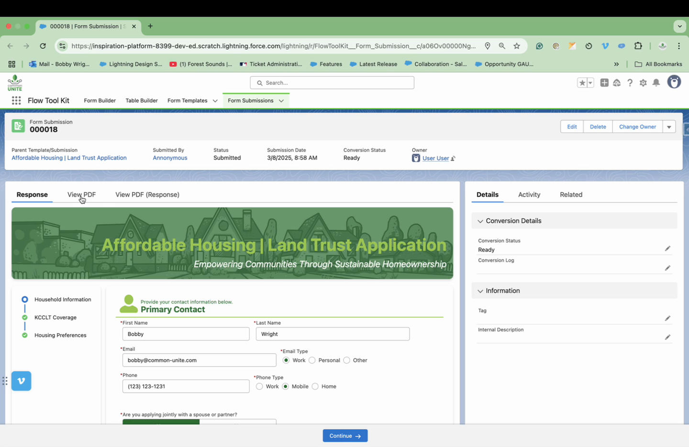
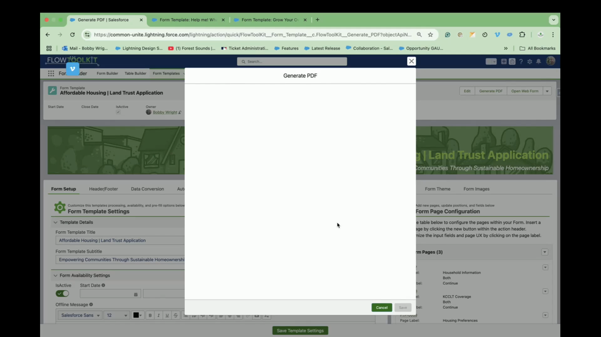

# How To: Create PDF from Submission

> Generate a PDF document from form submission data.


**Prerequisites**: A Form Template with submissions enabled. See [Build a Multi-Page Form](build-multi-page-form.md) and [Use Form Submissions](use-form-submissions.md).


## Video Walkthroughs





## Overview

Flow Tool Kit can generate PDF documents from form submission data — useful for applications, receipts, confirmation letters, and records that need to be shared or archived as files.

## Step 1: Configure PDF Generation

1. Set up PDF generation for your Form Template.
2. Configure which submission fields appear in the PDF.
3. Set PDF formatting options (header, footer, page layout).

## Step 2: Trigger PDF Generation

PDFs can be generated:

| Trigger | Description |
|---------|-------------|
| **On submission** | PDF created automatically when the form is submitted |
| **On conversion** | PDF created when the submission is converted to records |
| **Manual** | Admin triggers PDF generation from the submission record |
| **Flow action** | Use the PDF Generation invocable action in any Flow |

## Step 3: Access the Generated PDF

Generated PDFs are stored as **ContentDocument** records in Salesforce and linked to:
- The Form Submission record
- Optionally, any records created from the conversion

To view:
1. Open the submission record.
2. Look in the **Files** related list.
3. Click the PDF to preview or download.

## Using the PDF Generation Invocable Action

For custom PDF workflows, use the PDF Generation invocable action in any Flow:

1. Add an **Action** element to your Flow.
2. Search for the PDF Generation action.
3. Configure:
   - **Submission ID** — the Form Submission record to generate the PDF from
   - **Template** — optional PDF template settings
4. The action returns the ContentDocument ID of the generated PDF.

## Tips

- **Branding** — customize the PDF header with your organization's logo and colors
- **Distribution** — combine with [Email Notifications](set-up-email-notifications.md) to automatically email the PDF to the submitter or an internal team
- **Archival** — PDFs provide a point-in-time snapshot of the submission data, even if the original records are later modified

## Related Pages

- [Use Form Submissions](use-form-submissions.md) — submission lifecycle
- [Set Up Email Notifications](set-up-email-notifications.md) — email PDFs automatically
- [Invocable Actions](../invocable-actions/record-operations.md) — all Flow actions
