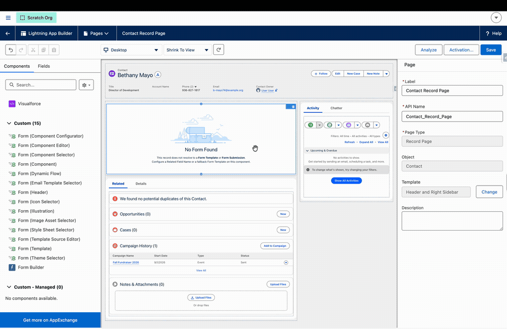

# Host Form On Record Page

> Put a live, working form on a Contact, Campaign, Case, or any other Lightning record page, resolved from the record itself, from an org-wide mapping, or from a fixed template you choose.


**Prerequisites**: A Form Template. See [Build a Multi-Page Form](build-multi-page-form.md). Available from v3.239.


## Overview

The Form (Template) component is not limited to Form Template and Form Submission record pages. Dropped onto any object's record page, it works out which form to show through three mechanisms, checked in order:

1. **Related Field Name**: a Form Template or Form Submission lookup reachable from the page's record. If the lookup is populated, the component loads that template or resumes that submission.
2. **Form Template Source mapping**: your org-wide convention. A Form Template Source custom metadata record maps an object (Campaign, for example) to the field on it that carries the template.
3. **Form Template (Fallback)**: a specific template chosen on the component. Always loads when the first two find nothing.

If none of the three resolve, respondents see a compact "No Form Found" illustration instead of a form, and the component tells the admin what to configure.

## Step 1: Add the Component

1. Open the record page in **Lightning App Builder** (Setup, Edit Page, or via the Object Manager).
2. Drag **Form (Template)** onto the canvas. A full-width region works best for multi-section forms; narrow sidebars suit short forms.
3. Until configured, the preview shows the "No Form Found" illustration. That's expected.

## Step 2: Pick Your Resolution Mechanism

### Option A: Related Field Name (record-driven)

Use this when the record already knows its form. The property is a picklist listing every Form Template and Form Submission lookup reachable from the page's object: its own fields first, then each parent's, then each grandparent's (for example `Campaign > Form Template` on a CampaignMember page). Form Template references list before Form Submission references within each group.

Choosing a **Form Submission** lookup (like Contact's `Latest Form Submission`) is the resume pattern: returning visitors land in their saved submission with all values restored. Choosing a **Form Template** lookup loads a fresh form driven by whichever template the record points at.

If the lookup is blank on a given record, resolution simply moves on to the next mechanism; nothing breaks.

### Option B: Form Template Source mapping (org-wide convention)

When every record of an object should resolve the same way (every Campaign carries its own template in a field, for example), configure a **Form Template Source** custom metadata record for the object instead of configuring each page. The component picks the mapping up automatically, and new submissions are stamped with the hosting record's id in `Source_Id__c`.

### Option C: Form Template (Fallback) (fixed template)

Pick a template from the dropdown, which lists every Form Template by name. It loads whenever nothing else resolves, which also makes it the simplest configuration: set only this property and every visitor to the page gets that form. Submissions created this way are stamped with the hosting record's id in `Source_Id__c`, so they report and resume from the record.

## Step 3: Save, Activate, Test

1. **Save** the page and activate it if it's new.
2. Visit a record where your chosen mechanism resolves, and confirm the form renders and saves.
3. Visit a record where it does not resolve (a contact with no submission yet, for instance) and confirm you get either your fallback template or the "No Form Found" state, whichever you configured.

## App Pages, Home Pages, and Experience Cloud

* **App and Home pages** have no record context. Set **Form Template** (the same fallback property) and the component loads that template directly. You can also pass a specific Record Id property if the page should always show one template or submission.
* **Experience Cloud** pages accept the same properties, entered as text (Experience Builder does not support dynamic dropdowns). Paste the Form Template record Id into the fallback property, or type the related field path, such as `Contact.FlowToolKit__Latest_Form_Submission__c`.

## Tips

* **Read Only** turns any of these configurations into a display surface: great for showing a submitted application on the record page for staff review.
* **The resolution order is your friend**: configure both a Related Field Name and a Fallback on the same page, and each record gets its own submission when one exists, with new visitors falling back to a fresh form.
* **Reporting**: submissions born from the source mapping or the fallback carry the hosting record's id in `Source_Id__c`, so "submissions from this Campaign's page" is one filter away.

## Related Pages

* [Form Templates](../form-templates.md): full component reference, including the resolution chain
* [Save and Resume Forms](save-and-resume-forms.md): draft persistence, autosave, and resume links
* [Use Form Submissions](use-form-submissions.md): the submission lifecycle
