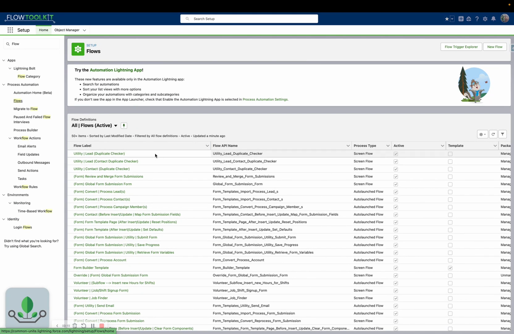

# Overridable Conversion Flows

> Customize the Form Template conversion process by overriding default Flows with your own logic.

## Overview

When a Form Submission is converted to Salesforce records, Flow Tool Kit uses built-in conversion Flows. If the default conversion doesn't meet your needs, you can **override** these Flows with your own, adding custom field mappings, validation, record linking, or any other logic.

## Video Walkthrough



## How It Works

1. Flow Tool Kit ships with **default conversion Flows** that handle standard submission-to-record mapping.
2. You create a **custom auto-launched Flow** that accepts the same inputs.
3. You configure the Form Template to use your custom Flow instead of the default.
4. When conversion runs, your Flow executes instead.

## Step 1: Understand the Default Conversion

The default conversion:

* Reads submission data from the `Form_Submission__c` record
* Maps fields based on the Conversion Rules you've configured
* Creates target records (Account, Contact, Lead, Case, etc.)
* Links the new records back to the submission

## Step 2: Create Your Custom Flow

1. Create a new **Auto-Launched Flow** in Flow Builder (or clone a packaged `| Template` starter, which arrives pre-wired).
2. Add the ONE required input variable: an input, non-collection record variable of type **Form Submission Convert** (`FlowToolKit__Form_Submission_Convert__e`). Any variable name works; the dispatcher detects it and passes the platform event in. This is the entire dispatch contract.
3. Call the packaged **(Form Submission) Convert | Utility | Setup | Overridable** subflow first: it returns the Form Submission, parent, Form Template, page section, and matching-rule settings, and handles start-of-conversion logging.
4. Add your custom logic (a Transform element mapping submission fields to your target is the packaged pattern), log the outcome with the **Form Template | Log Conversion Event** action, and hand control back by enabling the action's *Dispatch Return Event* on your success log.
5. Save and activate the Flow.

## Step 3: Configure the Override

1. In the Form Template configuration, find the conversion settings.
2. Set the **Override Flow** to your custom Flow's API name.
3. The default conversion is bypassed; your Flow runs instead.

## Common Use Cases

### Custom Field Mapping

Map submission fields to non-standard target fields, apply transformations, or split one field into multiple.

### Multi-Object Creation

Create records across multiple objects in a specific order with cross-references (e.g., create Account first, then Contact linked to that Account, then Opportunity linked to both).

### External System Integration

Call an external API during conversion: send data to an ERP, trigger a webhook, or sync with a third-party system.

### Complex Validation

Run business rules before conversion: check for duplicates, validate against external data, or enforce org-specific policies.

## Tips


**Test thoroughly.** Overriding conversion bypasses all default logic. Your custom Flow is responsible for everything: record creation, linking, error handling, and updating the submission status.


* Start by cloning the logic of the default conversion, then customize from there
* Always handle errors gracefully: log failures to a custom object or send admin notifications
* Keep the override Flow focused; delegate complex sub-tasks to subflows

## Related Pages

* [Use Form Submissions](https://github.com/common-unite/cUnite_FormBuilder/blob/master/documents/form-template-framework/how-to-guides/use-form-submissions.md): submission lifecycle
* [Form Template Framework](https://github.com/common-unite/cUnite_FormBuilder/blob/master/documents/form-template-framework/form-template-framework/form-templates.md): template reference
* [Form Submissions Reference](https://github.com/common-unite/cUnite_FormBuilder/blob/master/documents/form-template-framework/form-template-framework/form-submissions.md): submission details
