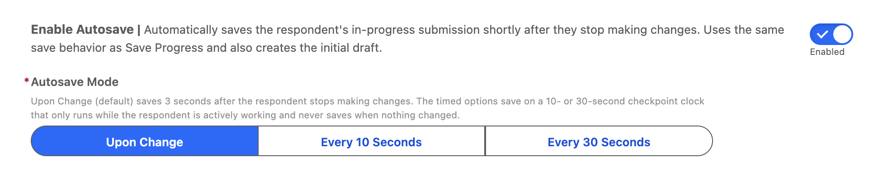

# Save And Resume Forms

> Let users save their progress on multi-page forms and return later to complete them.


**Prerequisites**: A Form Template (multi-page form). See [Build a Multi-Page Form](build-multi-page-form.md).


## Video Walkthrough



## Overview

For long or complex forms, users may not be able to complete everything in one session. Save and Resume lets them:

1. Save their progress at any point
2. Close the browser or navigate away
3. Return later and pick up exactly where they left off

All saved data is stored in a **Form Submission** record with a status of "Draft."

## Step 1: Enable Save & Resume

1. Open the Form Template record page and expand **Save & Form Submission Settings** in the Form Template Settings panel.
2. Configure:

| Setting                      | Description                                                                                                                                             |
| ---------------------------- | ------------------------------------------------------------------------------------------------------------------------------------------------------- |
| **Allow Save Progress**      | Adds a Save Progress button to the form so respondents can save manually and come back later                                                            |
| **Send Save Progress Email** | Emails the respondent a confirmation each time they save their progress                                                                                 |
| **Enable Autosave**          | Saves the in-progress submission automatically as the respondent works, no button click needed. See [Autosave](save-and-resume-forms.md#autosave) below |
| **Autosave Mode**            | How autosave paces itself: **Upon Change** (default), **Every 10 Seconds**, or **Every 30 Seconds**                                                     |

## Step 2: Provide a Way to Resume

Users need a way to find and re-open their saved submission:

### Option A: Direct Link

Send the user a link to resume their form (via email notification or on-screen confirmation).

### Option B: Submission List

Create a screen or page that shows the user's draft submissions with a "Continue" button.

### Option C: Auto-Resume

If the user returns to the same form URL and has an existing draft, automatically load their saved progress.

## Step 3: Test

1. Start filling out the form template.
2. Click **Save Draft** partway through.
3. Close the browser.
4. Return via your resume method.
5. Verify:
   * All previously entered data is restored
   * The user returns to the correct page
   * Completing and submitting the form works normally

## How It Works

1. **User clicks Save** → A `Form_Submission__c` record is created with status = "Draft"
2. **Field data is stored** → All entered values are serialized and saved on the submission record
3. **User returns** → The form loads the draft submission and pre-fills all fields
4. **User submits** → The draft is promoted to a full submission (status changes to "Submitted")

## Autosave

> Available from v3.239

Autosave commits the respondent's in-progress submission silently as they work, no button click required. It rides the exact same save pipeline as Save Progress: the draft is a normal `Form_Submission__c` with status "Draft", and if the respondent never clicks anything, autosave creates that initial draft record on its own. In Stages Mode, the current page's stage record is kept in sync on every autosave, just as it is on a manual save.

### Enabling it

On the Form Template record page, expand **Save & Form Submission Settings** and toggle **Enable Autosave** on. An **Autosave Mode** selector appears with three pacing options; **Upon Change** is the default.

### How the timing is calculated

The rule that governs everything: autosave is **100% interaction-driven**. A respondent who only reads the form never triggers a save, in any mode: the clock does not exist until their first change, and any completed save (automatic or manual) disarms all timers until the next change re-arms them.

**Upon Change (default)** is a debounce with a safety cap:

* Every change (a keystroke, a picklist selection, a checkbox toggle) restarts a **3-second countdown**. The save fires 3 seconds after the _last_ change, so it never interrupts active typing: as long as the respondent keeps working, the countdown keeps resetting.
* **15-second max-wait cap**: continuous typing would reset the countdown forever, so autosave never defers past 15 seconds from the first unsaved change. A respondent typing a long paragraph without a pause still checkpoints roughly every 15 seconds, then gets one final save 3 seconds after they stop.

**Every 10 Seconds / Every 30 Seconds** run a checkpoint clock:

* The clock starts on the respondent's **first change**, not on page load.
* On each tick, autosave checks whether anything actually changed since the last save. **Clean ticks are skipped**: nothing is ever written when nothing changed.
* Any save stops the clock; the next change starts it again from zero.

Choose Upon Change when you want drafts persisted as tightly as possible; choose a timed mode when you'd rather batch writes (for example, when submission records carry heavy downstream automation and you want fewer, predictable saves).

### What a save does (and doesn't do)

* The **first** autosave with no existing draft **creates** the Form Submission (status "Draft"); every later autosave **updates** that same record.
* Autosaves are **silent**: no toast, no page refresh, no interruption to what the respondent is doing. The Save Progress button (if enabled) keeps its normal confirmation toast.
* If an autosave **fails** (network hiccup, validation), it logs to the browser console and stays quiet; no error toast on every cycle. The draft simply catches up on the next save.
* If an autosave comes due while another save is still mid-flight, it **waits and retries** (3 seconds later in Upon Change; on the next tick in timed modes) instead of double-saving.
* A **manual Save Progress click resets everything**: pending countdowns are cancelled and the listener re-arms on the next change, so a manual save is never immediately followed by a redundant autosave.

### When autosave is inactive

Autosave never runs when:

* **Enable Autosave** is off (the default); the feature is strictly opt-in per template.
* The template renders **inside a Flow screen**; in Flows, your Flow owns the DML through the component's navigation outputs, so autosave stays out of the way.
* The form is **read-only** (`disableAll`).
* The submission is already **submitted** (its Submission Date is set); only drafts autosave.

### Guests and Experience Cloud

Autosave works for authenticated users, guest users, and embedded (iframe) contexts alike; guest and iframe saves route through the same **Form Submission Upsert** flow that Save Progress uses. Keep in mind that _retrieving_ a guest's draft later still requires a resume path, such as the emailed resume link in Stages Mode.

## Tips


**Draft submissions are not converted.** Only fully submitted forms go through the conversion process. Drafts remain as-is until the user completes and submits.


* **Reminder emails**: consider sending a reminder email after X days if a draft hasn't been completed
* **Draft expiration**: for time-sensitive forms (applications with deadlines), implement logic to expire old drafts
* **Authenticated users only**: Save & Resume requires user identity. Guest users on Experience Cloud need to be authenticated for their draft to be retrievable.

## Related Pages

* [Build a Multi-Page Form](build-multi-page-form.md): template creation
* [Use Form Submissions](use-form-submissions.md): submission lifecycle
* [Form Template Framework](../form-template-framework/form-templates.md): full reference
