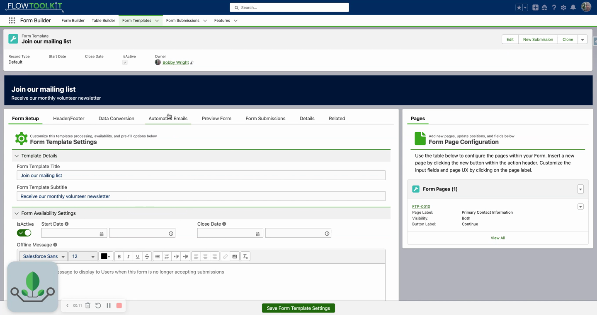

# How To: Set Up Email Notifications

> Send automated emails when forms are submitted — to the submitter, an admin, or both.


**Prerequisites**: A Form Template with submissions. See [Build a Multi-Page Form](build-multi-page-form.md).


## Overview

Flow Tool Kit can send automated email notifications when a form submission occurs. Common use cases:
- **Confirmation to submitter** — "Thank you, we received your application"
- **Alert to admin** — "New submission received for [Template Name]"
- **PDF attachment** — include the submission PDF in the email

## Video Walkthrough



## Step 1: Configure Email Templates

Create Salesforce email templates for your notifications:

1. Go to **Setup → Email Templates** (Classic or Lightning).
2. Create templates for each notification type.
3. Use merge fields to include submission data in the email body.

## Step 2: Link Templates to Your Form Template

1. In the Form Template configuration, navigate to the email notification settings.
2. Configure notification rules:

| Setting | Description |
|---------|-------------|
| **Recipient** | Who receives the email (submitter, admin, specific address) |
| **Email Template** | The Salesforce email template to use |
| **Trigger** | When the email sends (on submission, on conversion, both) |
| **Include PDF** | Whether to attach the submission PDF |

## Step 3: Test

1. Submit a test form.
2. Check the recipient's inbox for the notification.
3. Verify merge fields populated correctly.
4. If attaching PDFs, verify the attachment is present and readable.

## Notification Types

| Type | Recipient | Typical Content |
|------|-----------|----------------|
| **Confirmation** | Form submitter | "Thank you for your submission. Reference #12345." |
| **Admin Alert** | Internal team | "New submission for [Template]. Review at [link]." |
| **Conversion Notice** | Submitter | "Your application has been approved/processed." |

## Tips


**Email deliverability**: Ensure your org's email deliverability is set to "All Email" (Setup → Deliverability). Sandbox orgs default to "System Email Only" which blocks non-system emails.


- **Test in sandbox first** — email notifications in production can't be undone
- **Use org-wide email addresses** — set a professional "From" address instead of the running user's email
- **Rate limits** — Salesforce has daily email limits per org. High-volume forms may hit these limits.

## Related Pages

- [Use Form Submissions](use-form-submissions.md) — submission lifecycle
- [Create PDF from Submission](create-pdf-from-submission.md) — attach PDFs to emails
- [Build a Multi-Page Form](build-multi-page-form.md) — template creation
