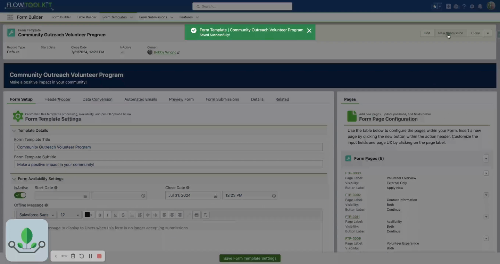

# How To: Use Form Submissions

> Capture, review, and convert form submission data into Salesforce records.


**Prerequisites**: A multi-page form template. See [Build a Multi-Page Form](build-multi-page-form.md).


## Video Walkthrough



## Overview

When users fill out a Form Template, their data is captured as a **Form Submission** record. Submissions can be reviewed before final processing, then converted into one or more Salesforce records (Account, Contact, Lead, Case, Opportunity, Campaign Member).

The submission lifecycle is: **Draft → Submitted → Reviewed → Converted**

## Step 1: Enable Submissions on Your Template

Form submissions are built into the Form Template Framework. When a user completes all pages and clicks Submit, a `Form_Submission__c` record is created automatically with all their input data.

## Step 2: Review Submissions

### In the Form Submission Tab

1. Navigate to the **Form Submissions** tab.
2. View a list of all submissions for your templates.
3. Click a submission to see the complete data the user entered.

### Review Mode

Submissions can be displayed in read-only review mode before final submission:

- The last page of the template can show a summary of all pages
- Users review their data and either go back to edit or confirm submission
- This is configured in the template settings

## Step 3: Convert Submissions to Records

After reviewing a submission, convert it into Salesforce records:

1. Open the submission record.
2. Click **Convert** (or set up automatic conversion).
3. The conversion process creates records based on your **Conversion Rules**.

### What Gets Created

| Target Object | When To Use |
|--------------|-------------|
| Account | Organization/company data |
| Contact | Individual person data |
| Lead | Prospect data for sales pipeline |
| Case | Support request or inquiry |
| Opportunity | Sales opportunity |
| Campaign Member | Add to a marketing campaign |

## Step 4: Set Up Conversion Rules

Conversion rules define how submission fields map to Salesforce fields:

1. Configure conversion rules for your template.
2. For each target object, map:
   - **Source field** (from the submission) → **Target field** (on the Salesforce object)
3. Set transformation rules if data needs to be modified during conversion.


**Tip**: You can convert a single submission into multiple objects. For example, a grant application might create an Account, Contact, and Opportunity in a single conversion.


## Step 5: Customize Conversion (Optional)

If the standard conversion doesn't meet your needs, override it with a custom Flow:

1. Create an auto-launched Flow that handles the conversion logic.
2. Reference it in the template's conversion configuration.
3. Your Flow receives the submission data and creates/updates records however you need.

See [Advanced Topics: Overridable Flows](../advanced-topics/overridable-flows.md) for details.

## Automatic vs. Manual Conversion

| Mode | Description | When To Use |
|------|-------------|------------|
| **Automatic** | Records created immediately on submission | Simple intake forms, no review needed |
| **Manual** | Admin reviews and triggers conversion | Applications, sensitive data, quality review |

## Related Pages

- [Form Submissions Reference](../form-template-framework/form-submissions.md) — full reference
- [Build a Multi-Page Form](build-multi-page-form.md) — template creation
- [Create PDF from Submission](create-pdf-from-submission.md) — generate PDFs
- [Set Up Email Notifications](set-up-email-notifications.md) — notify on submission
