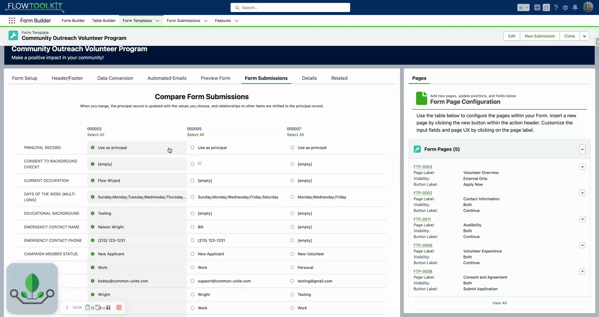

# Merge Submissions
> Consolidate duplicate form submissions by comparing records side-by-side and selecting which field values to keep.

## Video Walkthrough



## Overview

When someone accidentally submits a form more than once — or when you need to consolidate overlapping responses — the Merge Submissions feature lets you combine multiple form submissions into a single record. Instead of simply deleting duplicates, you can cherry-pick the best field values from each submission.

## How It Works

1. Navigate to the **Returned Responses** section on your Form Template record.
2. Select the duplicate or overlapping form submissions (e.g., 2-3 records).
3. Click **Merge Selected**.
4. The Merge Records component opens, showing a field-by-field comparison of all selected records.
5. For each field where values differ, select which record's value to keep (the "winning" value).
6. Click **Merge Records**.
7. The winning record is updated with the selected values from across all submissions.

## What Gets Compared

The merge view highlights **differences** between records. Fields with identical values across all selected submissions don't require a selection — only differing fields are shown for resolution.

Common fields that may differ between duplicate submissions:
- Submission date
- Signatures
- Free-text responses
- File uploads
- Contact details updated between submissions

## Tips & Considerations

- **Preserve, don't delete** — merging lets you keep the best data from each submission rather than losing information by deleting duplicates.
- **Uses the Merge Records component** — this is the same [Merge Records](../screen-components/merge-records.md) component available throughout Flow Tool Kit, integrated directly into the Form Template submission view.
- **Select carefully** — review each field difference before merging. The merge operation updates the winning record and cannot be undone through the UI.
- **Works within the template context** — the merge option appears in the Form Template's returned responses area, making it easy to spot and resolve duplicates.

## Related Pages

- [Form Submissions](form-submissions.md) — viewing and managing submissions
- [Merge Records](../screen-components/merge-records.md) — the merge component reference
- [Form Templates](form-templates.md) — form template record configuration
