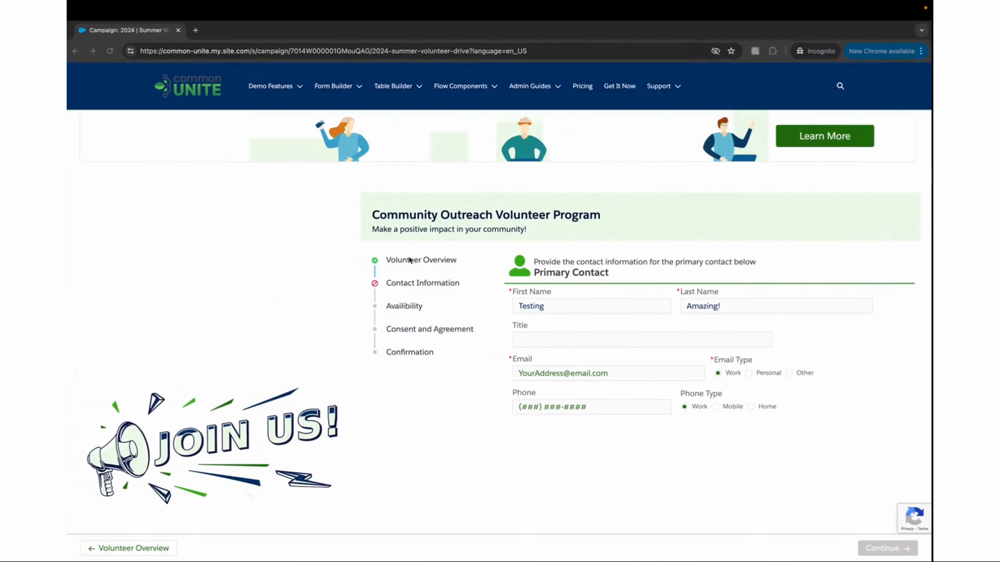

# Form Template Framework Overview

> Multi-page forms with built-in navigation, save-and-resume, submissions, and conversion — powered by a template record structure.

## Video Introduction



## What Is the Form Template Framework?

The Form Template Framework extends Flow Tool Kit beyond single-screen form components into multi-page, multi-step form workflows. While form components (built in Form Builder) handle individual data entry pages, Form Templates organize multiple form components across pages with built-in navigation, progress tracking, save-and-resume, and submission management.

## When to Use Form Templates

| Scenario | Use Form Components | Use Form Templates |
|----------|:-------------------:|:------------------:|
| Simple data entry — one object, one screen | Yes | |
| Multi-page intake or application | | Yes |
| Save and resume across sessions | | Yes |
| Submission review and approval workflows | | Yes |
| External-facing forms (Experience Cloud) with progress tracking | | Yes |
| Quick inline form on a record page | Yes | |
| Data collection with conversion to records | | Yes |



## Architecture

```
Form_Template__c (Template)
├── Form_Template_Page__c (Page 1)
│   ├── Form_Template_Page_Section__c → references Form Component A
│   └── Form_Template_Page_Section__c → references Form Component B
├── Form_Template_Page__c (Page 2)
│   └── Form_Template_Page_Section__c → references Form Component C
└── Form_Submission__c (User's saved progress / completed submission)
    └── Form_Submission_Conversion_Log__c (Conversion audit trail)
```

Each template contains **pages**, and each page contains **sections**. Each section references a **form component** built in Form Builder. The Form Template screen component renders one page at a time with navigation controls, and the submission system persists user responses.

## Key Capabilities

- **Multi-page navigation** — forward, backward, and page-level conditional logic
- **Save and resume** — authenticated users can save progress and return later
- **Form Submissions** — structured storage of user responses as `Form_Submission__c` records
- **Submission conversion** — transform submissions into Salesforce records (Account, Contact, Lead, etc.)
- **Overridable conversion flows** — replace default conversion with custom Flow logic
- **Email notifications** — trigger notifications on submission events
- **PDF generation** — create PDF documents from completed submissions
- **Campaign integration** — link submissions to Salesforce Campaigns
- **Form availability** — control when templates are active via date ranges and conditions

## Section Map

| Page | What It Covers |
|------|---------------|
| [Form Templates Reference](form-templates.md) | Screen component properties, inputs/outputs, how it works |
| [Form Submissions Reference](form-submissions.md) | Submission object, lifecycle, and data model |
| **How-To Guides** | |
| [Build Multi-Page Form](how-to/build-multi-page-form.md) | Step-by-step template creation |
| [Save and Resume](how-to/save-and-resume-forms.md) | Implementing save-and-resume in Flows |
| [Use Form Submissions](how-to/use-form-submissions.md) | Submission capture, review, and processing |
| [Create PDF from Submission](how-to/create-pdf-from-submission.md) | PDF generation for completed submissions |
| [Set Up Email Notifications](how-to/set-up-email-notifications.md) | Notification rules and configuration |
| [Overridable Conversion Flows](how-to/overridable-conversion-flows.md) | Custom conversion logic |
| **FAQ & Troubleshooting** | |
| [Form Template FAQ](faq/faq.md) | Common questions |
| [Form Template Troubleshooting](faq/troubleshooting.md) | Solutions to common issues |

## Related Pages

- [Core Concepts](../getting-started/core-concepts.md) — how form components and templates compare
- [Data Model](../advanced-topics/data-model.md) — complete object and field reference
- [Videos: Form Templates](../videos/videos-form-templates.md) — video walkthroughs
