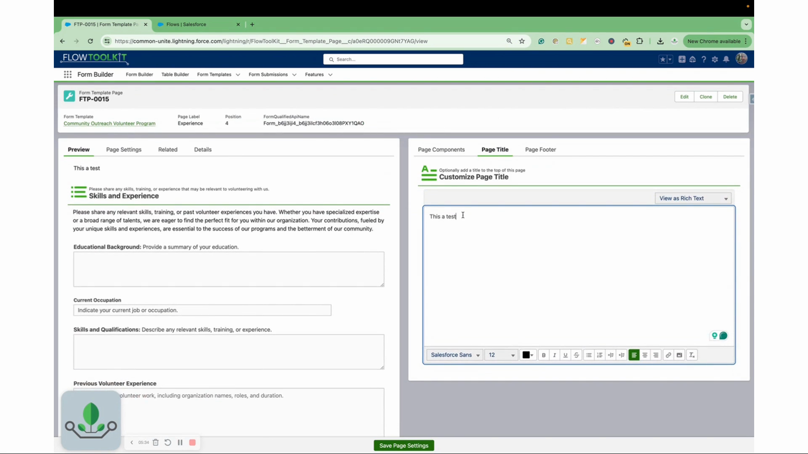

# Pages and Sections

> How Form Template Pages and Sections work — ordering, configuration, and relationship to form components.

## Video Walkthroughs







## Page Structure

Each `Form_Template_Page__c` record represents one step in the multi-page form. Pages are displayed one at a time with navigation controls.

### Page Fields

| Field | Type | Description |
|-------|------|-------------|
| **Form Template** | Lookup | Parent template this page belongs to |
| **Position** | Number | Display order (sorted ascending) |
| **Label** | Text | Page title shown in navigation |
| **Active** | Checkbox | Whether this page is included |
| **Conditional Logic** | Text | Conditions for showing/hiding this page |

### Page Ordering

Pages are sorted by the **Position** field (ascending numeric). Best practice:
- Use increments of 10 (10, 20, 30) to leave room for insertions
- Gaps are fine — only the relative order matters
- Duplicate positions cause unpredictable ordering

## Section Structure

Each `Form_Template_Page_Section__c` record represents one form component within a page. A page can have multiple sections, each rendering a different form component.

### Section Fields

| Field | Type | Description |
|-------|------|-------------|
| **Form Template Page** | Lookup | Parent page this section belongs to |
| **Position** | Number | Display order within the page |
| **Form** | Text | QualifiedApiName of the form component to render |

### Multiple Sections Per Page

When a page has multiple sections, each section renders its form component in order. This lets you combine form components for different objects on the same page:

```
Page: "Contact & Organization"
├── Section 1 (Position: 10) → "Contact_Info" form component (Contact object)
└── Section 2 (Position: 20) → "Org_Details" form component (Account object)
```

## Page Conditional Logic

Pages can be conditionally shown or hidden based on field values from **previous** pages.

**Supported conditions**:
- Field value equals / not equals
- Field is blank / not blank
- AND / OR combinations

**Limitation**: Conditions can only reference fields from earlier pages — not the current page or future pages. This is because the form data for later pages hasn't been entered yet.

### Example

Page 3 ("Spouse Information") is only shown when the "Marital Status" field on Page 1 equals "Married" or "Domestic Partnership".

## Related Pages

- [Creating Templates](creating-templates.md) — step-by-step template creation
- [Form Templates Reference](form-templates.md) — screen component properties
- [Page Conditional Logic](page-conditional-logic.md) — detailed conditional logic guide
