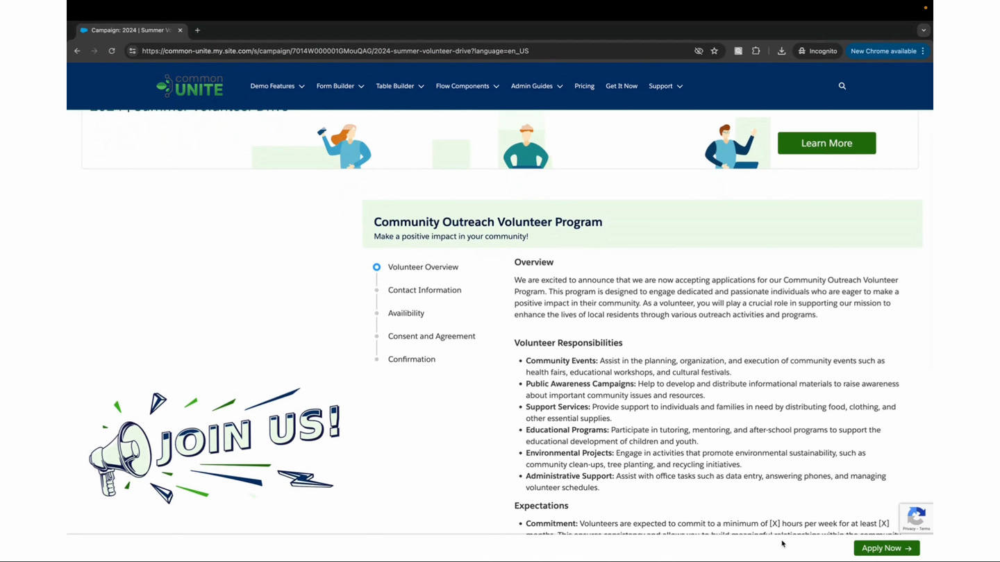
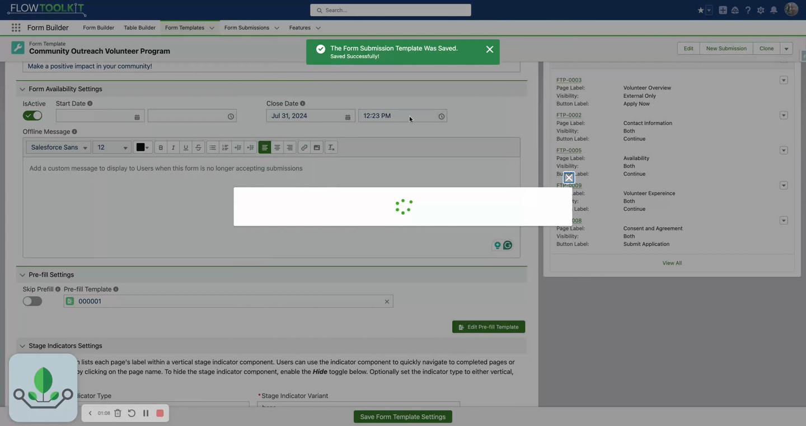
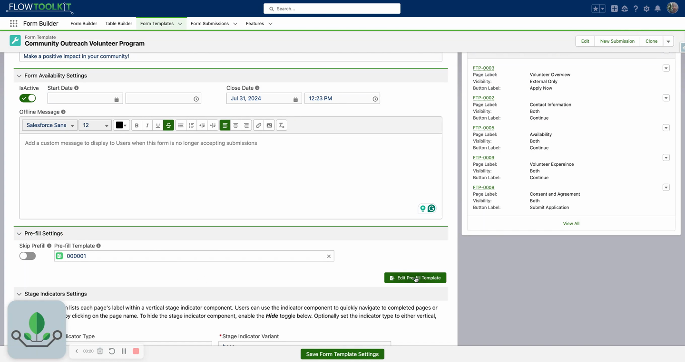

# Pre-fill Templates
> Set default field values on a Form Template record — no Flow logic required. Pre-populate visible fields and inject backend values for data conversion.

## Video Walkthroughs





## Overview

Pre-fill templates let you configure default field values directly on a Form Template record. When the form loads, those values are automatically populated — both visible fields (name, email type) and backend fields (campaign ID, lead source) that drive data conversion. This eliminates the need for Flow assignment elements or complex flow logic.

## Configuration

1. Navigate to your **Form Template** record.
2. Click **Edit Prefilled Template** (or "Edit Prefilled Values").
3. Click the field picker to browse all fields from the form submission object.
4. Select the fields you want to pre-fill.
5. Set a value for each selected field.
6. Click **Save Template**.

## What You Can Pre-fill

Pre-fill works for **any field** on the form submission object, whether the field is displayed on the form or not:

| Category | Examples |
|---|---|
| **User-visible fields** | First Name, Last Name, Email Type, Phone Type, Title |
| **Backend / hidden fields** | Campaign ID, Campaign Member Status, Lead Source |
| **Data conversion drivers** | Values that control which records are created during conversion (e.g., "New Volunteer" status) |

## Common Patterns

### 1. Default Contact Preferences
Set Email Type to "Work" and Phone Type to "Work" so users don't have to select these on every form.

### 2. Campaign Member Injection
Pre-fill the Campaign ID and Campaign Member Status (e.g., "New Volunteer") as backend values. When the form submission converts, the system automatically creates a Campaign Member with the correct status — the user never sees these fields.

### 3. Lead Source Tracking
Set Lead Source to identify where submissions came from (e.g., "Website", "Event Registration"). This value is injected behind the scenes and flows through to the converted Lead record.

### 4. Rapid Form Scaling
Build a single form template and use pre-fill values to customize it for different contexts. Combined with [Campaign Integration](campaign-integration.md), you can serve dozens of campaigns from one template with different default values.

## Tips & Considerations

- **No Flow needed** — pre-fill values are configured entirely on the Form Template record. You can create dozens of form solutions without ever opening Salesforce Flow.
- **Backend values are powerful** — the most impactful pre-fill values are often ones users never see: campaign assignments, lead sources, and data conversion parameters.
- **Overridable** — users can change pre-filled visible values on the form. Backend values that aren't on the form cannot be changed by users.
- **Works with save progress** — pre-filled values persist across save-and-resume sessions.

## Related Pages

- [Form Templates](form-templates.md) — form template record configuration
- [Campaign Integration](campaign-integration.md) — linking templates to campaigns
- [Submission Conversion](submission-conversion.md) — how pre-filled values drive data conversion
- [Overview](overview.md) — Form Template Framework overview
