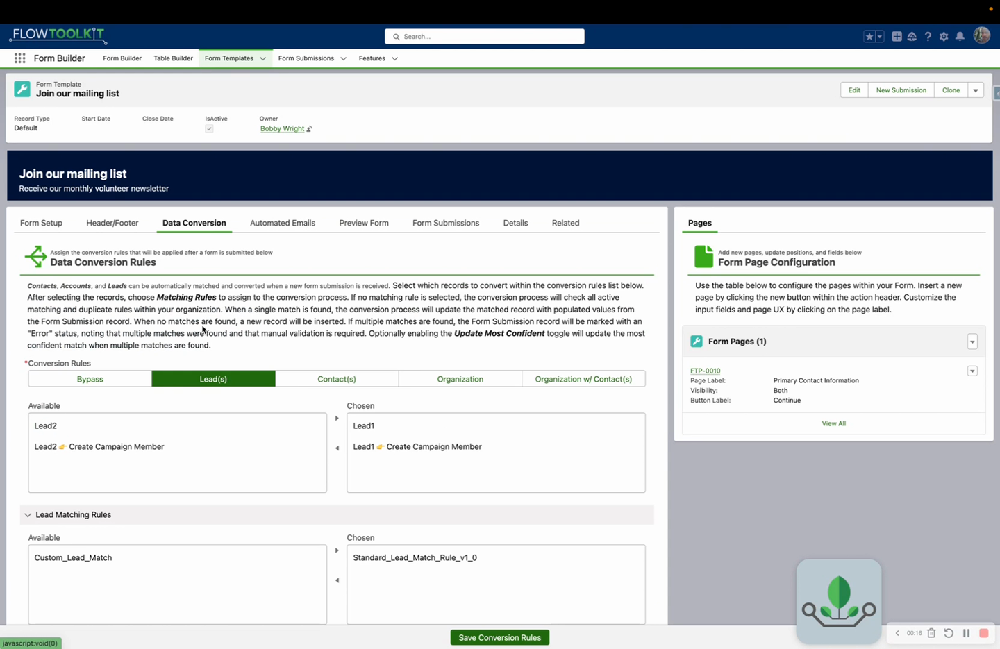

# Submission Conversion

> Transform completed Form Submissions into Salesforce records: Accounts, Contacts, Leads, Cases, or custom objects.

## Video Walkthrough



## Overview



Submission conversion is the process of taking a completed `Form_Submission__c` record and creating actual Salesforce records from the stored form data. This is the bridge between "user filled out a form" and "records exist in Salesforce."

## Conversion Lifecycle

```
Form Submission (Status: Submitted)
    ↓ Conversion triggered
Field values mapped to target object(s)
    ↓ Records created
Form_Submission_Conversion_Log__c entries recorded
    ↓ Status updated
Form Submission (Status: Complete)
```

## Conversion Methods

### Automatic Conversion

Conversion triggers automatically when a submission reaches "Submitted" status. This is configured at the template level and runs as a platform event-driven process.

### Manual Conversion

An admin or manager reviews the submission first, then triggers conversion manually. This allows for quality checks, edits, and approval before records are created.

## Conversion Rules

Conversion rules define the mapping between form fields and target object fields:

| Rule Property     | Description                                                              |
| ----------------- | ------------------------------------------------------------------------ |
| **Target Object** | Which Salesforce object to create (Account, Contact, Lead, Case, custom) |
| **Field Mapping** | Which form field maps to which target field                              |
| **Status Field**  | Which field on the submission tracks this conversion's status            |
| **Lookup Field**  | Which field on the submission stores the created record's Id             |

### Multi-Object Conversion

A single submission can convert to multiple objects. For example, a grant application might create:

1. A Contact record
2. An Account record (linked to the Contact)
3. A custom Grant\_Application\_\_c record (linked to both)

Each target object has its own conversion rule, field mapping, and status tracking.

## The Conversion Event Action

Every step of the pipeline runs through one invocable action — **Form Template | Conversion Event** — called in one of four modes:

| Mode                     | What it does                                                                                                       |
| ------------------------ | ------------------------------------------------------------------------------------------------------------------ |
| **Start**                | Kicks off the pipeline: resets every conversion status to Ready and sends the submission to its controller flow    |
| **Convert to Record**    | Dispatches the submission to a conversion flow (packaged default or your override) that builds one record          |
| **Log**                  | Records a step's outcome — success or error — and optionally stamps a status field and the created record's lookup |
| **Return to Controller** | Hands control back so the controller evaluates the next rule                                                       |

The packaged flows are ordinary autolaunched flows built from these calls, so customizing conversion means cloning a readable flow and editing it — the action's property editor guides each mode's inputs, including a grouped conversion-flow picker and automatic binding of the standard `FormSubmission`/`FormTemplate` variables.

Campaign Member conversion chains directly from the Contact and Lead upserts: as soon as a person converts, their membership follows — no separate controller pass.

## Conversion Log

Every conversion attempt is logged in `Form_Submission_Conversion_Log__c`:

| Field             | Description                         |
| ----------------- | ----------------------------------- |
| **Submission**    | The source submission               |
| **Target Object** | Object that was created             |
| **Record Id**     | Id of the created record            |
| **Status**        | Success or Error                    |
| **Message**       | Details about the conversion result |

Dispatch steps are silent, so the log reads chronologically: **Start once, each outcome (Created / Matched / Updated or an error), then Finish.** Related-record rows log against both the row and its parent submission, so parent-level monitoring covers every row.

## Error Handling

When a conversion fails (missing required fields, validation rule violations, duplicate rules):

1. The conversion log records the error
2. The submission status reflects the failure
3. The submission can be corrected and re-converted

## Related Pages

* [Form Submissions](form-submissions.md): submission object reference
* [Use Form Submissions](how-to/use-form-submissions.md): end-to-end guide
* [Overridable Conversion Flows](how-to/overridable-conversion-flows.md): custom conversion logic
* [Form Submission Actions](../invocable-actions/form-submission-actions.md): invocable actions for logging events
