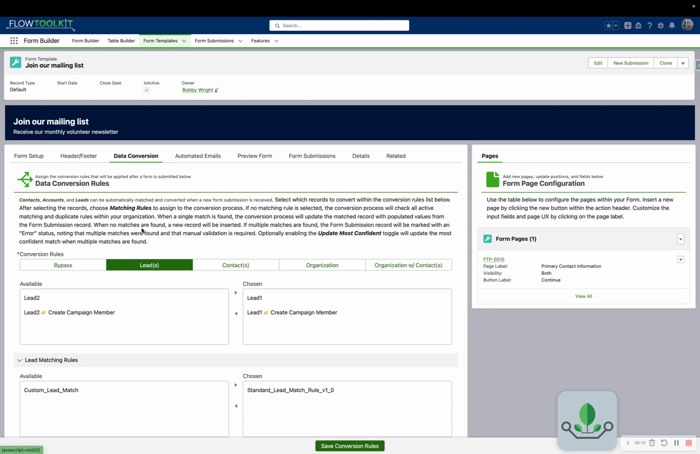
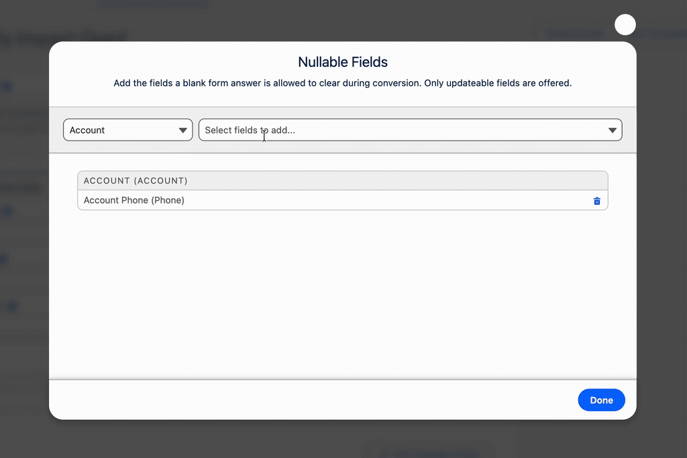
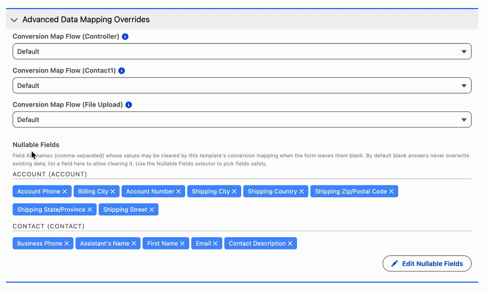

# Submission Conversion

> Transform completed Form Submissions into Salesforce records: Accounts, Contacts, Leads, Cases, or custom objects.

## Video Walkthrough



## Overview



Submission conversion is the process of taking a completed `Form_Submission__c` record and creating actual Salesforce records from the stored form data. This is the bridge between "user filled out a form" and "records exist in Salesforce."

## Conversion Lifecycle

```
Form Submission (Status: Submitted)
    ↓ Conversion triggered
Field values mapped to target object(s)
    ↓ Records created
Form_Submission_Conversion_Log__c entries recorded
    ↓ Status updated
Form Submission (Status: Complete)
```

## Conversion Methods

### Automatic Conversion

Conversion triggers automatically when a submission reaches "Submitted" status. This is configured at the template level and runs as a platform event-driven process.

### Manual Conversion

An admin or manager reviews the submission first, then triggers conversion manually. This allows for quality checks, edits, and approval before records are created.

## Conversion Rules

Conversion rules define the mapping between form fields and target object fields:

| Rule Property     | Description                                                              |
| ----------------- | ------------------------------------------------------------------------ |
| **Target Object** | Which Salesforce object to create (Account, Contact, Lead, Case, custom) |
| **Field Mapping** | Which form field maps to which target field                              |
| **Status Field**  | Which field on the submission tracks this conversion's status            |
| **Lookup Field**  | Which field on the submission stores the created record's Id             |

### Multi-Object Conversion

A single submission can convert to multiple objects. For example, a grant application might create:

1. A Contact record
2. An Account record (linked to the Contact)
3. A custom Grant\_Application\_\_c record (linked to both)

Each target object has its own conversion rule, field mapping, and status tracking.

## Nullable Fields (clearing values with blank answers)

Conversion mapping is protective by default: every packaged conversion flow runs the [Strip Null Values](../invocable-actions/collection-data-utilities.md#strip-null-values) action before writing, so a blank form answer never wipes data already on a matched record. **Nullable Fields** is the opt-out for the cases where blank *means* clear it - a respondent emptying their phone number, unchecking a consent box, or removing an assistant's name.

### Configuring on the Form Template

Open the Form Template record page and find **Nullable Fields** under **Data Conversion Settings → Advanced Data Mapping Overrides**. Click **Edit Nullable Fields** to open the selector:



- The **object picker** offers every accessible object in your org - conversion can target anything, not just the packaged objects.
- The **field picker** offers only fields that are valid and updateable on the chosen object, so a selection can never produce a conversion error.
- Chosen fields group into a card per object, and the read view shows them as badges grouped under each object with inline remove:



During conversion, every packaged conversion flow (Account, Contact, Lead, Case, Opportunity, and Campaign Member) passes the template's Nullable Fields value into its Strip Null Values calls automatically. When a listed field arrives blank, the matched record's value is cleared - checkboxes are set to `false`, since a checkbox cannot hold null. Fields not listed keep the full strip-null protection.


Conversion flows you cloned from the packaged **Overridable** flows before this feature shipped do not have the binding. Add the template's `Nullable Fields` field to each **Remove Null Values** action's **Nullable Fields (CSV or JSON)** input in your override.


### Extending to your own objects and flows

The selector is not tied to the Form Template. Any field whose API name contains `Nullable_Fields__c` renders the same selector automatically - in the Form Builder and on any record form:

1. Create a **Long Text Area** field named `Nullable_Fields__c` on any standard or custom object (a plain Text field works too).
2. Add it to a form in the Form Builder. The field renders as the Nullable Fields selector - no configuration required.
3. Optionally set a **Scoped Object** under the field's **Nullable Fields Settings** in the builder. Scoped mode locks the selector to that one object and stores a simple comma-separated list; leaving it **Universal** keeps the object picker and stores an object-keyed JSON map.
4. In your own flow, pass the field's value into the Strip Null Values action's **Nullable Fields (CSV or JSON)** input before your Update Records element.

### Building the list directly in Flow

The selector is a convenience, not a requirement - the action input is a plain string an admin can assemble in Flow:

- **Comma-separated names** for a single object, from a formula or Text Template:

  ```
  Email, Phone, Description
  ```

- **An object-keyed JSON map** when one string feeds strips of different objects - only the entry matching each stripped record's object applies, and a `"*"` key applies to any object:

  ```json
  {"Account":["Phone"],"Contact":"Email,Title","*":["Description"]}
  ```

- **Combine sources dynamically**: bind the template's stored value for the defaults and append per-interview additions with a formula - for example `{!FormTemplate.Nullable_Fields__c}` when the template list is all you need, or a formula that concatenates extra names onto a CSV.

Misconfigurations fail loudly rather than silently: a name that is not a valid, updateable field on the stripped record's object - or JSON that does not parse - faults the flow with a `Nullable Fields:` error identifying the field and object. Blank values, a bare comma, and an empty map (`{}`) are safe no-ops, so conditional formulas that sometimes produce nothing are fine.

## The Conversion Event Action

Every step of the pipeline runs through one invocable action - **Form Template | Conversion Event** - called in one of four modes:

| Mode                     | What it does                                                                                                       |
| ------------------------ | ------------------------------------------------------------------------------------------------------------------ |
| **Start**                | Kicks off the pipeline: resets every conversion status to Ready and sends the submission to its controller flow    |
| **Convert to Record**    | Dispatches the submission to a conversion flow (packaged default or your override) that builds one record          |
| **Log**                  | Records a step's outcome - success or error - and optionally stamps a status field and the created record's lookup |
| **Return to Controller** | Hands control back so the controller evaluates the next rule                                                       |

The packaged flows are ordinary autolaunched flows built from these calls, so customizing conversion means cloning a readable flow and editing it - the action's property editor guides each mode's inputs, including a grouped conversion-flow picker and automatic binding of the standard `FormSubmission`/`FormTemplate` variables.

Campaign Member conversion chains directly from the Contact and Lead upserts: as soon as a person converts, their membership follows - no separate controller pass.

## Conversion Log

Every conversion attempt is logged in `Form_Submission_Conversion_Log__c`:

| Field             | Description                         |
| ----------------- | ----------------------------------- |
| **Submission**    | The source submission               |
| **Target Object** | Object that was created             |
| **Record Id**     | Id of the created record            |
| **Status**        | Success or Error                    |
| **Message**       | Details about the conversion result |

Dispatch steps are silent, so the log reads chronologically: **Start once, each outcome (Created / Matched / Updated or an error), then Finish.** Related-record rows log against both the row and its parent submission, so parent-level monitoring covers every row.

## Error Handling

When a conversion fails (missing required fields, validation rule violations, duplicate rules):

1. The conversion log records the error
2. The submission status reflects the failure
3. The submission can be corrected and re-converted

## Nonprofit Cloud

Nonprofit Cloud models people and families differently: a person is a Person Account, a family is a Household with a Party Relationship Group, and membership and family relationships are records in their own right. The **Nonprofit Cloud Extension** teaches this pipeline that shape, using the same Conversion Rules, statuses, logs and Reprocess described above. See the [Nonprofit Cloud Extension overview](../nonprofit-cloud/overview.md).

## Related Pages

* [Nonprofit Cloud Extension](../nonprofit-cloud/overview.md): Person Accounts, Households and relationships
* [Form Submissions](form-submissions.md): submission object reference
* [Use Form Submissions](how-to/use-form-submissions.md): end-to-end guide
* [Overridable Conversion Flows](how-to/overridable-conversion-flows.md): custom conversion logic
* [Form Submission Actions](../invocable-actions/form-submission-actions.md): invocable actions for logging events
