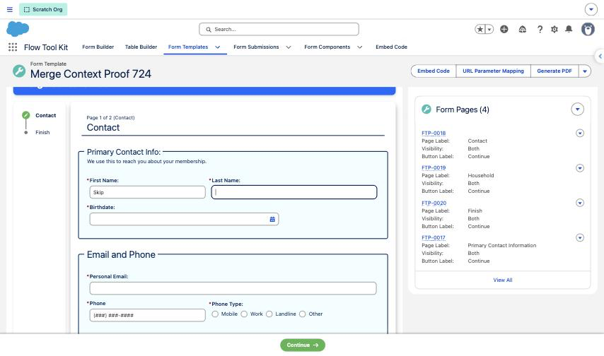
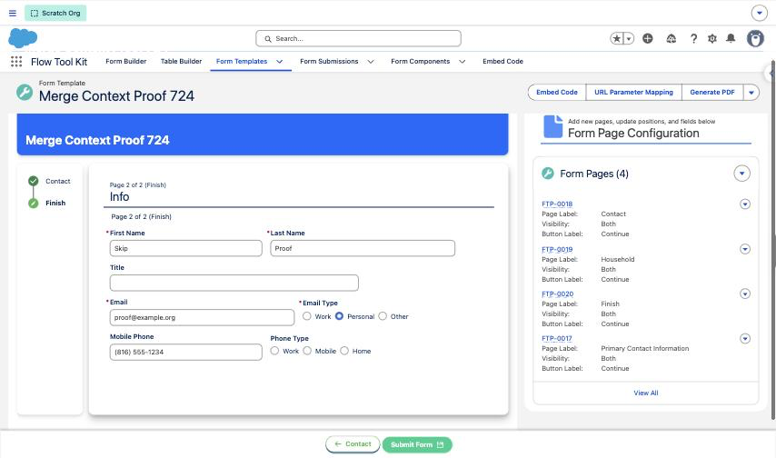

# Template, Page and Section Merge Fields

> Put values from the Form Template, the current page and the section itself into headers and text, including a live "Page 2 of 4" that follows your page conditional logic.

## Overview

Merge fields such as `{{FlowToolKit__Contact1_First_Name__c}}` read from the **Form Submission**, the record the respondent is filling in. Three more prefixes read from the records that **build** the form:

| Prefix        | Reads from                                            | Example                                   |
|---------------|-------------------------------------------------------|-------------------------------------------|
| `$Template.`  | The Form Template (`Form_Template__c`)                | `{{$Template.Name}}`                      |
| `$Page.`      | The page being shown (`Form_Template_Page__c`)        | `{{$Page.FlowToolKit__Page_Label__c}}`    |
| `$Section.`   | The section the text belongs to (`Form_Template_Page_Section__c`) | `{{$Section.FlowToolKit__Title__c}}` |

Two computed values count pages:

| Merge field        | Value                                                        |
|--------------------|--------------------------------------------------------------|
| `{{$Page.Number}}` | The page's position among the pages the respondent can see now |
| `{{$Page.Count}}`  | How many pages the respondent can see now                    |

Every field on the three objects can be merged, including custom fields you add in your org. Nothing needs to be switched on.

## Where They Work

| Surface                                   | Fields                                                                 |
|-------------------------------------------|------------------------------------------------------------------------|
| Section header (every header style)       | Title, Subtitle, Text, Kicker, Lead, Footer, Tags, background image URL |
| Section text                              | Display Text sections and the text shown above a component             |
| Section Flow Action button                | Button label and Record Id                                             |
| Page text                                 | Page Title, Details and Page Footer                                    |
| Review screen                             | Each page's heading                                                    |
| Form Template Page record page (preview)  | The same page and section text, in the builder preview                 |

They do **not** resolve inside a form component's own field labels, help text or placeholders. Those merge against the Form Submission only (see [Field Labels and Help Text](../form-configuration/field-labels-help-text.md)).

## Page Number and Page Count

`{{$Page.Number}}` and `{{$Page.Count}}` count **visible pages only**, and they recount while the respondent works through the form.

A page is left out of both when:

* **Hide** is checked on the page
* **Visibility** is set to the other audience (Internal Only pages for a site guest, External Only pages for an internal user)
* Its [page conditional logic](page-conditional-logic.md) currently hides it

The review screen and the payment step are never counted.

The numbers update on the next render after an answer changes a page rule. A page hidden in the middle of the form lowers the count on every page, and the pages after it move up by one. When the answer changes back, the page returns and the numbers go back.

The page the respondent is on always counts, even if an answer on that page would hide it. The form never hides the page in front of the respondent.

### Worked example

A template has three pages: Contact, Household and Finish. Household has this rule: **Hide when** First Name equals `Skip`. Every page's section subtitle reads:

```
Page {{$Page.Number}} of {{$Page.Count}} ({{$Page.FlowToolKit__Page_Label__c}})
```

| Respondent does                        | Contact shows            | Finish shows             |
|----------------------------------------|--------------------------|--------------------------|
| Opens the form                         | Page 1 of 3 (Contact)    | Page 3 of 3 (Finish)     |
| Types `Skip` in First Name             | Page 1 of 2 (Contact)    | Page 2 of 2 (Finish)     |
| Changes First Name back to `Keep`      | Page 1 of 3 (Contact)    | Page 3 of 3 (Finish)     |

The stage indicator drops and restores Household the same way, so the step list and the page numbers always agree.





## Syntax

### Use full API names

Write the field's API name exactly as the object stores it, **including the package namespace** on packaged fields:

* `{{$Page.FlowToolKit__Page_Label__c}}`, not `{{$Page.Page_Label__c}}`
* `{{$Template.Name}}` for standard fields (no namespace)
* `{{$Section.My_Custom_Field__c}}` for a field you created in your org (no namespace)

A wrong name renders as nothing. The form does not show an error.

### Combine with formatters

The date, number and currency formatters work on these prefixes too. Put the formatter first:

| Merge field                                   | Result                  |
|-----------------------------------------------|-------------------------|
| `{{$date.$Template.CreatedDate}}`             | `September 23, 2026`    |
| `{{$datetime.$Template.FlowToolKit__Start_Date__c}}` | `September 25, 2026, 9:00 AM` |
| `{{$number.$Page.Number}}`                    | `2`                     |

See [Field Labels and Help Text](../form-configuration/field-labels-help-text.md) for the full formatter list.

### Mix freely with Form Submission fields

One piece of text can use every source at once:

```
Hi {{FlowToolKit__Contact1_First_Name__c}}, you are on step {{$Page.Number}} of {{$Page.Count}} of {{$Template.Name}}.
```

Form Submission merge fields keep updating as the respondent types, and they now do so in section headers too.

### Lookups and child records

Each merge field reads a single value on the record itself. `{{$Template.FlowToolKit__Prefill_Template__c}}` gives the lookup's record Id. Fields across a relationship, such as `{{$Page.FlowToolKit__Form_Template__r.Name}}`, and child record lists are not available. Use `$Template.` instead of reaching up from the page.

## In the Builder Preview

The Form Template Page record page shows each section with the merge fields filled in. That preview has no respondent answers, so it cannot evaluate page conditional logic. It numbers every page except those marked **Hide** or set to **External Only**, which is what an internal user sees before any rule fires. Use **Preview Form** on the Form Template to see the live numbering.

## Troubleshooting

| Symptom                                               | Cause and fix                                                                                          |
|-------------------------------------------------------|--------------------------------------------------------------------------------------------------------|
| The merge field shows as blank                        | The API name is wrong or is missing the `FlowToolKit__` namespace. Copy the name from Object Manager. |
| The count is one higher than the pages you built      | A template created through the API or a data load gets a default first page. Delete it or check **Hide**. |
| The number does not change after a rule should fire   | Page rules run about 0.3 seconds after the answer changes. Move out of the field (Tab) to commit the value. |
| The preview number differs from the live form         | Expected. The preview cannot run page rules; use **Preview Form**.                                      |

## Related

* [Page Conditional Logic](page-conditional-logic.md)
* [Pages and Sections](pages-and-sections.md)
* [Field Labels and Help Text](../form-configuration/field-labels-help-text.md)
