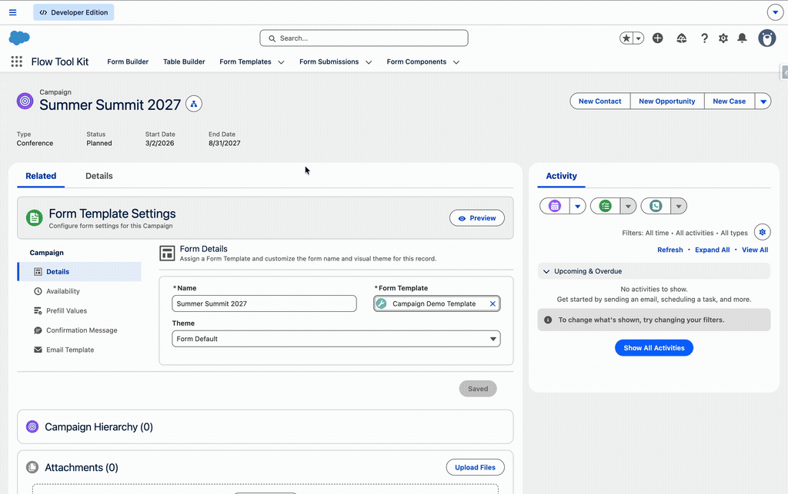
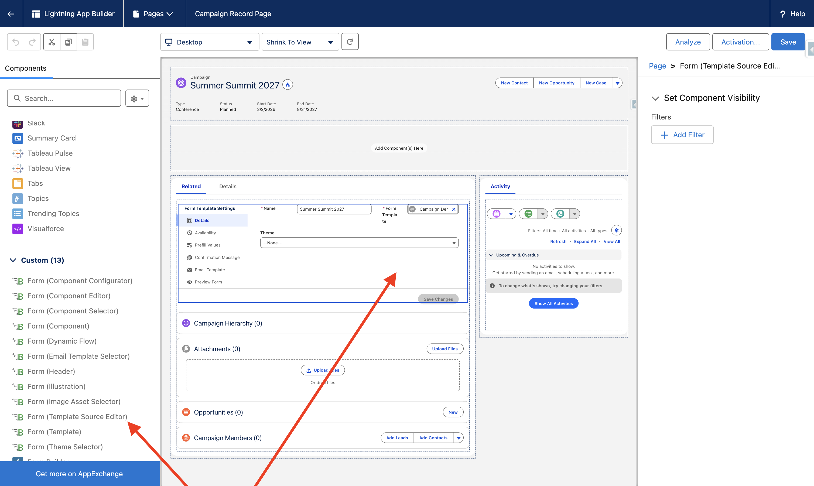

# Form Template Sources

**Build one form. Use it everywhere.**

Form Template Sources connect your forms to the records that drive them. A single registration form can power hundreds of campaigns, events, programs, or cohorts — each with its own name, dates, branding, pre-filled values, and confirmation messaging. No duplicating templates. No maintaining parallel forms. Just one form, configured per record.

Think about what this unlocks:

- **Event Registration** — one form template, reused across every event. Each event record controls its own registration dates, theme, and confirmation message.
- **Program Enrollment** — a program intake form that pulls the program name, eligibility dates, and pre-filled details directly from the program record.
- **Grant Applications** — a single application form connected to each funding opportunity, with deadlines and instructions driven by the grant record.
- **Membership Signups** — membership tiers drive different pre-fill values and confirmation emails, all from the same form.
- **Volunteer Signups** — each volunteer opportunity controls when its signup opens and closes, what the form says, and what the confirmation email contains.
- **Cohort Registration** — cohort records drive registration windows and pre-populate cohort-specific details into the form.

The pattern works with any standard or custom object. If you can create a record in Salesforce, you can connect a form to it.

## Why This Matters

Without Form Template Sources, admins who need the same form for 50 campaigns would either duplicate the template 50 times or build complex Flow logic to swap values. Both approaches break at scale.

With Form Template Sources, the form template stays the same. The source record does the work. Change a campaign's end date, and the form immediately stops accepting submissions. Update the confirmation message on a program record, and every new submission sees it. The form adapts to the record it's loaded from.

Every submission is also stamped with the source record's Id (`Source_Id__c`), creating a direct link back to the record that generated it. This means your conversion Flows can use the source Id to look up related data, display contextual information within the form, associate submissions with the right parent records, and trigger source-specific automation.

## How It Works

When the Form Template component receives a source record Id (instead of a Form Template Id), the system:

1. Determines the source object type from the record Id
2. Looks up the `Form Template Source` custom metadata record for that object
3. Reads the field mappings to find which fields on the source record store the overrides
4. Queries the source record and loads the mapped Form Template
5. Swaps any populated override values into the form configuration
6. Stamps `Source_Id__c` on the Form Submission so it can trace back to the source

If a mapped field is blank on the source record, the Form Template's own value is used as the fallback. This means you only need to override what's different — everything else inherits from the template.

### Where Forms Load From Source Records

The Form Template component can be placed on:

- **Lightning Record Pages** — drop it on a Campaign page, and it automatically detects the source configuration and renders the form
- **Experience Cloud Pages** — the source record Id is passed via the page context
- **Flow Screens** — pass any source record Id into the component's `recordId` property

Admins direct users to the source record using custom buttons, navigation menu items, or email links. When the user arrives, the form loads with that record's overrides applied.

### Form Submission Tracking

Every form submission loaded from a source record is stamped with:

- **Source Id** (`Source_Id__c`) — always populated with the source record Id. This is a text field that stores the Id regardless of the source object type. Used at runtime to re-apply source overrides when a user resumes a saved submission. Also available in conversion Flows to query the source record for related data — for example, looking up the event location, program coordinator, or grant requirements to display within the form or drive downstream automation.
- **Source Lookup Field** (optional) — a configurable lookup field on Form Submission that points directly back to the source record (e.g., `Campaign__c`). Useful for reports, list views, related lists on the source record, and platform event-driven conversion flows.

### Confirmation Email Resolution

When a form submission triggers a confirmation email, the system dynamically resolves which email template to use:

1. **Platform event override** — if the conversion event specifies a template, it takes highest priority
2. **Source record override** — the `Get Source Email Template` action queries the source record's configured email template field via the Form Template Source metadata
3. **Form Template default** — falls back to the template's own email template setting

This chain is handled automatically by the `(Form Submission) Convert | Utility | Send Email | Overridable` flow. The flow is overridable, so admins can customize the email logic for their org.

## Admin Setup

### Prerequisites

- Flow Tool Kit managed package installed
- `Form_Builder_Admin` permission set assigned

### Step 1: Create Fields on the Source Object

Add custom fields to the source object for each override you want to support. Only the **Form Template lookup** is required — all other fields are optional. Start with just the fields you need and add more later.

| Override | Field Type | Example (Campaign) |
|----------|-----------|-------------------|
| Form Template (required) | Lookup to `Form_Template__c` | `Form_Template__c` |
| Name | Text | `Name` (standard) |
| Active | Checkbox | `IsActive` (standard) |
| Start Date | Date or DateTime | `StartDate` (standard) |
| End Date | Date or DateTime | `EndDate` (standard) |
| Theme | Text (min 40 chars) | `Theme__c` |
| Pre-fill Template | Lookup to `Form_Submission__c` | `Prefill_Template_Override__c` |
| Confirmation Message | Rich Text (Html) | `Confirmation_Page_Message__c` |
| Offline Message | Rich Text (Html) | `Offline_Message__c` |
| Email Template | Text (min 40 chars) | `Email_Template_Name_Confirmation__c` |

For Campaign, the standard fields (`Name`, `IsActive`, `StartDate`, `EndDate`) are already available. The custom fields above are included in the Flow Tool Kit package.

### Step 2: Create the Form Template Source Metadata Record

Navigate to **Setup > Custom Metadata Types > Form Template Source > Manage Records > New**.

Configure the mapping:

| Section | Field | Description |
|---------|-------|-------------|
| **Information** | Source Object | The object that drives the form (e.g., Campaign) |
| **Information** | Form Template Field | The lookup field that points to the Form Template (required) |
| **Details** | Name Field | Field used as the form title |
| **Details** | Theme Field | Field storing the theme developer name |
| **Availability** | Active Field | Checkbox controlling whether the form accepts submissions |
| **Availability** | Start Date Field | Date/DateTime when submissions open |
| **Availability** | End Date Field | Date/DateTime when submissions close |
| **Availability** | Offline Message Field | Rich text shown when the form is unavailable |
| **Pre-fill Values** | Prefill Template Field | Lookup to a Form Submission record with default values |
| **Email/Messaging** | Confirmation Message Field | Rich text shown after successful submission |
| **Email/Messaging** | Email Template Field | Text field storing the email template developer name |
| **Form Submission Source** | Source Lookup Field | API name of the lookup field on Form Submission that points back to this object (optional) |

Only map the fields you need. Unmapped fields won't appear in the Form Template Source Editor component, and the Form Template's own values will be used.

### Step 3: Add the Component to the Record Page

Open the source object's record page in **Lightning App Builder** and add the **Form (Template Source Editor)** component.

The component automatically detects the Form Template Source metadata for the current object and displays the configured fields in a tabbed layout.

### Step 4: Configure the Source Record

Open a source record (e.g., a Campaign) and use the Form Template Source Editor to:

1. **Details** — assign a Form Template, set the form name, and choose a theme
2. **Availability** — toggle active, set start/end dates, and write an offline message
3. **Prefill Values** — select and configure a pre-fill template with default field values
4. **Confirmation Message** — write the message shown after submission
5. **Email Template** — select the confirmation email template
6. **Preview Form** — open a live preview of the form as users will see it

Changes auto-save when switching tabs. The Save Changes button is available for manual saves and is disabled when there are no pending changes.

## Extending to Other Objects

The Form Template Source system works with **any standard or custom object**. To add a new source object:

1. **Create fields** on the object for each override you need (at minimum, a lookup to `Form_Template__c`)
2. **Create a Form Template Source metadata record** mapping the object and its fields
3. **Add the Form Template Source Editor component** to the object's record page
4. **(Optional)** Create a lookup field on `Form_Submission__c` pointing to the source object and set the `Source Lookup Field` in the metadata record to enable direct relationship tracking

### Example: Event Registration

To use a custom `Event__c` object as a form source:

1. Add a `Form_Template__c` lookup, `IsActive__c` checkbox, `Registration_Start__c` and `Registration_End__c` date fields to `Event__c`
2. Create a Form Template Source metadata record: Source Object = `Event__c`, map each field
3. Place the Form Template Source Editor on the Event record page
4. Admins can now assign a form template to each event with custom dates and availability

Each event gets its own registration window, and every submission traces back to the event that generated it. Use `Source_Id__c` in your conversion Flows to associate registrants with the event, create related records, or display event-specific details within the form itself.

## Technical Reference

### Custom Metadata Type: Form_Template_Source__mdt

One record per source object. All field mappings use `MetadataRelationship` type (pointing to `FieldDefinition`) scoped to the source object, except `Source_Lookup_Field__c` which is a plain text field storing the API name.

### Components

| Component | Where to Find | Description |
|-----------|--------------|-------------|
| Form (Template Source Editor) | Lightning App Builder > Custom components | Tabbed editor placed on source record pages |
| Form (Template) | Lightning App Builder > Custom components / Flow Screen | Core form renderer — detects source records automatically when placed on a source record page |

### Flow Actions

| Action | Category | Description |
|--------|----------|-------------|
| Get Source Email Template | Flow Tool Kit | Resolves the confirmation email template name from a Form Template Source record. Pass the `Source_Id__c` from a Form Submission and the action returns the email template developer name configured on the source record, or null if no mapping exists. |

### Flows

| Flow | Description |
|------|-------------|
| (Form Submission) Convert \| Utility \| Send Email \| Overridable | Handles confirmation and save-progress emails. Dynamically resolves the email template from the source record before falling back to the Form Template default. This flow is **overridable** — admins can create an override to customize the email logic for their org. |

### How Source Resolution Works

When the Form Template component receives a record Id that isn't a Form Template or Form Submission, it treats it as a source record. The system queries the `Form_Template_Source__mdt` metadata for the record's object type, loads the mapped Form Template, and replaces any populated override values (name, dates, theme, pre-fill template, messages). If a field isn't mapped or is blank on the source record, the Form Template's own value is used.

For confirmation emails, the `Get Source Email Template` action follows the same pattern — it reads the email template field mapping from the metadata, queries the source record, and returns the template developer name. The send email flow uses this in a fallback chain: platform event override > source record override > Form Template default.
