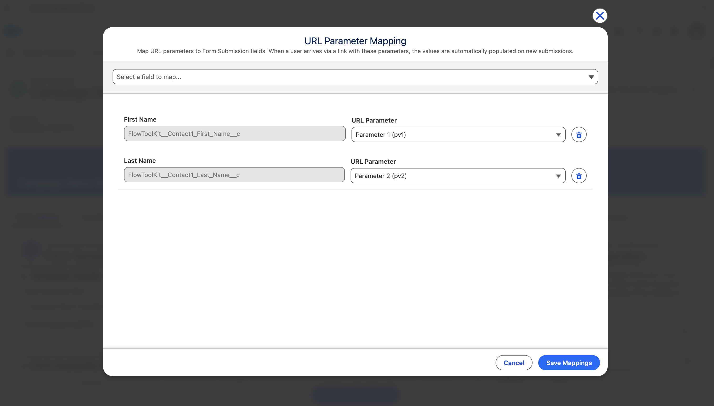
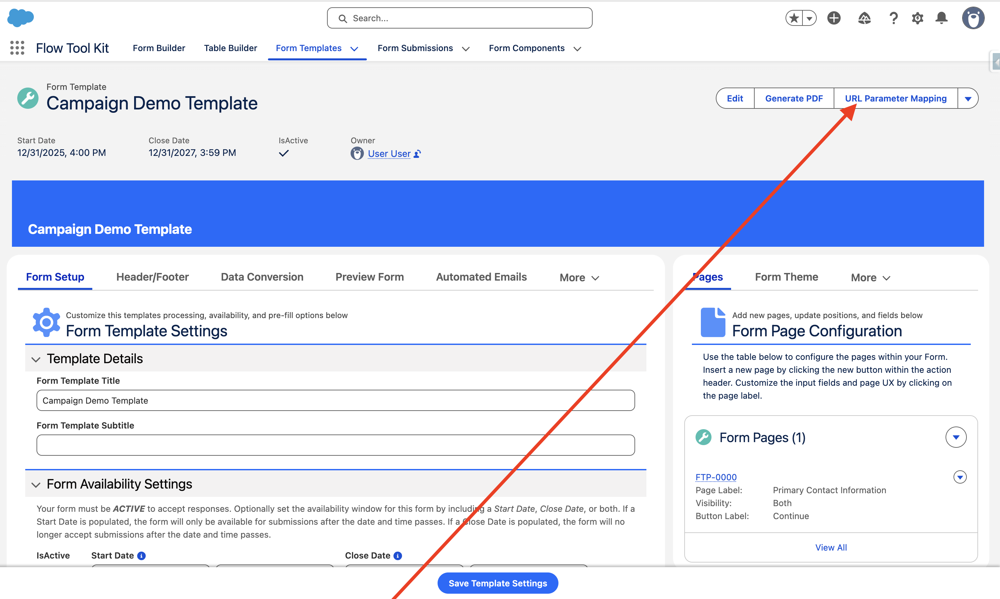

# URL Parameter Mapping

**Capture data from URLs automatically — no Flow required.**

URL Parameter Mapping lets admins configure a Form Template to read values from the page URL and populate them directly onto new Form Submissions. Map UTM tracking codes, referral IDs, pre-filled field values, or any custom parameter — all without wrapping the form in a Flow.

This is especially powerful with [Form Template Sources](form-template-sources.md). When a user clicks a campaign link with tracking parameters, the form loads with the campaign's overrides AND the URL parameters are captured on the submission — giving you full attribution in a single click.



## Use Cases

- **Marketing Attribution** — capture `utm_source`, `utm_campaign`, `utm_medium` on every submission for reporting
- **Referral Tracking** — pass a referral code via `pv1` and map it to a custom field on Form Submission
- **Pre-filled Fields** — include a donor ID or account number in the URL to pre-populate form fields
- **Campaign Linking** — pass a Campaign ID via `pv2` and map it directly to a lookup field
- **A/B Testing** — use `utm_content` to track which link variant drove the submission
- **Payment Flows** — capture `payment_intent` from Stripe redirect URLs

## How It Works

1. Admin opens a Form Template record and clicks the **URL Parameter Mapping** quick action
2. The editor modal opens — select Form Submission fields and map each one to a URL parameter key
3. Save the mappings (stored as JSON on the Form Template record)
4. When a user loads the form via a URL with matching parameters, the values are automatically assigned to the new Form Submission

**Example URL:**
```
https://yoursite.com/form-page?pv1=REF-12345&utm_source=email&utm_campaign=spring-2027
```

With mappings:
- `pv1` → `Referral_Code__c`
- `utm_source` → `UTM_Source__c`
- `utm_campaign` → `UTM_Campaign__c`

The form submission is created with all three fields pre-populated.

### Rules

- **New submissions only** — URL parameters are only applied when creating a new Form Submission. Resuming a saved submission never overwrites existing values.
- **Non-Flow context only** — when the form runs inside a Flow, use the existing `Form (Get Url Parameters)` screen component instead. URL Parameter Mapping is for forms loaded directly on record pages or Experience Cloud.
- **One param, many fields** — the same URL parameter can be mapped to multiple Form Submission fields (e.g., map `pv1` to both `Referral_Code__c` and `Campaign_Source__c`).
- **Intelligent type coercion** — URL parameters are strings, but the system automatically converts values to match the target field type (numbers, booleans, dates, lookups).

### Type Coercion

| Target Field Type | Conversion | Example |
|-------------------|------------|---------|
| Text, Email, URL, Phone | Direct assignment | `pv1=hello` → `"hello"` |
| Number, Currency, Percent | Parse as decimal | `pv1=99.95` → `99.95` |
| Integer | Parse as integer | `pv1=42` → `42` |
| Checkbox | `"true"` or `"1"` → true | `pv1=true` → `true` |
| Date | Parse ISO format | `pv1=2027-06-01` → `2027-06-01` |
| DateTime | Parse ISO format | `pv1=2027-06-01T09:00:00Z` → full datetime |
| Lookup (Id) | Direct assignment | `pv1=001xx000003DGbr` → record Id |
| Picklist | Direct assignment | `pv1=Option A` → `"Option A"` |

Invalid values (e.g., `"abc"` for a number field) are silently skipped — the field is left blank rather than causing an error.

## Admin Setup

### Step 1: Open the URL Parameter Mapping Quick Action

Navigate to a Form Template record and click **URL Parameter Mapping** in the action buttons.

> **Don't see the action?** You may need to add it to the Form Template page layout or Lightning record page. Go to **Setup > Object Manager > Form Template > Page Layouts** and add the "URL Parameter Mapping" action to the layout. For Lightning pages, edit the page in Lightning App Builder and add the action to the highlights panel.



### Step 2: Add Field Mappings

In the editor modal:

1. **Select a field** from the dropdown — shows all updateable Form Submission fields (internal/system fields are filtered out)
2. **Choose the URL parameter** from the combobox — select which URL param key populates this field
3. **Repeat** for each field you want to capture
4. Click **Save Mappings**


### Available URL Parameters

| Parameter | Description |
|-----------|-------------|
| `pv1` – `pv9` | Generic parameters for custom use |
| `utm_source` | UTM tracking: traffic source |
| `utm_content` | UTM tracking: content variant |
| `utm_medium` | UTM tracking: marketing medium |
| `utm_term` | UTM tracking: search term |
| `utm_campaign` | UTM tracking: campaign name |
| `payment_intent` | Stripe payment intent ID |
| `eventType` | Event type identifier |

### Step 3: Build URLs with Parameters

Construct URLs that include your mapped parameters:

```
https://yoursite.com/form-page?utm_source=linkedin&utm_campaign=spring-drive&pv1=VIP
```

When users click these links, the form loads and the mapped fields are automatically populated.

## Technical Reference

### Storage

Mappings are stored as a JSON array in `URL_Parameter_Mapping__c` (Long Text Area) on `Form_Template__c`:

```json
[
  { "param": "utm_source", "field": "UTM_Source__c" },
  { "param": "utm_campaign", "field": "UTM_Campaign__c" },
  { "param": "pv1", "field": "Referral_Code__c" }
]
```

### Components

| Component | Description |
|-----------|-------------|
| URL Parameter Mapping (Quick Action) | Opens the mapping editor modal on a Form Template record |

### How It Works at Runtime

When the Form Template component loads outside of Flow context:

1. Reads `URL_Parameter_Mapping__c` JSON from the Form Template record
2. Reads URL parameters from the page reference state (or falls back to `location.href` for Experience Cloud)
3. For each mapping, reads the URL parameter value and coerces it to the target field's data type
4. Assigns the value to the Form Submission record before rendering the form
5. Skips any parameters that are missing from the URL or fail type coercion
