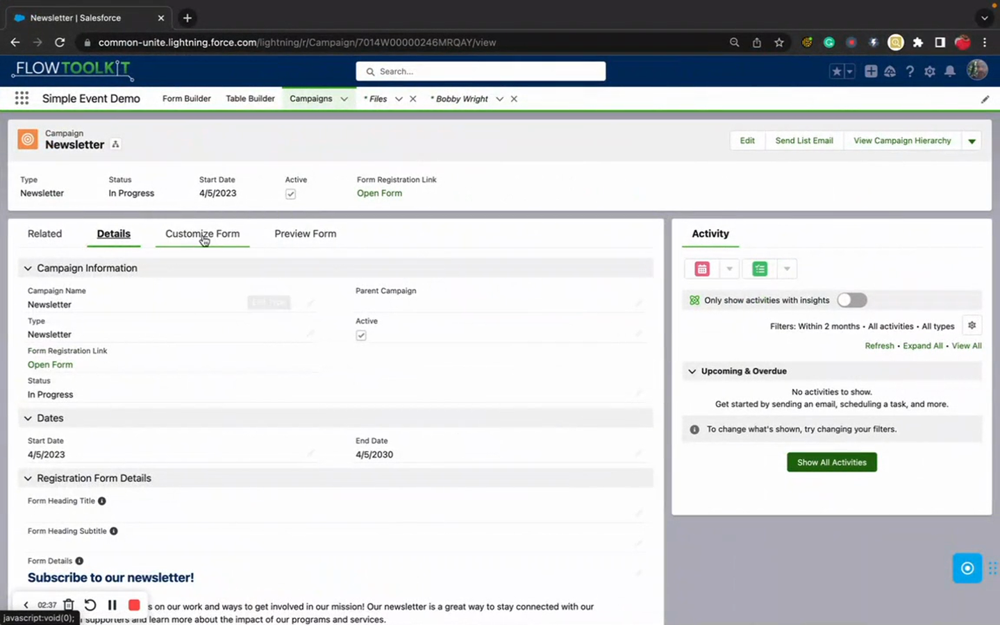

# Core Concepts

> Understand how Flow Tool Kit's building blocks fit together before you start building.

## Video Introduction





## The Big Picture

Flow Tool Kit works in two phases:

1. **Design time** — you build form components and table components using the visual editors (Form Builder, Table Builder)
2. **Runtime** — your form and table components render as interactive forms on Flow Screens (Flow Form, Flow Data Table)

All configuration is stored as **Custom Metadata** records. This means your form component definitions are metadata — they deploy between orgs the same way custom fields and page layouts do.

## Key Building Blocks

### Form Components

A **form component** is the top-level container — the reusable layout configuration you build in Form Builder. It's tied to a single Salesforce object (e.g., Contact, Account, a custom object) and defines the complete layout that end users see when the form renders at runtime.

- Created in [Form Builder](../screen-components/form-builder.md)
- Stored as `Form__mdt` Custom Metadata records
- Referenced by [Flow Form](../screen-components/flow-form.md) at runtime

### Sections

**Sections** are groups of fields within a form component. They provide visual structure — headings, column layouts, and collapsible areas.

- Each form component has one or more sections
- Sections can have 1, 2, or 3 columns
- Sections support [conditional visibility](../form-configuration/conditional-logic.md) — show or hide an entire section based on field values
- Sections can display as standard blocks or collapsible accordions

### Fields (Form Components)

**Fields** are the individual inputs within sections — text boxes, picklists, checkboxes, lookups, dates, file uploads, and more.

- Each field maps to a Salesforce field on the form component's object
- Fields inherit the Salesforce field type but can be customized (label overrides, help text, default values, validation)
- Fields support [conditional visibility](../form-configuration/conditional-logic.md) at the individual field level
- See [Form Components](../form-configuration/form-components-system.md) for the full list of supported field types

### Conditional Logic

**Conditional Logic** rules control when fields and sections are visible. Rules evaluate at runtime as the user fills out the form.

- **Field-based rules** — show a field when another field has a specific value (e.g., show "Other Reason" when Reason = "Other")
- **User-based rules** — show content based on the current user's profile, role, or permissions
- Rules can use AND/OR combinations
- See [Conditional Logic](../form-configuration/conditional-logic.md) for full details

### Themes

**Themes** control the visual appearance of your form components — colors, fonts, spacing, and styling.

- Created as `Form_Style_Sheet__mdt` Custom Metadata records
- Assigned to form components in Form Builder or overridden at runtime
- See [Themes, Labels & Styling](../form-configuration/themes-labels-styling.md)

### Labels

**Labels** provide language-specific text overrides for form elements. Use them for translations or custom terminology.

- Created as `Form_Labels__mdt` Custom Metadata records
- Applied per-form-component or globally
- See [Themes, Labels & Styling](../form-configuration/themes-labels-styling.md)

## How It All Connects

```
Form Builder (design time)
    ↓ creates
Form Component: Form__mdt + Form_Section__mdt + Form_Field__mdt (metadata)
    ↓ consumed by
Flow Form (runtime on Flow Screens)
    ↓ renders
Interactive form for end users
    ↓ outputs
SObject Record (with user input values)
    ↓ used in
Flow logic (Create/Update records, decisions, etc.)
```

## Form Components vs. Form Templates

Flow Tool Kit offers two approaches to building forms:

| | Single-Page Form Components | Form Templates |
|---|---|---|
| **Use when** | Simple data entry — one screen, one object | Multi-step workflows — multiple pages, submissions, review |
| **Builder** | Form Builder | Form Builder + Template configuration |
| **Runtime component** | Flow Form | Form Template |
| **Pages** | Single screen | Multiple pages with navigation |
| **Save & Resume** | No | Yes — users can save and return later |
| **Submissions** | No — data goes directly to Flow variables | Yes — data captured as Form Submission records |
| **Conversion** | N/A — you handle record creation in Flow | Built-in conversion to Account, Contact, Lead, Case, etc. |

Most users start with **single-page form components** and move to **Form Templates** when they need multi-step workflows, submissions, or external-facing forms.

See [Form Template Framework](../form-template-framework/form-templates.md) for the full multi-page form documentation.

## Custom Metadata Types

Flow Tool Kit stores all configuration as Custom Metadata Types (CMDTs). This is important because:

- **CMDTs deploy between orgs** — your form component definitions travel with your metadata deployments
- **CMDTs don't count against data storage** — no impact on your org's record limits
- **CMDTs are available in packages** — form component configs can be included in managed and unmanaged packages

See [Custom Metadata Types](../form-configuration/custom-metadata-types.md) for the complete list of CMDTs and what each one stores.

## Next Steps

- [Permission Sets](permission-sets.md) — understand the three permission sets and who gets what
- [Form Builder Reference](../screen-components/form-builder.md) — deep dive into the Form Builder interface
- [Feature Overview](../welcome/feature-overview.md) — see everything Flow Tool Kit can do
