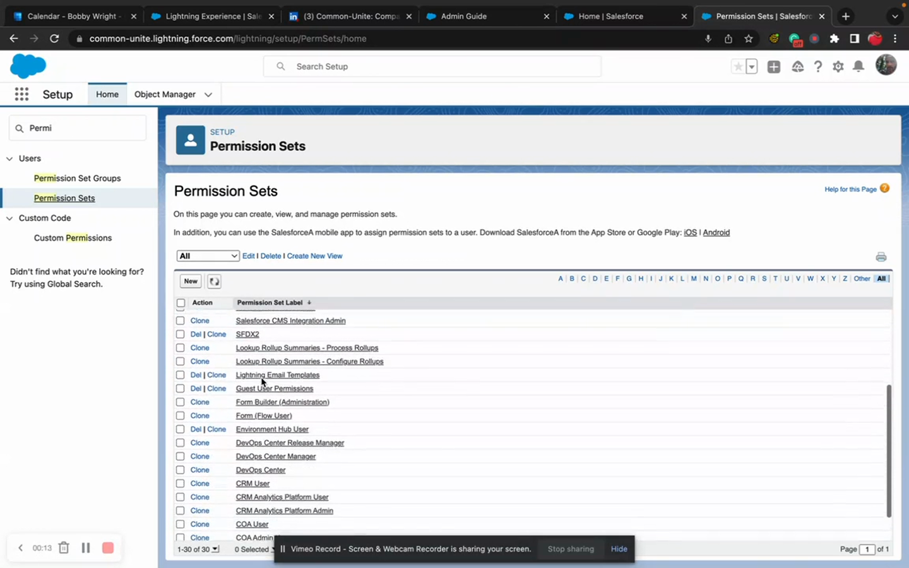
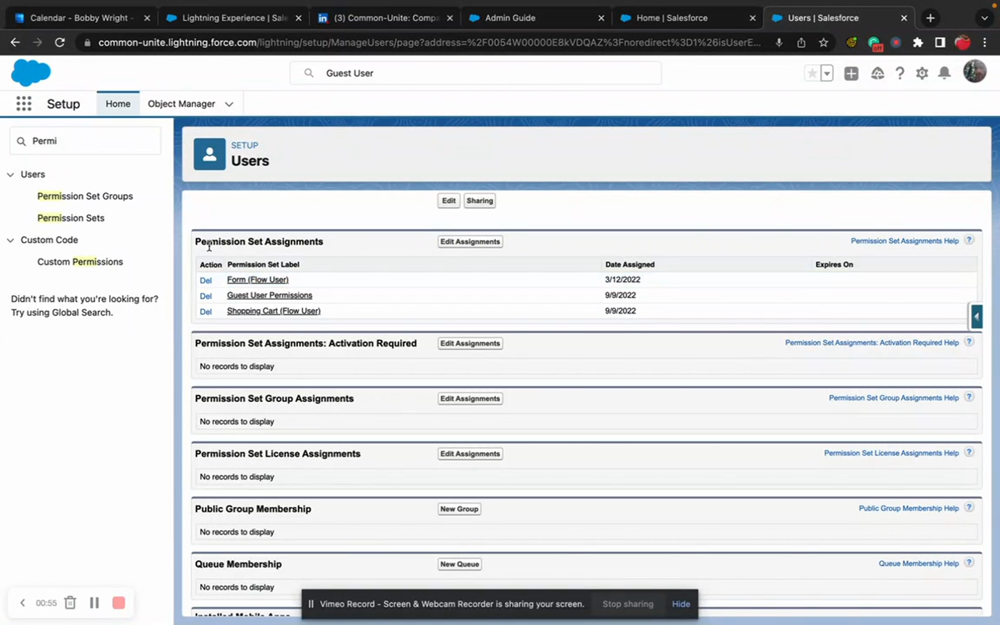

# Permission Sets

> Flow Tool Kit includes three permission sets. Assign them based on what each user needs to do.


**Prerequisites**: Flow Tool Kit must be installed in your org. See [Installation](installation.md).


## Video Walkthrough



## Overview

| Permission Set | For | Summary |
|---------------|-----|---------|
| **Form Builder Admin** | System Administrators | Full access — build forms, manage templates, admin utilities, cache management, metadata operations |
| **Form Builder Manager** | Delegated admins / form builders | Build and manage forms and templates — no admin utilities or setup access |
| **Form Flow User** | End users who fill out forms | Minimum runtime access — render forms, submit data, use invocable actions in flows |

## Form Builder Admin

**Assign to**: System Administrators and users who need full control over Flow Tool Kit.

This is the most permissive set. It grants:

- **56 Apex class accesses** — all runtime, builder, and admin utility classes
- **478 field permissions** — full read/edit on all Flow Tool Kit fields
- **14 object permissions** — full CRUD on all Flow Tool Kit objects
- **5 custom tabs** — Form Builder, Form Components, Form Submissions, Form Templates, Table Builder
- **6 Visualforce pages** — CacheFlow (cache management), Form Submission Print, Form Template Clone/Export/Import
- **User permissions** — Access Content Builder, Modify Metadata, View Roles, View Setup


- **Admin utilities**: CacheFlowController, FormSubmissions_Utility, FormTemplate_Utility, FormTemplatePage_Utility, FormTemplatePageSections_Utility, Utilities_Form
- **Installation**: InstallScript
- **Site management**: SiteUrlRewriter, LoggedEmailMessage_Utility
- **Setup permissions**: View Setup, Modify Metadata, Access Content Builder, View Roles
- **Visualforce pages**: CacheFlow, FormTemplateClone, FormTemplateExport, FormTemplateImport, FormSubmissionPrint
- **App visibility**: Form Builder Lightning app
- **Tab visibility**: All 5 custom tabs


## Form Builder Manager

**Assign to**: Non-admin users who need to build, edit, and manage forms and templates.


**Delegated Admin Pattern**: Form Builder Manager is designed for power users who aren't System Administrators but need to create and manage forms for their teams. They can do everything a form builder needs — create forms, manage templates, configure fields — without requiring admin-level org permissions.


This set grants:

- **47 Apex class accesses** — all runtime and builder classes, excluding admin utilities
- **477 field permissions** — read/edit on nearly all Flow Tool Kit fields
- **14 object permissions** — full CRUD on all Flow Tool Kit objects (same as Admin)
- **No custom tabs** — tabs must be assigned separately or via an app
- **No Visualforce pages** — no cache management or template import/export
- **No setup permissions** — no View Setup, Modify Metadata, or Content Builder access

Form Builder Manager users can:
- Create, edit, and delete forms in Form Builder
- Configure fields, sections, conditional logic, and themes
- Create and manage Form Templates (multi-page forms)
- Manage Form Submissions (review, convert)
- Use all Invocable Actions in Flows
- Access all Form Tool Kit objects and fields

Form Builder Manager users **cannot**:
- Reset the form cache (CacheFlow page)
- Clone/export/import Form Templates via Visualforce pages
- Access Salesforce Setup pages
- Modify metadata

## Form Flow User

**Assign to**: End users who interact with forms in Flows but never build or manage them.

This is the minimum set needed for form rendering at runtime:

- **36 Apex class accesses** — runtime classes only (form rendering, data operations, invocable actions)
- **446 field permissions** — read/edit on fields needed for form submission and interaction
- **11 object permissions** — runtime objects only (excludes Campaign, Form_Submission_Conversion_Log__c, and deployment events)
- **No custom tabs, Visualforce pages, or setup permissions**

Form Flow User grants access to these invocable action classes:
- Collection Subset, Remove Nulls
- DateTime/Epoch conversions
- Duplicate Check, Merge Records
- File Upload handlers
- Get SObject Type, Record Types
- Upsert Bypass Duplicates
- Form Submission Data
- Form Configuration and Repeater Configuration


**Common mistake**: Forgetting to assign Form Flow User to end users. If a user can't see form fields or gets "Insufficient access" errors when filling out a form in a Flow, check their permission set assignment first.


## Comparison Matrix

| Capability | Admin | Manager | Flow User |
|-----------|:-----:|:-------:|:---------:|
| Build forms in Form Builder | Yes | Yes | No |
| Fill out forms in Flows | Yes | Yes | Yes |
| Manage Form Templates | Yes | Yes | No |
| Review/convert submissions | Yes | Yes | No |
| Use Invocable Actions in Flows | Yes | Yes | Yes |
| Reset form cache (CacheFlow) | Yes | No | No |
| Import/export templates (VF) | Yes | No | No |
| View Setup | Yes | No | No |
| Custom tab access | Yes | No | No |
| Apex classes | 56 | 47 | 36 |
| Field permissions | 478 | 477 | 446 |
| Object permissions | 14 | 14 | 11 |

## Assignment Best Practices

1. **Start with the least privilege** — assign Form Flow User to all users who interact with forms, then upgrade to Manager only for users who need to build forms.
2. **Use Form Builder Manager for delegated admins** — don't give System Administrator profiles just for form building. Form Builder Manager provides everything a form builder needs.
3. **Audit regularly** — review permission set assignments quarterly to ensure users have the right level of access.
4. **Don't combine with restrictive profiles** — permission sets add to (never subtract from) profile permissions. If a profile restricts object access, the permission set may not be enough.

## Related Pages

- [Installation](installation.md) — install the package and assign permissions
- [Core Concepts](core-concepts.md) — understand how forms, sections, and fields work
- [FAQ](../faq-troubleshooting/faq.md) — common permission-related questions
