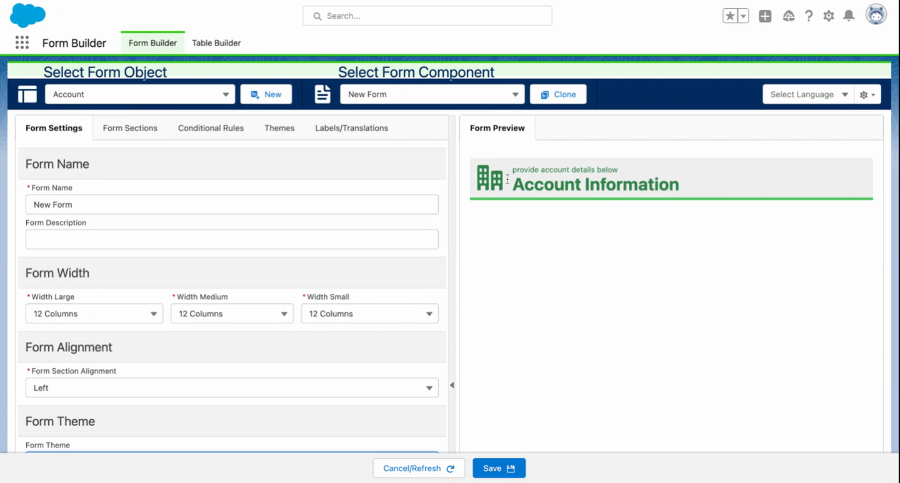
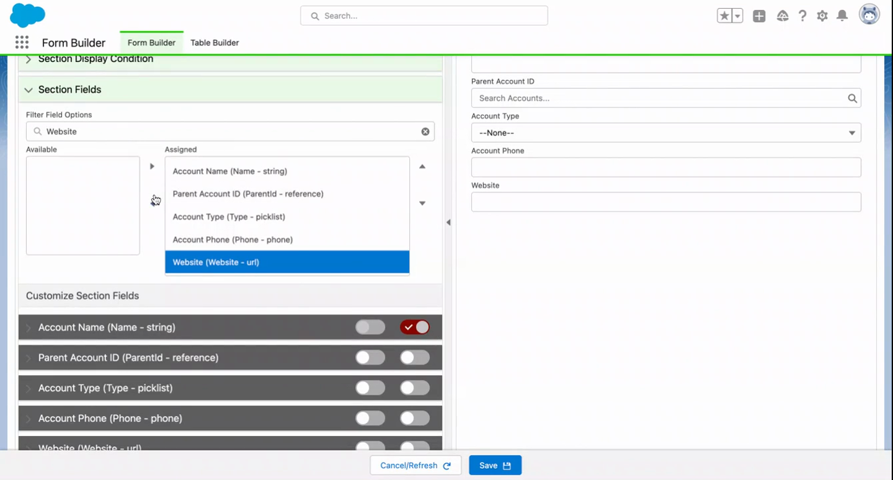

# Quick Start: Build Your First Form Component

> Build a working form component and add it to a Flow in under 5 minutes.


**Prerequisites**: Flow Tool Kit is installed and you have the **Form Builder Admin** or **Form Builder Manager** permission set assigned. See [Installation](installation.md) if you haven't done this yet.


## Video Walkthrough



## Step 1: Open Form Builder

Open the **App Launcher** (waffle icon) and search for **Form Builder**. Click the Form Builder tab.

You'll see the Form Builder interface — this is where you create and manage all your form components.

## Step 2: Create a New Form Component

1. Click **New Form**.
2. Select an object — for this guide, choose **Contact**.
3. Give your form component a name (e.g., "Contact Intake Form").
4. Click **Create**.

## Step 3: Add a Section

Every form component needs at least one section to hold fields.

1. Click **Add Section**.
2. Name it "Contact Information" (or leave the default).
3. Set the number of columns — **2 columns** works well for most forms.

## Step 4: Add Fields

1. The field panel shows all available fields for your selected object.
2. **Drag fields** into your section — start with: First Name, Last Name, Email, Phone, and Account.
3. Fields snap into the column layout automatically.


**Tip**: The Account field automatically renders as a Lookup field — users can search for and select an existing account.


## Step 5: Configure a Field (Optional)

Click any field to see its properties panel. You can:

- Mark it as **Required**
- Override the **Label** text
- Add **Help Text** that appears below the field
- Set a **Default Value**
- Add **Conditional Visibility** rules (show/hide based on other field values)

For now, mark **Last Name** and **Email** as required.

## Step 6: Save the Form Component

Click **Save**. Your form component metadata is now stored and ready to use.

## Step 7: Add the Form Component to a Flow

1. Open **Setup → Flows** and create a new **Screen Flow**.
2. Add a **Screen** element.
3. In the component panel, find **Flow Form** (under the FlowToolKit section).
4. Drag it onto the screen.
5. In the property editor:
   - Set **Object** to `Contact`
   - Set **Form** to the form component you just created ("Contact Intake Form")
   - Set **Record** to a Contact record variable (create one if needed)
6. Save and activate your flow.

## Step 8: Test It

Click **Debug** or **Run** in Flow Builder to preview your form. You should see your Contact Intake form component rendered with the fields you configured, in the layout you defined.

## What's Next?

You've built your first form component. Here's where to go from here:

- [Core Concepts](core-concepts.md) — understand form components, sections, fields, and how they connect
- [Form Builder Reference](../screen-components/form-builder.md) — all Form Builder features in detail
- [Flow Form Reference](../screen-components/flow-form.md) — all Flow Form properties and options
- [Conditional Logic](../form-configuration/conditional-logic.md) — show/hide fields based on values
- [Themes and Styling](../form-configuration/themes-labels-styling.md) — customize the look of your forms
