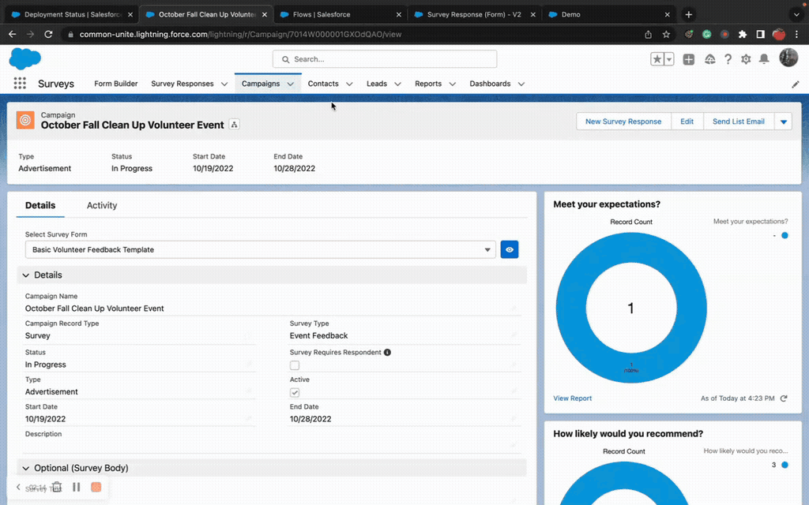

# How To: Add Conditional Logic

> Show or hide fields and sections based on field values, user attributes, or device type.


**Prerequisites**: A form created in Form Builder. See [Build a Form](build-a-form.md) if you haven't created one yet.


## Video Walkthrough



## Overview

Conditional logic lets you create dynamic forms that respond to user input. Common examples:
- Show "Spouse Name" when Marital Status = "Married"
- Show "Other Reason" when Reason = "Other"
- Hide admin-only fields from non-admin users
- Show different sections based on the selected record type

## Step 1: Open Your Form in Form Builder

Navigate to the **Form Builder** tab and open the form you want to add conditional logic to.

## Step 2: Select the Target

Click the **field** or **section** you want to conditionally show or hide. The properties panel opens on the right.

## Step 3: Add a Conditional Logic Rule

1. In the properties panel, find the **Conditional Logic** section.
2. Click **Add Condition**.
3. Configure the condition:

| Setting | Description | Example |
|---------|-------------|---------|
| **Field** | The field whose value triggers the rule | Marital Status |
| **Operator** | How to compare the value | Equals, Not Equals, Contains, Is Blank, etc. |
| **Value** | The value to match against | "Married" |

## Step 4: Combine Multiple Conditions (Optional)

If you need more than one condition:

1. Click **Add Condition** again to add more conditions.
2. Set the **Logic Type**:
   - **AND** — all conditions must be true (more restrictive)
   - **OR** — any one condition must be true (more permissive)

**Example — AND logic**: Show "Emergency Contact" section when Status = "Active" AND Department = "Field Operations"

**Example — OR logic**: Show "Details" field when Category = "Other" OR Category = "Custom"

## Step 5: Save and Test

1. Click **Save** in Form Builder.
2. Open your Flow and run/debug it.
3. Change the controlling field value and verify the target shows/hides correctly.

## Types of Conditions

### Field-Based Conditions

The most common type — the target is shown/hidden based on another field's value on the same form.

| Operator | Description | Example |
|----------|-------------|---------|
| Equals | Exact match | Status = "Active" |
| Not Equals | Anything except | Priority ≠ "Low" |
| Contains | Substring match | Description contains "urgent" |
| Is Blank | Field has no value | Email is blank |
| Is Not Blank | Field has a value | Phone is not blank |
| Greater Than | Numeric comparison | Amount > 1000 |
| Less Than | Numeric comparison | Age < 18 |

### User-Based Conditions

Show/hide based on who is filling out the form:

| Condition | Description |
|-----------|-------------|
| **Profile** | Show for specific profiles (e.g., System Administrator) |
| **Role** | Show for specific roles |
| **Custom Permission** | Show for users with a specific custom permission |
| **Device** | Show on desktop only, mobile only, or both |


**Tip**: User-based conditions are great for showing admin-only fields (like internal notes) without creating separate forms. One form serves all audiences.


## Section vs. Field Conditional Logic

| Level | When to Use |
|-------|------------|
| **Section** | Hide an entire group of related fields at once (e.g., "Spouse Information" section) |
| **Field** | Hide a single field while keeping the rest of the section visible |


**The controlling field must be on the same form.** Conditional logic evaluates fields on the current form only. You cannot reference fields from other screen components or flow variables.


## Common Patterns

### "Other" Free-Text Field
Show a text field when a picklist value is "Other":
- Target: "Other Reason" text field
- Condition: Reason field **Equals** "Other"

### Progressive Disclosure
Show additional fields after a user makes a key selection:
- Target: "Policy Details" section
- Condition: Has Existing Policy **Equals** "Yes"

### Role-Based Fields
Show internal fields only for staff:
- Target: "Internal Notes" field
- Condition: User Profile **Equals** "System Administrator"

## Troubleshooting

| Issue | Fix |
|-------|-----|
| Condition not firing | Check the field API name (not label) and value case sensitivity |
| Field always hidden | Check if AND logic requires conditions that can't all be true simultaneously |
| Changes not visible | Clear form cache — navigate to `your-org/apex/FlowToolKit__CacheFlow` |

## Related Pages

- [Conditional Logic Reference](../form-configuration/conditional-logic.md) — all operators, properties, and advanced configuration
- [Build a Form](build-a-form.md) — create a form from scratch
- [Form Builder Reference](../screen-components/form-builder.md) — full editor documentation
