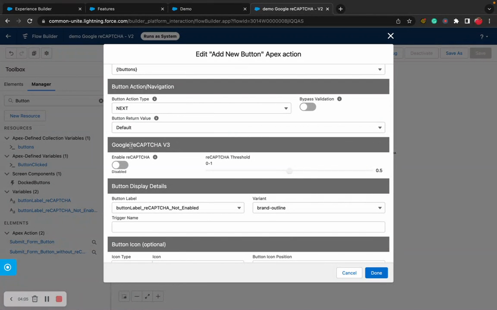

# Add reCAPTCHA

> Protect public-facing forms from bots with Google reCAPTCHA.


**Prerequisites**: A form deployed on an Experience Cloud site. reCAPTCHA is only needed for public-facing forms; internal Lightning forms don't need it.


## Video Walkthrough



## Overview

When your forms are exposed on Experience Cloud sites (especially to unauthenticated/guest users), you need bot protection. Flow Tool Kit integrates with Google reCAPTCHA to validate that form submissions come from real users.

## Step 1: Get reCAPTCHA Keys from Google

1. Go to the [Google reCAPTCHA admin console](https://www.google.com/recaptcha/admin).
2. Click **+** to register a new site.
3. Choose **reCAPTCHA v2** ("I'm not a robot" checkbox) or **reCAPTCHA v3** (invisible scoring).
4. Add your Experience Cloud site domain under **Domains** (e.g., `yourorg.my.site.com`).
5. Click **Submit**.
6. Copy your **Site Key** and **Secret Key**.

## Step 2: Configure in Salesforce

### Add CSP Trusted Site

1. Go to **Setup → CSP Trusted Sites**.
2. Add `https://www.google.com` as a trusted site.
3. Enable all relevant permissions (Connect, Script, Style).

### Create Named Credential (for reCAPTCHA v3 / server-side validation)

1. Go to **Setup → Named Credentials**.
2. Create a credential for the reCAPTCHA verification endpoint:
   * **URL**: `https://www.google.com/recaptcha/api/siteverify`
   * **Authentication**: No authentication (the secret key is sent as a parameter)

### Store Keys in Custom Metadata

1. Navigate to the reCAPTCHA configuration in Flow Tool Kit settings.
2. Enter your **Site Key** and **Secret Key**.
3. Select the reCAPTCHA version (v2 or v3).

### Grant Guest User Permissions (required for Experience Cloud)


**Don't skip this.** Without these permissions, guest users hit `You don't have read permissions on the User External Credential object` the moment they click a reCAPTCHA-enabled button. Granting External Credential Principal Access alone is **not** enough.


On the permission set assigned to your guest user, grant all of:

* **Read** on the `UserExternalCredential` standard object (Object Settings)
* **External Credential Principal Access** for `GoogleRecaptcha - External Form User`
* Apex Class Access to `FlowToolKit.reCAPTCHA`

Then assign the permission set via **Experience Workspaces → Administration → Pages → Go to Force.com → Public Access Settings → Manage Assignments**. Also verify **Setup → Session Settings → Let guest users make callouts using Named Credentials** is enabled.

See [Google reCAPTCHA Setup: Grant Guest User Access](../advanced-topics/google-recaptcha-setup.md#grant-guest-user-access-to-the-external-credential) for the full checklist.

## Step 3: Enable reCAPTCHA on Your Form

1. Open the form in **Form Builder** or configure via the form's CMDT settings.
2. Enable the reCAPTCHA option.
3. Set the reCAPTCHA configuration reference.

## Step 4: Test

1. Open your Experience Cloud site as a guest user (use an incognito browser window).
2. Fill out the form.
3. For v2: verify the "I'm not a robot" checkbox appears and works.
4. For v3: verify the form submits successfully (reCAPTCHA score is validated server-side).
5. Verify that bot-like submissions are blocked.

## reCAPTCHA v2 vs v3

|                     | v2 (Checkbox)                      | v3 (Invisible)                           |
| ------------------- | ---------------------------------- | ---------------------------------------- |
| **User Experience** | User clicks a checkbox             | No user interaction; runs in background |
| **When to Use**     | When you want visible verification | When you want seamless UX                |
| **Scoring**         | Pass/fail                          | Score 0.0-1.0 (you set the threshold)    |
| **Complexity**      | Simpler to set up                  | Requires threshold tuning                |


**Recommendation**: Start with reCAPTCHA v2 for simplicity. Move to v3 if the checkbox friction is unacceptable for your users.


## Troubleshooting

| Issue                                                                                        | Fix                                                                                                                                                                                                                                                                                       |
| -------------------------------------------------------------------------------------------- | ----------------------------------------------------------------------------------------------------------------------------------------------------------------------------------------------------------------------------------------------------------------------------------------- |
| reCAPTCHA widget doesn't load                                                                | Check CSP Trusted Sites: `https://www.google.com` must be trusted                                                                                                                                                                                                                        |
| "Invalid site key" error                                                                     | Verify the site key matches your domain in the Google reCAPTCHA console                                                                                                                                                                                                                   |
| All submissions blocked                                                                      | Check the secret key is correct. For v3, lower the score threshold.                                                                                                                                                                                                                       |
| Works in sandbox, not production                                                             | Add the production domain to the Google reCAPTCHA site registration                                                                                                                                                                                                                       |
| `You don't have read permissions on the User External Credential object` on guest-user click | Guest user permission set is missing **Read** on the `UserExternalCredential` standard object. Granting the External Credential Principal alone is not sufficient. See [Grant Guest User Permissions](add-recaptcha.md#grant-guest-user-permissions-required-for-experience-cloud) above. |

## Related Pages

* [reCAPTCHA & Security Reference](../form-configuration/recaptcha-security.md): full configuration details
* [Google reCAPTCHA Setup (Advanced)](../advanced-topics/google-recaptcha-setup.md): detailed setup guide
* [Deploy to Experience Cloud](deploy-to-experience-cloud.md): Experience Cloud form deployment
* [Guest User Permissions](../experience-cloud/experience-cloud-components.md): required permissions for guest users
