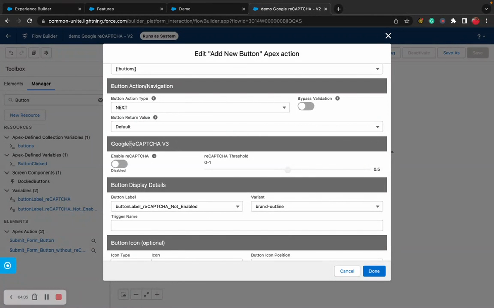

# Add reCAPTCHA

> Protect public-facing forms from bots with Google reCAPTCHA.


**Prerequisites**: A form deployed on an Experience Cloud site. reCAPTCHA is only needed for public-facing forms; internal Lightning forms don't need it.


## Video Walkthrough



## Overview

When your forms are exposed on Experience Cloud sites (especially to unauthenticated/guest users), you need bot protection. Flow Tool Kit integrates with Google reCAPTCHA to validate that form submissions come from real users.

## Step 1: Get reCAPTCHA Keys from Google

1. Go to the [Google reCAPTCHA admin console](https://www.google.com/recaptcha/admin).
2. Click **+** to register a new site with type **reCAPTCHA v3** (Flow Tool Kit uses v3's invisible scoring; there is no checkbox variant).
3. Add your Experience Cloud site domain under **Domains** (e.g., `yourorg.my.site.com`).
4. Click **Submit**.
5. Copy your **Site Key** and **Secret Key**.

## Step 2: Configure in Salesforce

### Add CSP Trusted Site

1. Go to **Setup → CSP Trusted Sites**.
2. Add `https://www.google.com` as a trusted site.
3. Enable all relevant permissions (Connect, Script, Style).

### Create the External Credential and Named Credential

The **secret key lives in an External Credential**, never in a setting. Exact names matter; the package's Apex references them directly.

1. **Setup → Named Credentials → External Credentials**: create `GoogleRecaptcha`, protocol **Custom**. Add a Named Principal called `External Form User`, and on it an authentication parameter named `secret_key` whose value is your Google Secret Key.
2. **Setup → Named Credentials**: create Named Credential `GoogleRecaptcha`, URL `https://www.google.com/recaptcha/api/siteverify`, using the external credential from step 1, with **Allow Formulas in HTTP Body** checked, and `FlowToolKit` added under Allowed Namespaces.

### Set the Site Key

1. **Setup → Custom Settings → Flow Tool Kit Settings → Manage**: set **Google reCAPTCHA Site Key** (this drives iframe embeds automatically).
2. For Experience Cloud sites, add the reCAPTCHA script and event bridge to the site's **Settings → Advanced → Edit Head Markup**, then publish. The exact snippet is in [Google reCAPTCHA Setup, Step 4](../advanced-topics/google-recaptcha-setup.md#step-4-set-the-site-key). Skipping this is the most common setup miss, and its symptom is a sticky "reCAPTCHA Timeout" toast 10 seconds after a protected button is clicked.

### Grant Guest User Permissions (required for Experience Cloud)


**Don't skip this.** Without these permissions, guest users hit `You don't have read permissions on the User External Credential object` the moment they click a reCAPTCHA-enabled button. Granting External Credential Principal Access alone is **not** enough.


On the permission set assigned to your guest user, grant all of:

* **Read** on the `UserExternalCredential` standard object (Object Settings)
* **External Credential Principal Access** for `GoogleRecaptcha - External Form User`
* Apex Class Access to `FlowToolKit.reCAPTCHA`

Then assign the permission set via **Experience Workspaces → Administration → Pages → Go to Force.com → Public Access Settings → Manage Assignments**. Also verify **Setup → Session Settings → Let guest users make callouts using Named Credentials** is enabled.

See [Google reCAPTCHA Setup: Grant Guest User Access](../advanced-topics/google-recaptcha-setup.md#step-5-grant-guest-user-access) for the full checklist.

## Step 3: Enable reCAPTCHA on Your Buttons

reCAPTCHA is configured **per button**, not per form. In the Custom Buttons property editor:

1. Enable **reCAPTCHA** on the button that submits data (Next or Submit).
2. Set the **reCAPTCHA Threshold** as a score from 0.0 to 1.0 (default 0.5); the click proceeds only when Google's score meets it.

## Step 4: Test

1. Open your Experience Cloud site as a guest (private browser window).
2. Fill out the form and click the protected button; the form should submit with no visible challenge (v3 is invisible).
3. If a sticky **reCAPTCHA Timeout** toast appears after ~10 seconds, the head-markup script from Step 2 is missing or carries the wrong site key.
4. The submission's button metadata records the returned score, so you can confirm verification really ran.

## Troubleshooting

| Issue                                                                                        | Fix                                                                                                                                                                                                                                                                                       |
| -------------------------------------------------------------------------------------------- | ----------------------------------------------------------------------------------------------------------------------------------------------------------------------------------------------------------------------------------------------------------------------------------------- |
| Sticky **reCAPTCHA Timeout** toast on click                                                  | The site's head markup script is missing, unpublished, or has the wrong site key                                                                                                                                                                                                         |
| reCAPTCHA script doesn't load                                                                | Check CSP Trusted Sites: `https://www.google.com` and `https://www.gstatic.com` must be trusted                                                                                                                                                                                          |
| "Invalid site key" error                                                                     | Verify the site key matches your domain in the Google reCAPTCHA console                                                                                                                                                                                                                   |
| All submissions blocked                                                                      | Check the `secret_key` parameter on the external credential principal, and lower the button threshold (scale is 0.0 to 1.0)                                                                                                                                                              |
| Works in sandbox, not production                                                             | Add the production domain to the Google reCAPTCHA site registration                                                                                                                                                                                                                       |
| `You don't have read permissions on the User External Credential object` on guest-user click | Guest user permission set is missing **Read** on the `UserExternalCredential` standard object. Granting the External Credential Principal alone is not sufficient. See [Grant Guest User Permissions](add-recaptcha.md#grant-guest-user-permissions-required-for-experience-cloud) above. |

## Related Pages

* [reCAPTCHA & Security Reference](../form-configuration/recaptcha-security.md): full configuration details
* [Google reCAPTCHA Setup (Advanced)](../advanced-topics/google-recaptcha-setup.md): detailed setup guide
* [Deploy to Experience Cloud](deploy-to-experience-cloud.md): Experience Cloud form deployment
* [Guest User Permissions](../experience-cloud/experience-cloud-components.md): required permissions for guest users
