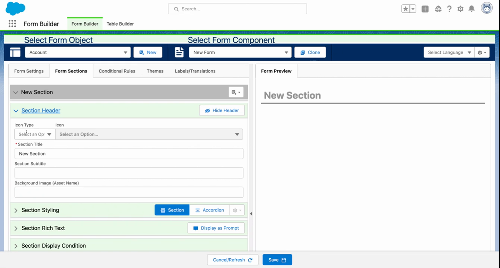

# How To: Build a Form Component

> End-to-end guide — create an object configuration, build a form component in Form Builder, and add it to a Flow.


**Prerequisites**: Flow Tool Kit installed, **Form Builder Admin** or **Form Builder Manager** permission set assigned. See [Installation](../getting-started/installation.md).


## Video Walkthrough



## Step 1: Open Form Builder

Open the **App Launcher** and search for **Form Builder**. Click the tab to open the form editor.

## Step 2: Create an Object Configuration

Before building a form component, you need an object configuration that tells Form Builder which Salesforce object the form component targets.

1. In Form Builder, click **New Form**.
2. Select the **Object** (e.g., Contact, Account, or any custom object).
3. Give your form component a descriptive **Name** (e.g., "Contact Intake" or "Case Creation Form").
4. Click **Create**.


**Tip**: Form component names should be descriptive enough that other admins know what they're for at a glance. You'll reference this name when adding the form component to a Flow.


## Step 3: Add Sections

Sections are the structural containers for your fields. They create visual groupings when the form renders at runtime.

1. Click **Add Section**.
2. Set the **Section Label** (e.g., "Personal Information", "Address Details").
3. Choose the number of **Columns** — 1, 2, or 3. Two columns is the most common layout.
4. Repeat for each logical grouping of fields.


**Common Mistake**: Putting all fields in one section. Use multiple sections to break the form component into digestible groups — it makes the form easier to fill out and easier to manage.


## Step 4: Add Fields

1. The **Field Panel** on the left shows all available fields for your object.
2. **Drag fields** into the appropriate section, or click to add them.
3. Fields snap into the column layout automatically.
4. **Reorder** fields by dragging them within or between sections.

### Recommended Fields to Start With

| Object | Good Starting Fields |
|--------|---------------------|
| Contact | First Name, Last Name, Email, Phone, Account (lookup), Mailing Address |
| Account | Name, Phone, Website, Industry, Billing Address |
| Case | Subject, Description, Priority, Status, Contact (lookup) |
| Lead | First Name, Last Name, Company, Email, Phone, Lead Source |

## Step 5: Configure Field Properties

Click any field to open its **Properties Panel**:

| Property | What It Does |
|----------|-------------|
| **Required** | User must fill in this field to proceed |
| **Read Only** | Displays the value but doesn't allow editing |
| **Label Override** | Change the field label shown to users |
| **Help Text** | Instructional text displayed below the field |
| **Default Value** | Pre-filled value when the form loads |
| **Placeholder** | Ghost text shown in empty fields |
| **Conditional Visibility** | Show/hide based on other field values (see [Add Conditional Logic](add-conditional-logic.md)) |

## Step 6: Save the Form Component

Click **Save**. Your form component metadata is now stored as Custom Metadata records and ready to use.

## Step 7: Add the Form Component to a Flow

1. Open **Setup → Flows** and create a new **Screen Flow** (or edit an existing one).
2. Add a **Screen** element.
3. In the component panel, find **Flow Form** under the FlowToolKit section.
4. Drag it onto the screen.
5. In the **Custom Property Editor**:
   - **Object**: Select the same object as your form component (e.g., Contact)
   - **Form**: Select the form component you just created
   - **Record**: Assign a record variable of the matching object type

## Step 8: Use the Form Output in Your Flow

After the screen element, the form component's output is available as a record variable:

- `{!FlowForm.record}` — the SObject record containing all field values the user entered
- Use this in **Create Records**, **Update Records**, or **Decision** elements

For example, to create a new Contact:
1. Add a **Create Records** element after the screen
2. Set the input to `{!FlowForm.record}`

## Step 9: Test

Click **Debug** or **Run** in Flow Builder to preview your form. Verify:
- All fields appear in the correct sections
- Required fields show validation when left empty
- The record is created/updated correctly after submission

## What's Next

- [Add Conditional Logic](add-conditional-logic.md) — show/hide fields based on values
- [Configure Lookup Fields](configure-lookup-fields.md) — customize lookup search and display
- [Configure Themes and Styling](configure-themes-and-styling.md) — change form appearance
- [Form Builder Reference](../screen-components/form-builder.md) — all features and options

## Related Pages

- [Flow Form Reference](../screen-components/flow-form.md) — all input/output properties
- [Core Concepts](../getting-started/core-concepts.md) — how form components, sections, and fields connect
