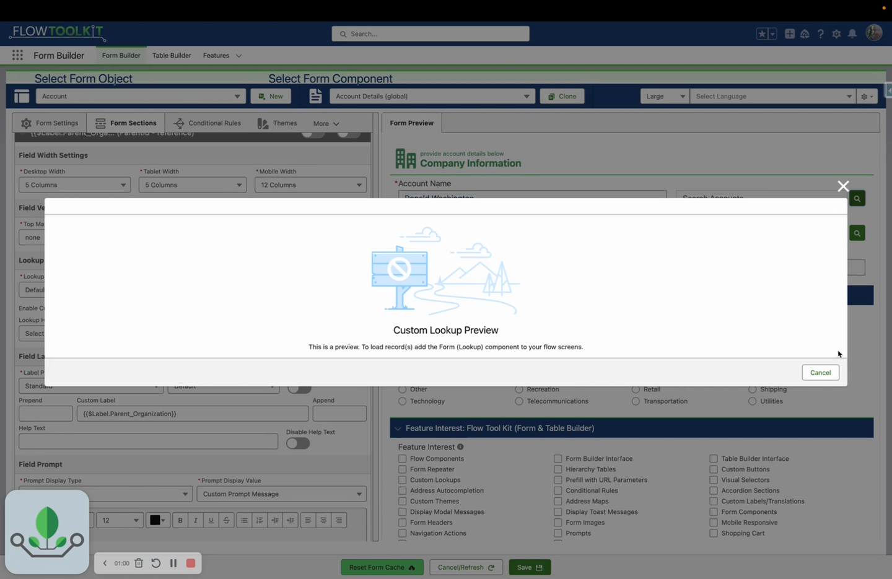

# How To: Configure Lookup Fields

> Customize how lookup fields search, display, and filter records in your forms.


**Prerequisites**: A form with at least one lookup field (e.g., Account on Contact, or any custom lookup). See [Build a Form](build-a-form.md).


## Video Walkthrough



## Overview

When your form includes a lookup field (like Account on a Contact form), Flow Tool Kit renders it as a searchable lookup with a modal table. You can customize which columns appear in the search results, add filters, enable new record creation, and even display hierarchical data.

## Step 1: Create a Lookup Table Form

The lookup modal uses a separate Form to define its columns:

1. Open **Form Builder** and create a **new Form** for the lookup's target object (e.g., Account).
2. Add the fields you want to display as **search result columns** — Name, Phone, Industry, etc.
3. Save this form. You'll reference it in the Lookup component configuration.


**Tip**: Keep lookup table forms simple — 3-5 columns is ideal. Too many columns make the search modal hard to scan.


## Step 2: Add the Lookup Component to Your Flow Screen

1. In Flow Builder, open the screen that has your Flow Form.
2. Add a **Form (Lookup)** component to the **same screen**.
3. Configure the Lookup component:

| Property | Value | Example |
|----------|-------|---------|
| **Object** | The lookup target object | `Account` |
| **Form** | The lookup table form you created | `Account_Lookup_Table` |
| **Field Name** (optional) | Specific lookup field to configure | `AccountId` |

If you leave **Field Name** blank, the Lookup component applies to all lookup fields for that object on the form.

## Step 3: Test the Lookup

1. Run or debug your Flow.
2. Click the lookup field on the form.
3. The lookup modal should open showing your configured columns.
4. Search for a record and select it.

## Advanced Configuration

### Filtering Search Results

Add a filter to limit which records appear in the lookup. You can set filters through the Lookup component properties or by passing a pre-filtered record collection.

### Hierarchy Tree Display

For self-referencing objects (like Account → Parent Account):

1. Set **Display As Data Tree** to `true`.
2. Set **Hierarchy Field Name** to the parent lookup field (e.g., `ParentId`).
3. Records display in a collapsible tree structure instead of a flat table.

### New Record Creation

Allow users to create new records directly from the lookup modal:

1. Set a **Record Template** with default field values for new records.
2. Optionally set **Override Table Form Name** to use a different form for the creation UI.
3. If the object uses record types, pass **Record Type Options** to let users select a type.

### Display Options

| Property | Description |
|----------|-------------|
| **Show Row Number Column** | Display row numbers in the search results |
| **Hide Table Header** | Remove column headers for a cleaner look |
| **Hide Table Footer** | Remove the footer row |
| **Table Height** | Set a fixed height (pixels) for the search results area |

## Common Patterns

### Account Lookup on Contact Form
- Lookup Object: Account
- Columns: Name, Phone, Industry, Billing City
- Result: Users search accounts by name and see key info to pick the right one

### Contact Lookup with Role Filter
- Lookup Object: Contact
- Columns: Name, Email, Title, Account Name
- Filter: Only show contacts related to a specific account

### Hierarchical Account Picker
- Lookup Object: Account
- Tree display enabled with `ParentId`
- Users can expand parent accounts to find child accounts visually

## Related Pages

- [Lookup Reference](../screen-components/lookup.md) — all properties and configuration options
- [Build a Form](build-a-form.md) — creating forms from scratch
- [Use Data Tables](use-data-tables.md) — similar column configuration for table displays
