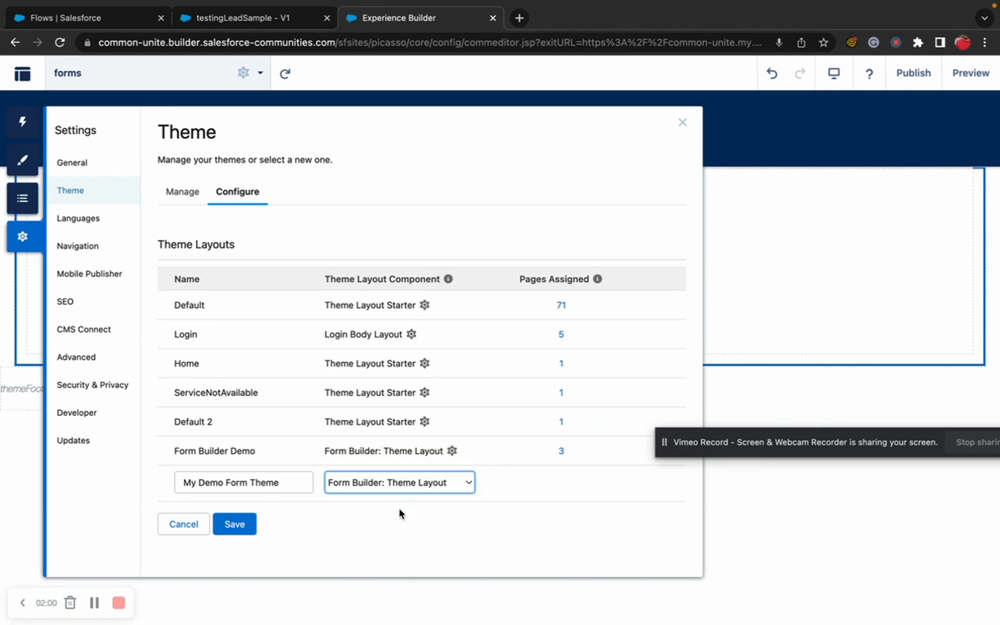

# How To: Deploy to Experience Cloud

> Add Flow Tool Kit forms to an Experience Cloud site for external users.


**Prerequisites**: An active Experience Cloud site and Flow Tool Kit installed. See [Experience Cloud Overview](../experience-cloud/experience-cloud-components.md).


## Video Walkthrough



## Overview

Flow Tool Kit forms can be deployed on Experience Cloud sites for external users — customers, applicants, partners, or guest users. The architecture uses a **wrapper → property editor → core** pattern:

1. **Wrapper component** — exposed in Experience Builder, receives configuration as JSON
2. **Property editor** — admin UI for configuring the component in Experience Builder
3. **Core component** — the actual Flow Form/Data Table that does the work

## Step 1: Add the Component to a Page

1. Open **Experience Builder** for your site.
2. Navigate to the page where you want the form.
3. In the component panel, find the Flow Tool Kit Experience Cloud components.
4. Drag the component onto the page.

## Step 2: Configure with the Property Editor

1. Click the component to open the **Property Editor** panel.
2. Configure the form settings:

| Setting | Description |
|---------|-------------|
| **Form** | Select the form to display |
| **Object** | The SObject the form targets |
| **Display Mode** | How the form appears (component, button, modal) |

3. The property editor stores all configuration as a single JSON string — you don't need to manage individual properties.

## Step 3: Set Up Guest User Permissions

If your form is accessible to unauthenticated (guest) users:

1. Go to **Setup → Sites → [Your Site] → Public Access Settings**.
2. Grant the guest user profile:
   - **Object access**: Read on the form's target object and related objects
   - **Field access**: Read/Edit on fields the form uses
   - **Apex class access**: Grant access to Flow Tool Kit runtime classes
3. Assign the **Form Flow User** permission set concepts (guest user profiles can't directly receive permission sets — use the profile's class and object access instead).


**Security**: Only grant the minimum permissions needed. Guest users should never have Write access to sensitive objects. Review the [Guest User Permissions](../experience-cloud/experience-cloud-components.md) documentation carefully.


## Step 4: Configure CSP Trusted Sites

Flow Tool Kit may need external resources (e.g., for reCAPTCHA, file uploads):

1. Go to **Setup → CSP Trusted Sites**.
2. Add any required domains.
3. Common entries:
   - `https://www.google.com` (for reCAPTCHA)

## Step 5: Test

1. **Preview in Experience Builder** — use the Preview button to see the form.
2. **Test as guest user** — open an incognito browser and visit your site URL.
3. **Test as authenticated user** — log in as a community user and test.
4. Verify:
   - Form loads and renders correctly
   - Fields accept input and validation works
   - Submission creates the expected records
   - Error messages display appropriately

## Display Modes

| Mode | Description | When To Use |
|------|-------------|------------|
| **Component** | Form renders inline on the page | Default — form is the main page content |
| **Button** | Button click opens the form | Form is secondary content, triggered by user action |
| **Modal** | Form appears in an overlay dialog | Quick data entry without leaving the current page |

## Performance Considerations


**Check Lightning Web Security (LWS)**. If your Experience Cloud forms are slow, the #1 thing to check is whether LWS is enabled. Go to **Setup → Session Settings** and enable "Use Lightning Web Security for Lightning web components." This can dramatically improve performance — see [Troubleshooting](../faq-troubleshooting/troubleshooting.md#experience-cloud-form-is-slow).


- **Caching** — form metadata is cached for performance. If changes aren't reflected, reset the cache.
- **Record count** — limit the number of records loaded on initial page load. Use pagination for large datasets.
- **LWR vs Aura runtime** — newer LWR-based sites have different performance characteristics than Aura-based sites.

## Related Pages

- [Experience Cloud Components](../experience-cloud/experience-cloud-components.md) — wrapper and property editor reference
- [Dynamic Flow Display](../experience-cloud/dynamic-flow-display.md) — Flow display component
- [Add reCAPTCHA](add-recaptcha.md) — protect public-facing forms
- [Deployment: Experience Cloud](../deployment/deploying-to-experience-cloud.md) — deploying metadata for EC
