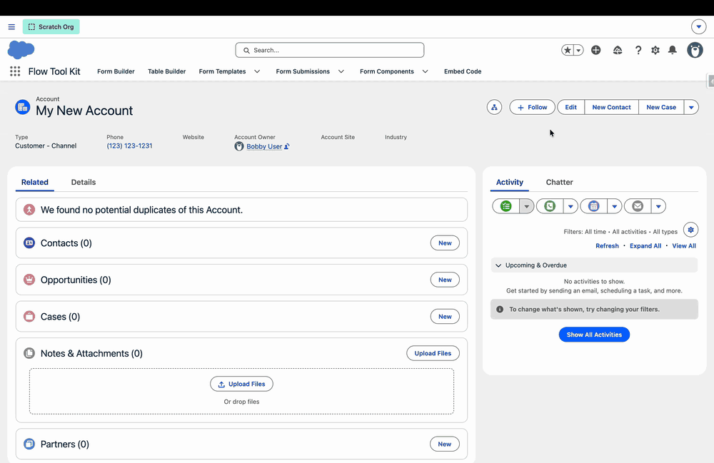
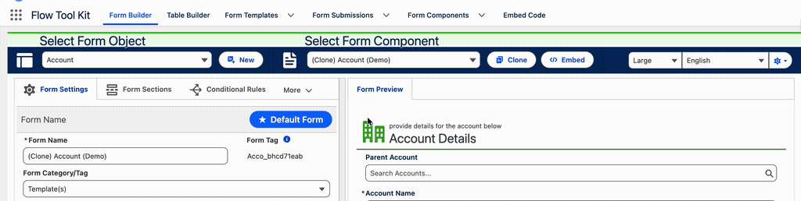
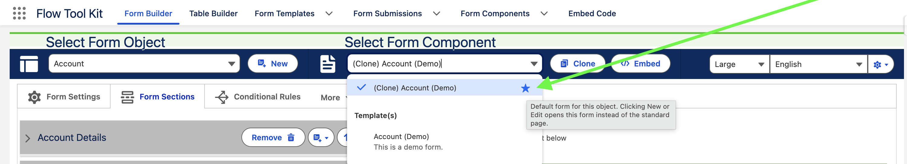
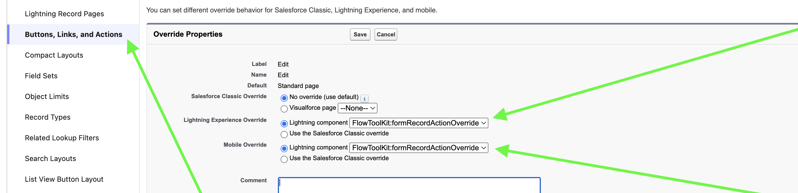
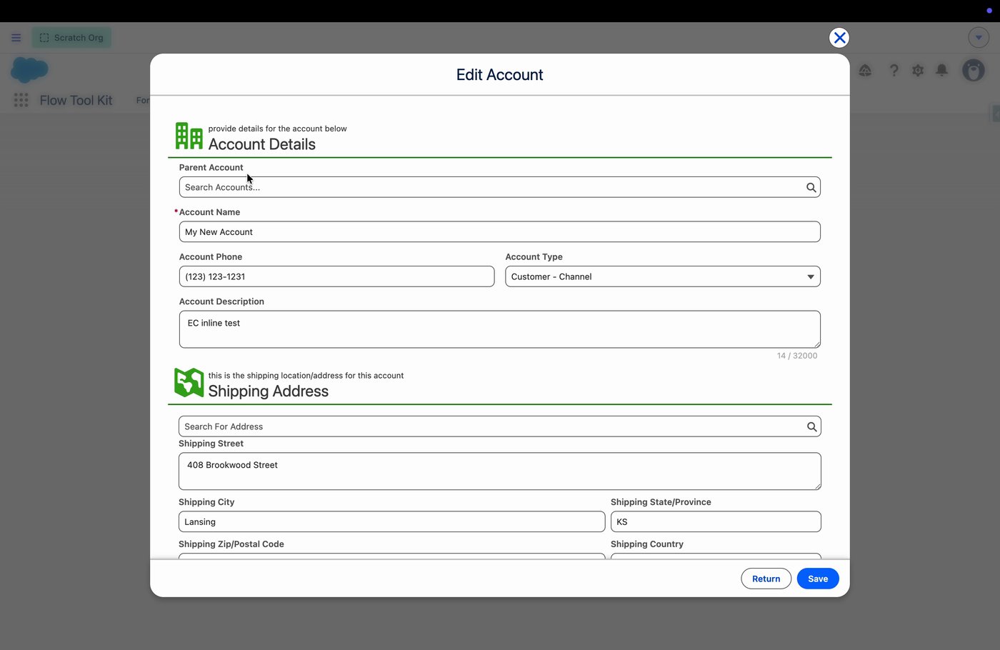

# How To: Override New and Edit with a Form

> Replace the standard **New** and **Edit** pages on any object with one of your Flow Tool Kit forms, so users get your layout, your help text, your conditional logic, and your validation instead of the stock page layout.


**Prerequisites**: A form built for the object you want to override (see [Build a Form](build-a-form.md)), and permission to edit the object in **Setup** (Customize Application).


## What It's For

By default, clicking **New** or **Edit** on a record opens the standard Salesforce page layout. That layout cannot show conditional logic, rich text message cards, themes, section dividers, Likert matrices, or any of the other form features in this package.

This feature swaps that standard page for a form you built. Users keep clicking the same familiar **New** and **Edit** buttons; what opens is your form.

## How It Works

Setting this up has **two halves**, and both are required. Doing only one produces nothing.

| Half | Where | What it decides |
|------|-------|-----------------|
| 1. Nominate the form | **Form Builder** | *Which* form opens for this object |
| 2. Override the action | **Setup > Object Manager** | *That* a form opens at all, instead of the standard page |

Think of it as a light switch and a bulb. Setup is the switch that redirects the button; the **Default Form** flag is the bulb that says which form to show.

---

## Step 1: Build a Form for the Object

Build the form as normal in **Form Builder**, with **Select Form Object** set to the object you plan to override. See [Build a Form](build-a-form.md) if you have not done this before.

Two things matter for an override form specifically:

- **Include every required field on the object.** The form replaces the standard page entirely, so a required field that is missing from your form will block the save with an error the user cannot fix from the screen in front of them.
- **Build it as a Form Component, not a Table Component.** Only a form can stand in for a record's New or Edit page.

## Step 2: Nominate It as the Default Form

1. In **Form Builder**, load the form.
2. Open the **Form Settings** tab.
3. Click **Make Default** in the top right of the **Form Name** header.
4. Click **Save** to deploy.

The button reports the current state and the action available:

| Button shows | Meaning |
|--------------|---------|
| **+ Make Default** | This form is not the object's default. Click to make it so. |
| **★ Default Form** | This form **is** the object's default. |
| **✕ Remove Default** (on hover) | Clicking now will remove it as the default. |


The change is not live until you click **Save**. Like every other Form Builder setting, the flag is stored in custom metadata and is only committed when the form deploys.


### Only One Default per Object

An object can have exactly one default form. If another form on the same object already holds the flag, saving here **turns that one off automatically**, in the same deployment. You do not have to find and clear the old one, and there is never a moment when two forms both claim the object.

### Spotting the Default Later

In the **Select Form Component** picker, the object's default form is lifted out of its category and pinned to the top of the list, marked with a blue star:

Hovering the star explains what it means. This marker reflects the **deployed** state, so it appears after you save, not the moment you click the button.

## Step 3: Override the New and Edit Actions in Setup

Now redirect the buttons themselves.

1. Go to **Setup > Object Manager** and choose your object.
2. Click **Buttons, Links, and Actions** in the left sidebar.
3. Find **Edit** in the list, then choose **Edit** from its row dropdown.
4. Under **Override Properties**:
   - **Lightning Experience Override**: choose **Lightning component**, then pick `FlowToolKit:formRecordActionOverride`.
   - **Mobile Override**: choose **Lightning component**, then pick `FlowToolKit:formRecordActionOverride`.
   - **Salesforce Classic Override**: leave as **No override (use default)**. Lightning components cannot override Classic pages.
5. Click **Save**.
6. **Repeat the whole step for the `New` action.**


**This applies to every user in the org.** An action override is not profile-specific or record-type-specific. Once you save it, everyone who clicks New or Edit on that object gets your form. Test in a sandbox or scratch org before doing this in production.



**Clone cannot be overridden this way.** Salesforce only allows a Lightning component to override **View**, **New**, **Edit**, and **Tab**. Clone is not on that list, so it keeps using the standard page.


## Step 4: Test It

1. Open any record of that object and click **Edit**. Your form should open, populated with the record's current values.
2. Change a field and click **Save**. You should see a success toast and land back on the record.
3. Go to the object's list view and click **New**. Your form should open empty.
4. Fill in the required fields and click **Save**. You should land on the record you just created.

---

## What Users See

The presentation differs by where the user is, because the platform treats the two contexts differently.

### In Lightning Experience

The form opens in a **modal** over the page, with two buttons in the footer:

| Button | Behavior |
|--------|----------|
| **Save** | Validates, saves, and navigates to the record. On **New**, it navigates to the record it just created. |
| **Return** | Closes without saving and goes back to wherever the user came from (the record, or the list view). |

While a save is in flight, both buttons disable and **Save** reads *Saving...*, so a slow insert does not look like a dead button.

If the form refuses the save because a field failed validation, **the modal stays open** with the errors visible, rather than closing and losing the user's input.

### In Experience Cloud

Experience Cloud already opens an action override in its own popup. Rendering another modal inside it would produce a modal within a modal, so in a community the form renders **inline** in the popup and supplies its own Save button. The behavior is the same; only the framing differs.

---

## Special Objects

Three objects in this package route to a purpose-built editor instead of a general form. This is automatic; there is nothing to configure beyond the Setup override.

| Object | What opens |
|--------|-----------|
| **Form Template** | The **Form Template Settings** editor. It saves as you type, so the modal has no Save button; closing it returns you to the record. |
| **Form Submission** (pre-fill template) | The **pre-fill values** editor, for editing the stored values the template seeds. |
| **Form Submission** (child or related row) | The specific form named on that submission record. |
| **Form Submission** (anything else) | The submission's whole form template, as the submitter saw it. |

## Behavior Reference

- **No default form assigned?** The override opens and shows a "no form assigned" illustration rather than an empty shell, so the cause is visible instead of looking broken.
- **Loading.** The form's skeleton renders immediately and fills in as the form resolves, so users do not stare at a blank page.


**Objects with record types: test before you roll this out.** When a user picks a record type in the New dialog, that choice is **not currently passed through to the form**. The form is a single fixed layout, so it does not vary by record type, and the new record does not pick up the chosen type's defaults. This is a known gap. If your object relies on record types to drive different New layouts or defaults, validate the result in a sandbox before overriding the action in production.

Form Template is the exception: it does receive the selected record type.


## Troubleshooting

| Symptom | Cause / Fix |
|---------|-------------|
| Clicking New or Edit still opens the standard page | The Setup override is missing, or was set on only one of the two actions. Both **New** and **Edit** must be overridden separately (Step 3). |
| The form opens but shows a "no form assigned" illustration | No form on that object has **Default Form** enabled, or it was enabled but never saved. Redo Step 2 and click **Save**. |
| The wrong form opens | Another form on the object holds the Default Form flag. Load the form you want and click **Make Default**; the other is cleared automatically. |
| The star does not appear in the form selector | The flag has not deployed yet. Click **Save** in Form Builder, then reload the page. |
| Save does nothing and the modal stays open | The form failed validation. Scroll the modal for the field error. A required field on the object that is missing from your form will do this (see Step 1). |
| It works in Lightning Experience but looks different in a community | Expected. Experience Cloud renders the form inline inside its own popup instead of a nested modal. |
| A new record gets the wrong record type, or the wrong defaults | The record type picked in the New dialog is not passed to the form (see the warning above). Either add the Record Type field to the form, or keep the standard New page on objects that depend on record types. |
| Clone still opens the standard page | Expected, and not configurable. Salesforce does not allow Lightning components to override Clone. |

## Related

- [Build a Form](build-a-form.md)
- [Add Conditional Logic](add-conditional-logic.md)
- [Configure Themes and Styling](configure-themes-and-styling.md)
- [Deploy to Experience Cloud](deploy-to-experience-cloud.md)
